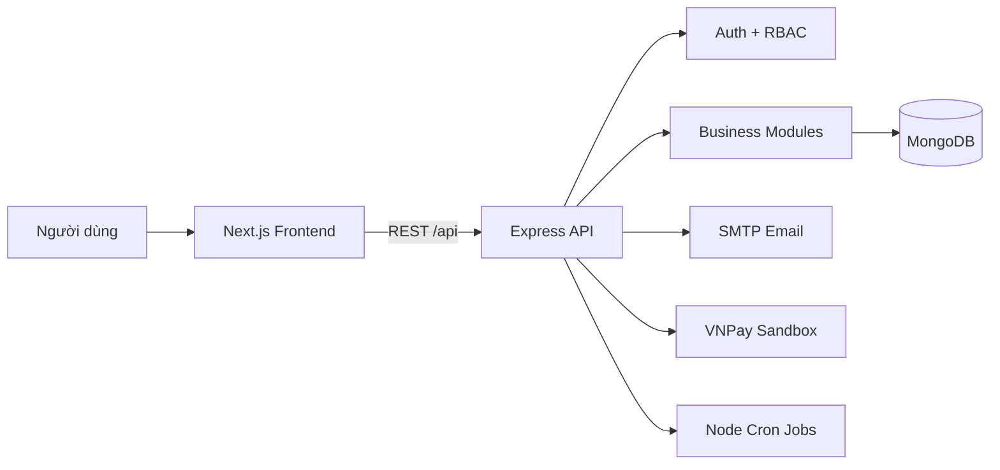
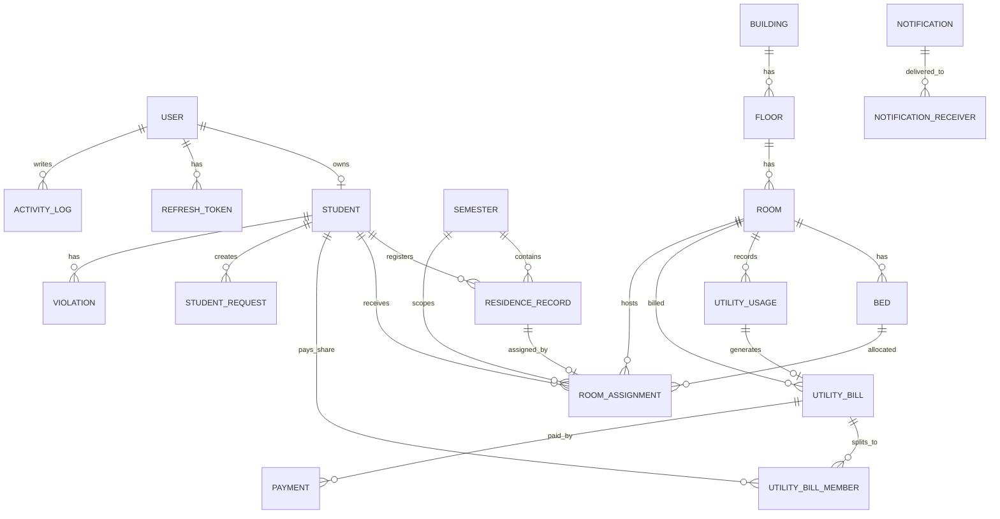

# PTIT Dormitory - Hệ thống quản lý ký túc xá

<div align="center">


**PTIT Dormitory** là hệ thống quản lý sinh viên lưu trú ký túc xá, được xây dựng theo kiến trúc fullstack TypeScript gồm frontend Next.js và backend Express/MongoDB.

[Production](https://neethgie-plus-frontend.vercel.app/) · [Tính năng](#tính-năng-chính) · [Kiến trúc](#kiến-trúc-tổng-quan) · [Cài đặt](#cài-đặt-local) · [API](#api-overview) · [Gitflow](#gitflow--production-release)

</div>

---

## Truy cập nhanh Production

> Frontend production: **[https://neethgie-plus-frontend.vercel.app/](https://neethgie-plus-frontend.vercel.app/)**

| Mục đích | URL |
|---|---|
| Mở ứng dụng | [https://neethgie-plus-frontend.vercel.app/](https://neethgie-plus-frontend.vercel.app/) |
| API base | `https://neethgie-plus-frontend.vercel.app/api` |
| Health check | `https://neethgie-plus-frontend.vercel.app/api/health` |
| VNPay return | `https://neethgie-plus-frontend.vercel.app/payment/vnpay-return` |

## Tổng quan

Dự án phục vụ nghiệp vụ quản lý sinh viên ở ký túc xá theo từng kỳ lưu trú. Hệ thống hỗ trợ cán bộ quản lý tiếp nhận danh sách sinh viên, import Excel, phân phòng/giường, theo dõi lịch sử lưu trú, phát hành thông báo, quản lý đơn từ, vi phạm, hóa đơn điện nước và thanh toán VNPay sandbox.

Mục tiêu thiết kế là tách rõ trách nhiệm giữa giao diện và nghiệp vụ: frontend chỉ hiển thị, thu thập thao tác và gọi API; backend là nguồn sự thật cho xác thực, phân quyền, kiểm tra dữ liệu, transaction, xếp phòng, tính hóa đơn, thanh toán và audit log.

## Demo Production

| Thành phần | URL / cấu hình |
|---|---|
| Frontend | [https://neethgie-plus-frontend.vercel.app/](https://neethgie-plus-frontend.vercel.app/) |
| API base production | `https://neethgie-plus-frontend.vercel.app/api` hoặc giá trị tương đương trong `NEXT_PUBLIC_API_BASE_URL` |
| Health check | `/api/health` |
| VNPay return | `/payment/vnpay-return` |

Trong production, frontend được triển khai trên Vercel. Backend/API được cấu hình cùng domain frontend qua hạ tầng deploy hoặc biến môi trường public của frontend, giúp client gọi API nhất quán qua base path `/api`.

## Vai trò người dùng

| Vai trò | Mục đích |
|---|---|
| `ADMIN` | Quản trị tài khoản, phân quyền, xem báo cáo hệ thống và audit log. |
| `MANAGER` | Vận hành nghiệp vụ ký túc xá: sinh viên, kỳ lưu trú, phòng/giường, xếp phòng, nội quy, thông báo, đơn từ, hóa đơn, vi phạm và báo cáo. |
| `STUDENT` | Xem hồ sơ cá nhân, phòng ở, lịch sử lưu trú, thông báo, nội quy, đơn từ, vi phạm và hóa đơn; thực hiện thanh toán khi có quyền. |

## Tính năng chính

### Quản trị và phân quyền

- Đăng nhập, đăng xuất, refresh token, đổi mật khẩu, quên mật khẩu và xác minh OTP.
- RBAC theo vai trò `ADMIN`, `MANAGER`, `STUDENT` kết hợp permission code chi tiết.
- Khóa/mở khóa tài khoản, reset mật khẩu người dùng.
- Audit log tự động cho các thao tác ghi quan trọng.

### Quản lý sinh viên và kỳ lưu trú

- Quản lý hồ sơ sinh viên, trạng thái cư trú và thông tin học vụ.
- Import danh sách sinh viên từ Excel, lưu batch import và lỗi từng dòng.
- Xuất dữ liệu sinh viên/lịch sử lưu trú ra Excel.
- Quản lý kỳ lưu trú với trạng thái chuẩn bị, đang hoạt động và đã kết thúc.
- Lưu lịch sử lưu trú theo kỳ để không mất dữ liệu phòng/giường cũ.

### Quản lý ký túc xá và xếp phòng

- Quản lý tòa nhà, tầng, phòng và giường.
- Xếp phòng tự động theo kỳ lưu trú.
- Xếp phòng thủ công, chuyển phòng, hủy gán giường và quản lý sinh viên chưa được xếp phòng.
- Kiểm tra các ràng buộc quan trọng: đúng giới tính phòng, không vượt sức chứa, không trùng giường, không trùng sinh viên trong cùng kỳ.

### Nội quy, thông báo, đơn từ và vi phạm

- Tạo, cập nhật, công bố và lưu trữ nội quy ký túc xá.
- Gửi thông báo chung hoặc thông báo riêng cho sinh viên.
- Sinh viên tạo đơn từ; cán bộ quản lý xử lý và cập nhật trạng thái.
- Ghi nhận, cập nhật và tra cứu vi phạm theo sinh viên/kỳ lưu trú.

### Điện nước, thanh toán và báo cáo

- Nhập chỉ số điện nước theo phòng.
- Tạo hóa đơn điện nước theo kỳ/tháng, có thành viên hóa đơn để theo dõi từng sinh viên.
- Cấu hình giá điện theo bậc, đơn giá nước và tham số hệ thống.
- Thanh toán VNPay sandbox, return URL, IPN và xác nhận tiền mặt.
- Báo cáo lưu trú, sức chứa ký túc xá, điện nước, thanh toán, đơn từ, vi phạm và xu hướng vận hành.

## Kiến trúc tổng quan



### Nguyên tắc thiết kế

- Backend là nguồn sự thật cho nghiệp vụ, phân quyền và validation cuối cùng.
- Dữ liệu lưu trú xoay quanh `Semester`, `ResidenceRecord` và `RoomAssignment`; sinh viên không giữ giường trực tiếp.
- Các nghiệp vụ nhiều bước như import Excel, xếp phòng, chuyển kỳ và thanh toán cần transaction/idempotency ở backend.
- Email và thông báo được tách khỏi transaction chính để tránh làm hỏng dữ liệu hợp lệ khi provider bên ngoài lỗi.
- Response API được chuẩn hóa, lỗi đi qua middleware tập trung.

## Database Schema

Database sử dụng MongoDB thông qua Mongoose. Thiết kế schema đầy đủ được lưu tại [`docs/data-model.dbml`](docs/data-model.dbml) để có thể xem bằng dbdiagram.io; các bảng trong DBML được map sang collection/model MongoDB tương ứng trong `backend/src/models`.

### Nhóm collection chính

| Nhóm dữ liệu | Collection / model | Vai trò |
|---|---|---|
| Auth & RBAC | `User`, `Permission`, `RolePermission`, `RefreshToken`, `PasswordResetToken` | Xác thực, phiên đăng nhập, phân quyền và reset mật khẩu. |
| Sinh viên & lưu trú | `Student`, `Semester`, `ResidenceRecord`, `RoomAssignment` | Hồ sơ sinh viên, kỳ lưu trú, lịch sử cư trú và gán phòng/giường theo kỳ. |
| Cấu trúc ký túc xá | `Building`, `Floor`, `Room`, `Bed` | Mô hình vật lý của ký túc xá từ tòa nhà đến từng giường. |
| Nội quy & giao tiếp | `Regulation`, `Notification`, `NotificationReceiver`, `StudentRequest`, `Violation` | Nội quy, thông báo, đơn từ sinh viên và vi phạm. |
| Điện nước & thanh toán | `UtilityUsage`, `UtilityBill`, `UtilityBillMember`, `Payment` | Chỉ số điện nước, hóa đơn phòng, trạng thái từng thành viên và giao dịch VNPay/tiền mặt. |
| Cấu hình & vận hành | `SystemConfig`, `ElectricPriceTier`, `ImportBatch`, `ImportRowError`, `EmailLog`, `ActivityLog` | Tham số hệ thống, giá điện, import Excel, email queue/log và audit log. |

### Quan hệ nghiệp vụ cốt lõi



### Ràng buộc và index quan trọng

- `User.username`, `User.email`, `Student.studentCode` là unique để tránh trùng tài khoản và mã sinh viên.
- `ResidenceRecord` unique theo `{ studentId, semesterId }`, bảo đảm một sinh viên chỉ có một hồ sơ lưu trú trong một kỳ.
- `RoomAssignment` unique theo `{ studentId, semesterId }` và `{ bedId, semesterId }` cho assignment đang active, tránh một sinh viên có nhiều giường hoặc một giường có nhiều sinh viên trong cùng kỳ.
- `Floor` unique theo `{ buildingId, floorNumber }`, `Room` unique theo `{ floorId, roomNumber }`, `Bed` unique theo `{ roomId, bedNumber }`.
- `UtilityUsage` và `UtilityBill` được index theo `{ roomId, month, year }` để tránh ghi trùng chỉ số/hóa đơn cùng phòng cùng tháng.
- `RefreshToken` và `PasswordResetToken` có TTL index theo `expiresAt` để tự dọn token hết hạn.
- `Payment.vnpTxnRef` unique sparse để bảo đảm giao dịch VNPay idempotent.

### Luồng dữ liệu chính

1. Cán bộ tạo hoặc import sinh viên vào kỳ lưu trú, hệ thống tạo/cập nhật `Student`, `ResidenceRecord`, `ImportBatch` và `ImportRowError` nếu có lỗi.
2. Khi xếp phòng, backend tạo `RoomAssignment` liên kết `Student`, `Semester`, `Room`, `Bed` và snapshot dữ liệu để giữ lịch sử.
3. Khi nhập điện nước, `UtilityUsage` được dùng để sinh `UtilityBill`; hệ thống tạo `UtilityBillMember` cho từng sinh viên trong phòng.
4. Thanh toán VNPay/tiền mặt tạo `Payment`; khi thành công, backend cập nhật `UtilityBill` và các `UtilityBillMember` liên quan.
5. Mọi nghiệp vụ quan trọng ghi `ActivityLog`; thông báo/email được lưu qua `Notification`, `NotificationReceiver` và `EmailLog`.

## Tech Stack

| Layer | Công nghệ |
|---|---|
| Monorepo | npm workspaces |
| Frontend | Next.js 16.2.9 App Router, React 19.2.7, TypeScript |
| UI | Tailwind CSS 4, lucide-react, Recharts, Sonner |
| State/Data | Zustand, TanStack Query, Axios |
| Backend | Node.js 20+, Express 4.21.2, TypeScript, tsx |
| Database | MongoDB, Mongoose 8 |
| Auth | JWT access token, refresh token, HTTP-only cookie |
| Validation | Zod |
| Security | Helmet, CORS credentials, cookie-parser, express-rate-limit |
| Excel | ExcelJS, XLSX |
| Email | Nodemailer / SMTP |
| Jobs | node-cron |
| Payment | VNPay sandbox |
| Logging | Winston |
| Testing | Node test runner qua `tsx --test` |

## Cấu trúc thư mục

```text
ptit-dormitory/
├── backend/
│   ├── src/
│   │   ├── app.ts
│   │   ├── server.ts
│   │   ├── config/
│   │   ├── common/
│   │   ├── integrations/
│   │   ├── jobs/
│   │   ├── models/
│   │   ├── modules/
│   │   └── routes/
│   ├── scripts/
│   └── package.json
├── frontend/
│   ├── src/
│   │   ├── app/
│   │   ├── components/
│   │   ├── config/
│   │   ├── features/
│   │   ├── lib/
│   │   └── types/
│   ├── public/
│   └── package.json
├── docs/
├── package.json
├── package-lock.json
└── README.md
```

## Cài đặt local

### Yêu cầu

- Node.js `>=20`
- npm `>=10`
- MongoDB local hoặc MongoDB Atlas
- Tài khoản VNPay sandbox nếu muốn kiểm thử thanh toán thật
- SMTP account nếu muốn kiểm thử email

### 1. Cài dependencies

```bash
npm install
```

### 2. Tạo biến môi trường

Backend:

```bash
cp backend/.env.example backend/.env
```

Frontend:

```bash
cp frontend/.env.local.example frontend/.env.local
```

Trên Windows PowerShell:

```powershell
Copy-Item backend/.env.example backend/.env
Copy-Item frontend/.env.local.example frontend/.env.local
```

### 3. Cấu hình môi trường backend

```env
NODE_ENV=development
PORT=5000
CLIENT_URL=http://localhost:3000
SERVER_URL=http://localhost:5000
LOG_LEVEL=debug

MONGODB_URI=mongodb+srv://<user>:<password>@<cluster>.mongodb.net/ptit_dormitory?retryWrites=true&w=majority

JWT_ACCESS_SECRET=change_me_access_secret
JWT_REFRESH_SECRET=change_me_refresh_secret
JWT_ACCESS_EXPIRES_IN=15m
JWT_REFRESH_EXPIRES_IN=7d
COOKIE_SECRET=change_me_cookie_secret

SMTP_HOST=smtp.gmail.com
SMTP_PORT=587
SMTP_USER=your_email@gmail.com
SMTP_PASS=your_app_password
SMTP_FROM=PTIT Dormitory <your_email@gmail.com>

VNPAY_TMN_CODE=your_sandbox_tmn_code
VNPAY_HASH_SECRET=your_sandbox_hash_secret
VNPAY_URL=https://sandbox.vnpayment.vn/paymentv2/vpcpay.html
VNPAY_API_URL=https://sandbox.vnpayment.vn/merchant_webapi/api/transaction
VNPAY_RETURN_URL=http://localhost:3000/payment/vnpay-return
VNPAY_IPN_URL=http://localhost:5000/api/payments/vnpay/ipn
```

### 4. Cấu hình môi trường frontend

```env
NEXT_PUBLIC_API_BASE_URL=http://localhost:5000/api
NEXT_PUBLIC_APP_NAME=PTIT Dormitory
```

Production trên Vercel:

```env
NEXT_PUBLIC_API_BASE_URL=https://neethgie-plus-frontend.vercel.app/api
NEXT_PUBLIC_APP_NAME=PTIT Dormitory
```

### 5. Chạy dự án

Chạy cả frontend và backend từ root:

```bash
npm run dev
```

Hoặc chạy riêng từng phần:

```bash
npm run dev:be
npm run dev:fe
```

| Dịch vụ | URL local |
|---|---|
| Frontend | http://localhost:3000 |
| Backend API | http://localhost:5000/api |
| Health check | http://localhost:5000/api/health |

## Seed dữ liệu

Backend có các script seed phục vụ dữ liệu demo và cấu hình hệ thống:

```bash
npm run seed -w backend
```

Script trên chạy lần lượt:

- `seed:permissions`
- `seed:users`
- `seed:configs`
- `seed:dormitory`
- `seed:electric`

Tài khoản demo mặc định:

| Vai trò | Username / Email | Mật khẩu |
|---|---|---|
| Admin | `admin` / `admin@ptit.edu.vn` | giá trị `SEED_ADMIN_PASSWORD` hoặc `admin123` khi chưa cấu hình |
| Manager | `manager` / `manager@ptithcm.edu.vn` | `manager123` |
| Student | mã sinh viên được seed, ví dụ `N24DCCN001` | `student123` |

Không chạy seed trên production nếu database đã có dữ liệu thật.

## API Overview

Base URL local: `http://localhost:5000/api`

Base URL production: `https://neethgie-plus-frontend.vercel.app/api` hoặc giá trị public tương ứng trong `NEXT_PUBLIC_API_BASE_URL`.

| Nhóm API | Endpoint chính | Mô tả |
|---|---|---|
| Health | `GET /health` | Kiểm tra uptime và trạng thái database. |
| Auth | `/auth/*` | Login, refresh, logout, forgot/reset/change password, `/me`. |
| Users | `/users/*` | Quản lý tài khoản, khóa/mở khóa, reset password. |
| Students | `/students/*` | Hồ sơ sinh viên, thống kê, export Excel, lịch sử lưu trú. |
| Import | `/students/import-excel`, `/import-batches/*` | Import Excel và tra cứu lỗi import. |
| Semesters | `/semesters/*` | Danh sách, cập nhật, kích hoạt và revert kỳ lưu trú. |
| Dormitory | `/buildings`, `/floors`, `/rooms`, `/beds` | Quản lý cấu trúc ký túc xá. |
| Room assignments | `/room-assignments/*` | Xếp phòng tự động/thủ công, lịch sử, chuyển phòng, danh sách chưa xếp. |
| Regulations | `/regulations/*` | Nội quy, publish/archive, danh sách đã công bố. |
| Notifications | `/notifications/*` | Thông báo chung, riêng, thông báo của sinh viên, unread count. |
| Requests | `/student-requests/*` | Sinh viên tạo đơn, cán bộ xử lý trạng thái. |
| Violations | `/violations/*` | Ghi nhận và tra cứu vi phạm. |
| Utility usage | `/utility-usages/*` | Nhập và tra cứu chỉ số điện nước. |
| Utility bills | `/utility-bills/*` | Tạo hóa đơn, xem hóa đơn, quá hạn, hủy hóa đơn. |
| Payments | `/payments/*` | VNPay create/return/IPN, kiểm tra trạng thái, xác nhận tiền mặt. |
| Reports | `/reports/*` | Báo cáo lưu trú, sức chứa, điện nước, thanh toán, vi phạm, đơn từ. |
| Configs | `/configs/*`, `/electric-price-tiers/*` | Cấu hình hệ thống và bậc giá điện. |
| Audit logs | `/audit-logs/*` | Nhật ký thao tác hệ thống. |
| Dashboard | `/dashboard/admin`, `/dashboard/student` | Dữ liệu dashboard theo vai trò. |

## Testing và chất lượng

Chạy toàn bộ kiểm tra từ root:

```bash
npm run typecheck
npm run lint
npm test
npm run build
```

Chạy riêng từng workspace:

```bash
npm run typecheck -w backend
npm run lint -w backend
npm run test -w backend
npm run build -w backend

npm run typecheck -w frontend
npm run lint -w frontend
npm run build -w frontend
```

## Deployment

### Frontend - Vercel

- Root Directory: `frontend`
- Framework Preset: Next.js
- Build Command: `npm run build`
- Output: mặc định của Next.js
- Production domain: `https://neethgie-plus-frontend.vercel.app/`

Biến môi trường:

```env
NEXT_PUBLIC_API_BASE_URL=https://neethgie-plus-frontend.vercel.app/api
NEXT_PUBLIC_APP_NAME=PTIT Dormitory
```

### Backend - Node service

Backend có thể deploy lên Render, Railway, VPS hoặc nền tảng Node.js tương đương.

- Root Directory: `backend`
- Build Command: `npm install && npm run build`
- Start Command: `npm start`
- Health Check Path: `/api/health`

Biến môi trường production tối thiểu:

```env
NODE_ENV=production
PORT=5000
CLIENT_URL=https://neethgie-plus-frontend.vercel.app
SERVER_URL=https://neethgie-plus-frontend.vercel.app
MONGODB_URI=<mongodb-atlas-uri>
JWT_ACCESS_SECRET=<strong-secret>
JWT_REFRESH_SECRET=<strong-secret>
COOKIE_SECRET=<strong-secret>
```

Biến tùy chọn theo tính năng:

- SMTP: `SMTP_HOST`, `SMTP_PORT`, `SMTP_USER`, `SMTP_PASS`, `SMTP_FROM`
- VNPay: `VNPAY_TMN_CODE`, `VNPAY_HASH_SECRET`, `VNPAY_URL`, `VNPAY_API_URL`, `VNPAY_RETURN_URL`, `VNPAY_IPN_URL`
- Seed admin: `SEED_ADMIN_USERNAME`, `SEED_ADMIN_EMAIL`, `SEED_ADMIN_PASSWORD`

## Gitflow & Production Release

Quy trình phát hành được khuyến nghị:

```bash
git switch develop
git switch -c feature/production-readme

git add README.md
git commit -m "docs(readme): document production dormitory system"

git switch develop
git merge --no-ff feature/production-readme

git switch main
git merge --no-ff develop
```

Trước khi merge vào `main`, chạy:

```bash
npm run typecheck
npm run lint
npm test
npm run build
```

## Ghi chú vận hành

- Không commit file `.env`, `.env.local` hoặc secret thật.
- Không chạy seed trên production nếu không chủ đích reset/ghi đè dữ liệu.
- VNPay return URL chỉ phục vụ hiển thị kết quả cho người dùng; IPN là nguồn cập nhật trạng thái thanh toán đáng tin cậy.
- Với MongoDB transaction, nên dùng MongoDB Atlas hoặc replica set.
- Các thay đổi tài liệu production nên được commit riêng để dễ review và rollback.
