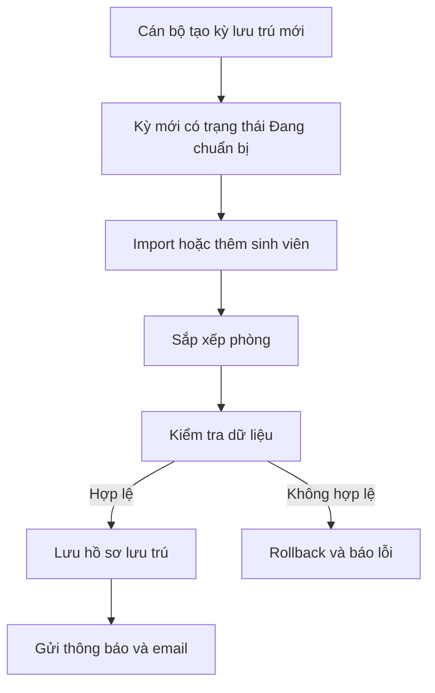
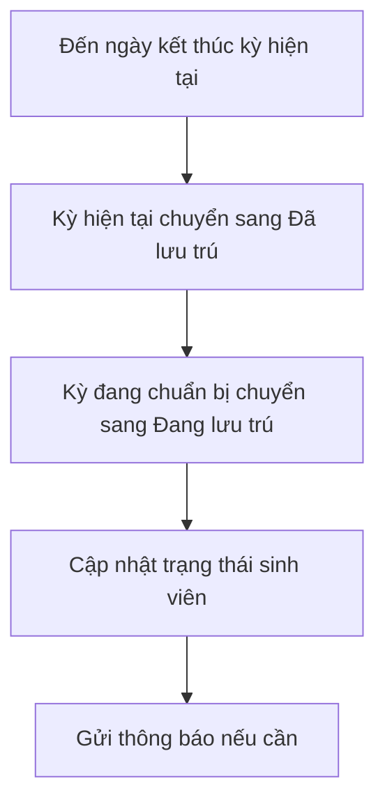
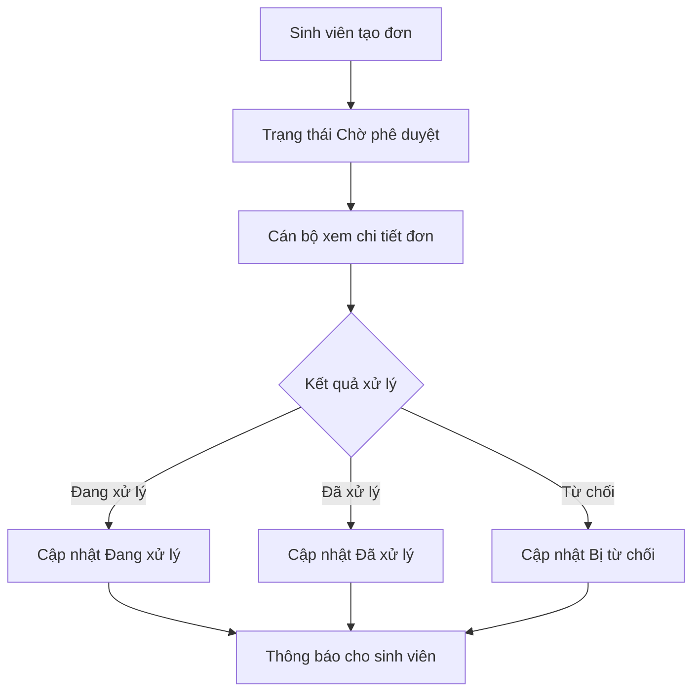
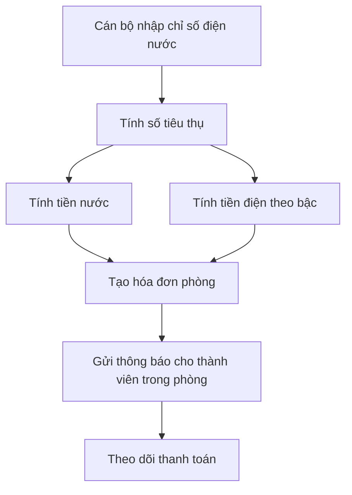
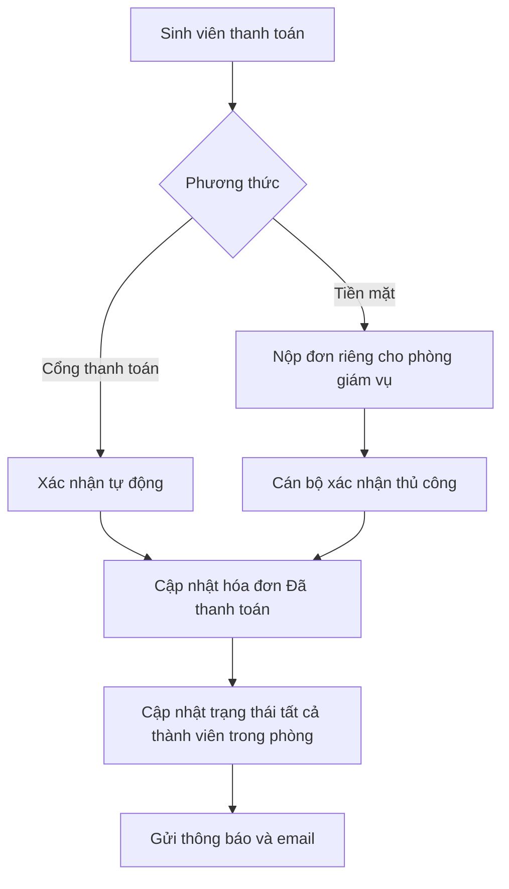

# Tài liệu ngữ cảnh nghiệp vụ  
# Dự án: Xây dựng phần mềm quản lý sinh viên ở ký túc xá HVCS

## 1. Mục tiêu tài liệu

Tài liệu này mô tả đầy đủ bối cảnh, vai trò người dùng, chức năng nghiệp vụ, trạng thái dữ liệu và các luồng xử lý chính của hệ thống quản lý sinh viên ở ký túc xá HVCS.

Mục tiêu chính là giúp **agent / AI coding assistant / developer** hiểu đúng logic nghiệp vụ trước khi phân tích, thiết kế database, viết API, viết frontend hoặc sinh tài liệu kỹ thuật.

---

## 2. Tổng quan hệ thống

Hệ thống quản lý sinh viên ở ký túc xá HVCS dùng để quản lý quá trình sinh viên lưu trú tại ký túc xá theo từng kỳ lưu trú.

Hệ thống tập trung vào các nghiệp vụ chính:

- Quản lý tài khoản và phân quyền.
- Quản lý hồ sơ sinh viên lưu trú.
- Import danh sách sinh viên đã đăng ký lưu trú từ file Excel.
- Sắp xếp phòng và giường cho sinh viên theo quy tắc ưu tiên.
- Quản lý khu, tầng, phòng, giường.
- Quản lý kỳ lưu trú.
- Quản lý nội quy ký túc xá.
- Quản lý thông báo chung và thông báo riêng.
- Gửi thông báo qua phần mềm và email.
- Quản lý đơn từ của sinh viên.
- Quản lý hóa đơn điện nước theo phòng.
- Quản lý vi phạm.
- Thống kê, báo cáo lịch sử lưu trú và chi phí.

---

## 3. Phạm vi nghiệp vụ

### 3.1. Trong phạm vi dự án

Dự án chỉ xử lý các sinh viên **đã đăng ký lưu trú** từ bộ phận khác chuyển sang.

Hệ thống cần hỗ trợ:

- Nhập danh sách sinh viên đã đăng ký lưu trú bằng file Excel.
- Thêm thủ công sinh viên vào danh sách lưu trú.
- Xuất hồ sơ lưu trú ra file Excel.
- Sắp xếp phòng tự động.
- Quản lý trạng thái lưu trú theo kỳ.
- Gửi thông báo và email cho sinh viên.
- Theo dõi lịch sử lưu trú, hóa đơn, vi phạm, đơn từ.

### 3.2. Ngoài phạm vi dự án

Các phần sau không phải trọng tâm nghiệp vụ của dự án:

- Quy trình sinh viên đăng ký lưu trú ban đầu.
- Phê duyệt hồ sơ đăng ký lưu trú từ bộ phận tuyển chọn / đăng ký.
- Thanh toán tiền mặt trực tiếp tại phòng giám vụ, ngoài phần ghi nhận thủ công của cán bộ quản lý.
- Xác minh thanh toán bên ngoài cổng thanh toán, nếu chưa tích hợp thực tế.

---

## 4. Đối tượng sử dụng hệ thống

Hệ thống có 3 nhóm người dùng chính:

1. Quản trị viên hệ thống.
2. Cán bộ quản lý ký túc xá.
3. Sinh viên.

---

## 5. Chức năng chung của hệ thống

Các chức năng chung áp dụng cho nhiều vai trò:

### 5.1. Đăng nhập

Người dùng đăng nhập bằng tài khoản được cấp.

Tùy vai trò, hệ thống hiển thị chức năng tương ứng.

### 5.2. Đăng xuất

Người dùng có thể đăng xuất khỏi hệ thống.

### 5.3. Quên mật khẩu / đổi mật khẩu

Người dùng có thể yêu cầu đặt lại mật khẩu.

Hệ thống gửi hướng dẫn hoặc mã xác thực qua email sinh viên.

### 5.4. Xem nội quy quy định

Người dùng, đặc biệt là sinh viên, có thể xem nội quy ký túc xá đã được công bố.

---

## 6. Vai trò 1: Quản trị viên hệ thống

Quản trị viên hệ thống chịu trách nhiệm quản lý tài khoản, phân quyền và giám sát hoạt động hệ thống.

### 6.1. Quản lý tài khoản và phân quyền

Quản trị viên có thể:

- Tạo mới tài khoản người dùng.
- Gán vai trò cho người dùng.
- Phân quyền truy cập chức năng.
- Khóa tài khoản người dùng.
- Mở khóa tài khoản người dùng.
- Cập nhật thông tin tài khoản nếu cần.

### 6.2. Xem nhật ký hoạt động

Quản trị viên có thể xem nhật ký thao tác của hệ thống.

Mục tiêu của nhật ký:

- Theo dõi lịch sử thao tác của người dùng.
- Phát hiện lỗi nghiệp vụ hoặc lỗi hệ thống.
- Giúp truy vết khi có sai sót dữ liệu.
- Hiển thị thông tin dễ hiểu để cán bộ kỹ thuật hoặc quản trị viên dễ sửa lỗi.

Ví dụ nhật ký cần ghi nhận:

- Ai đăng nhập / đăng xuất.
- Ai import file Excel.
- Ai tạo kỳ lưu trú.
- Ai thay đổi phòng / giường.
- Ai cập nhật hóa đơn.
- Ai thay đổi trạng thái đơn từ.
- Ai khóa / mở khóa tài khoản.
- Lỗi import Excel.
- Lỗi gửi email.
- Lỗi thanh toán.

---

## 7. Vai trò 2: Cán bộ quản lý ký túc xá

Cán bộ quản lý ký túc xá là vai trò nghiệp vụ chính của hệ thống.

Vai trò này quản lý sinh viên lưu trú, kỳ lưu trú, phòng ở, hóa đơn, thông báo, đơn từ, vi phạm và báo cáo.

---

# 8. Quản lý thông tin sinh viên lưu trú

## 8.1. Mục tiêu

Quản lý hồ sơ sinh viên đang hoặc đã lưu trú tại ký túc xá.

Hệ thống cho phép:

- Thêm sinh viên thủ công.
- Import danh sách sinh viên từ file Excel.
- Xuất hồ sơ lưu trú ra file Excel.
- Cập nhật thông tin sinh viên.
- Theo dõi lịch sử lưu trú theo từng kỳ.
- Gửi thông báo và email khi sinh viên được thêm vào hệ thống.

---

## 8.2. Thời điểm thêm sinh viên

Sinh viên thường được thêm vào hệ thống khi bắt đầu một kỳ lưu trú mới.

Các kỳ lưu trú gồm:

- Kỳ 1.
- Kỳ 2.
- Kỳ hè.

Khi bắt đầu kỳ mới, cán bộ quản lý có thể:

1. Import file Excel danh sách sinh viên đã đăng ký lưu trú.
2. Thêm thủ công từng sinh viên.

Sau khi sinh viên được thêm thành công:

- Hệ thống tạo / cập nhật hồ sơ sinh viên.
- Hệ thống gửi thông báo trong phần mềm.
- Hệ thống gửi email đến email sinh viên.

---

## 8.3. Import sinh viên từ Excel

File Excel chứa danh sách sinh viên đã đăng ký lưu trú.

Hệ thống cần kiểm tra:

- File đúng định dạng.
- Dữ liệu bắt buộc không được rỗng.
- Mã sinh viên không bị trùng bất thường.
- Email hợp lệ.
- Giới tính hợp lệ.
- Thông tin lớp, ngành, khóa, khoa hợp lệ.
- Sinh viên có thuộc kỳ lưu trú đang chuẩn bị hay không.
- Tổng số sinh viên có thể được xếp vào phòng hay không.

Nếu import thành công:

- Sinh viên được thêm vào kỳ lưu trú.
- Hệ thống tiến hành sắp xếp phòng nếu cán bộ chọn xếp phòng tự động.
- Gửi thông báo và email.

Nếu import thất bại:

- Không được lưu dữ liệu dở dang.
- Không được xếp phòng một phần.
- Hệ thống rollback toàn bộ thao tác import.
- Hệ thống hiển thị lý do lỗi rõ ràng.

---

## 8.4. Nguyên tắc rollback khi import Excel

Khi import danh sách sinh viên và sắp xếp phòng:

> Nếu không đủ phòng / giường hoặc có lỗi nghiệp vụ nghiêm trọng, hệ thống phải rollback toàn bộ.

Điều này có nghĩa là:

- Không thêm một phần sinh viên.
- Không xếp một phần phòng.
- Không tạo hóa đơn / thông báo sai.
- Không làm thay đổi trạng thái phòng nếu quy trình thất bại.

Các lỗi cần rollback:

- Không đủ giường trống.
- Thiếu phòng phù hợp giới tính.
- File Excel sai cấu trúc nghiêm trọng.
- Dữ liệu sinh viên không hợp lệ.
- Lỗi khi lưu database trong quá trình import.
- Lỗi logic khiến không thể hoàn thành xếp phòng.

---

# 9. Quản lý kỳ lưu trú

## 9.1. Khái niệm kỳ lưu trú

Kỳ lưu trú là khoảng thời gian sinh viên bắt đầu và kết thúc cư trú trong ký túc xá.

Một kỳ lưu trú có thể là:

- Kỳ 1.
- Kỳ 2.
- Kỳ hè.

## 9.2. Thuộc tính kỳ lưu trú

Entity `Semester` nên có các thông tin:

| Trường | Ý nghĩa |
|---|---|
| `id` | Mã kỳ lưu trú |
| `name` | Tên kỳ, ví dụ: Kỳ 1, Kỳ 2, Kỳ hè |
| `academic_year` | Năm học, ví dụ: 2026-2027 |
| `start_date` | Ngày bắt đầu lưu trú |
| `end_date` | Ngày kết thúc lưu trú |
| `created_at` | Ngày tạo kỳ |
| `type` hoặc `status` | Trạng thái kỳ |
| `note` | Ghi chú nếu có |

## 9.3. Trạng thái kỳ lưu trú

Kỳ lưu trú có 3 trạng thái chính:

| Trạng thái | Ý nghĩa |
|---|---|
| `PREPARING` / `Đang chuẩn bị` | Kỳ mới vừa được tạo, đang chuẩn bị dữ liệu sinh viên và xếp phòng |
| `ACTIVE` / `Đang lưu trú` | Kỳ đang diễn ra, sinh viên đang ở ký túc xá |
| `FINISHED` / `Đã lưu trú` | Kỳ đã kết thúc, dữ liệu được lưu lịch sử |

## 9.4. Quy tắc chuyển trạng thái kỳ

Khi tạo kỳ mới:

- Kỳ mới mặc định là `Đang chuẩn bị`.
- Không được chỉnh sửa các kỳ đã kết thúc, trừ một số thông tin ghi chú nếu hệ thống cho phép.
- Khi kỳ trước kết thúc:
  - Kỳ trước chuyển sang `Đã lưu trú`.
  - Kỳ đang chuẩn bị chuyển sang `Đang lưu trú`.

Ví dụ:

| Thời điểm | Kỳ 1 | Kỳ 2 |
|---|---|---|
| Đang chuẩn bị năm học | Đang chuẩn bị | Chưa tạo |
| Kỳ 1 bắt đầu | Đang lưu trú | Chưa tạo |
| Chuẩn bị kỳ 2 | Đang lưu trú | Đang chuẩn bị |
| Kỳ 1 kết thúc | Đã lưu trú | Đang lưu trú |

## 9.5. Không thay đổi kỳ cũ

Các kỳ đã kết thúc cần được xem như dữ liệu lịch sử.

Không nên cho phép:

- Sửa ngày bắt đầu / kết thúc của kỳ đã hoàn tất.
- Xóa kỳ đã có sinh viên lưu trú.
- Xóa lịch sử phòng / giường.
- Xóa hóa đơn, vi phạm, đơn từ thuộc kỳ cũ.

Nếu bắt buộc điều chỉnh, nên có:

- Nhật ký chỉnh sửa.
- Lý do chỉnh sửa.
- Người chỉnh sửa.
- Thời gian chỉnh sửa.

---

# 10. Quản lý khu, tầng, phòng và giường

## 10.1. Mục tiêu

Cán bộ quản lý cần quản lý cấu trúc vật lý của ký túc xá.

Cấu trúc gồm:

- Khu / dãy nhà.
- Tầng.
- Phòng.
- Giường.

## 10.2. Khu / dãy nhà

Khu hoặc dãy nhà có thể là:

- Dãy A.
- Dãy B.
- Dãy C.
- Khu nam.
- Khu nữ.
- Khu ưu tiên tân sinh viên.

Thông tin nên có:

| Trường | Ý nghĩa |
|---|---|
| `id` | Mã khu |
| `name` | Tên khu |
| `description` | Mô tả |
| `is_active` | Còn sử dụng hay không |

## 10.3. Tầng

Tầng thuộc một khu / dãy nhà.

Thông tin nên có:

| Trường | Ý nghĩa |
|---|---|
| `id` | Mã tầng |
| `building_id` | Khu / dãy nhà |
| `floor_number` | Số tầng |
| `description` | Mô tả |

## 10.4. Phòng

Phòng thuộc một tầng.

Phòng có thể được quy định dành cho nam hoặc nữ.

Thông tin nên có:

| Trường | Ý nghĩa |
|---|---|
| `id` | Mã phòng |
| `floor_id` | Tầng |
| `room_code` | Số phòng, ví dụ A101 |
| `gender_type` | Nam, nữ hoặc có thể thay đổi |
| `capacity` | Sức chứa |
| `status` | Đang sử dụng, tạm khóa, bảo trì |
| `is_freshman_priority` | Có phải phòng ưu tiên cho tân sinh viên không |
| `note` | Ghi chú |

## 10.5. Giường

Giường thuộc một phòng.

Thông tin nên có:

| Trường | Ý nghĩa |
|---|---|
| `id` | Mã giường |
| `room_id` | Phòng |
| `bed_code` | Mã giường, ví dụ A101-01 |
| `status` | Trống, đã có sinh viên, hỏng, bảo trì |

---

# 11. Logic sắp xếp phòng cho sinh viên

## 11.1. Mục tiêu

Khi bắt đầu kỳ lưu trú mới, hệ thống cần tự động sắp xếp phòng và giường cho sinh viên dựa trên các quy tắc ưu tiên.

Khi bắt đầu kỳ mới:

> Tất cả phòng mặc định được xem là trống trong ngữ cảnh xếp phòng cho kỳ mới và sẽ được sắp xếp lại theo dữ liệu của kỳ mới.

Tuy nhiên hệ thống vẫn phải giữ lịch sử phòng ở của kỳ trước để phục vụ ưu tiên và tra cứu.

---

## 11.2. Dữ liệu đầu vào cho việc xếp phòng

Quy trình xếp phòng cần các dữ liệu:

- Kỳ lưu trú hiện tại.
- Danh sách sinh viên đã đăng ký lưu trú.
- Danh sách phòng.
- Danh sách giường.
- Giới tính sinh viên.
- Phòng / giường sinh viên đã ở ở kỳ trước.
- Lớp.
- Ngành.
- Khóa.
- Khoa.
- Cấu hình phòng ưu tiên cho tân sinh viên.
- Cấu hình dãy / khu ưu tiên cho tân sinh viên.

---

## 11.3. Quy tắc bắt buộc

Các quy tắc bắt buộc phải thỏa mãn trước khi xét ưu tiên:

1. Sinh viên chỉ được xếp vào phòng còn giường trống.
2. Sinh viên nam chỉ được xếp vào phòng dành cho nam.
3. Sinh viên nữ chỉ được xếp vào phòng dành cho nữ.
4. Không được xếp quá sức chứa phòng.
5. Một sinh viên trong một kỳ chỉ có một giường chính thức.
6. Một giường trong một kỳ chỉ thuộc về một sinh viên.
7. Nếu không đủ phòng / giường phù hợp thì rollback toàn bộ quy trình import và xếp phòng.
8. Phòng ưu tiên tân sinh viên trong kỳ 1 phải được giữ đúng theo cấu hình.

---

## 11.4. Quy tắc ưu tiên khi xếp phòng

Thứ tự ưu tiên từ cao xuống thấp:

1. **Khu vực ưu tiên cho tân sinh viên**  
   Nếu là kỳ 1, hệ thống chừa các phòng đầu của dãy được cấu hình cho tân sinh viên.  
   Cấu hình này có thể thay đổi.

2. **Cùng giới tính đối với loại phòng**  
   Sinh viên phải được xếp vào phòng phù hợp giới tính.

3. **Cùng phòng đã ở của kỳ trước**  
   Ví dụ: khi sang kỳ 2, sinh viên từng ở kỳ 1 sẽ được ưu tiên ở lại cùng phòng.  
   Điều kiện:
   - Sinh viên có lưu trú ở kỳ trước.
   - Phòng cũ còn tồn tại và còn sử dụng.
   - Phòng cũ không nằm trong diện phòng ưu tiên tân sinh viên nếu kỳ hiện tại cần giữ phòng đó.
   - Phòng cũ phù hợp giới tính.
   - Phòng cũ còn đủ giường.

4. **Cùng lớp**  
   Ưu tiên xếp sinh viên cùng lớp vào cùng phòng hoặc phòng gần nhau.

5. **Cùng ngành**  
   Nếu không thể cùng lớp, ưu tiên cùng ngành.

6. **Cùng khóa**  
   Nếu không thể cùng ngành, ưu tiên cùng khóa.

7. **Cùng khoa**  
   Nếu không thể cùng khóa, ưu tiên cùng khoa.

---

## 11.5. Logic xếp phòng đề xuất

Quy trình xếp phòng tự động nên chạy theo hướng sau:

### Bước 1: Chuẩn hóa dữ liệu sinh viên

- Đọc danh sách sinh viên từ Excel hoặc danh sách thêm thủ công.
- Kiểm tra mã sinh viên.
- Kiểm tra giới tính.
- Kiểm tra lớp, ngành, khóa, khoa.
- Loại bỏ hoặc báo lỗi dữ liệu sai.
- Gom nhóm sinh viên theo giới tính.

### Bước 2: Kiểm tra sức chứa tổng thể

- Đếm tổng số sinh viên nam.
- Đếm tổng số sinh viên nữ.
- Đếm tổng số giường nam khả dụng.
- Đếm tổng số giường nữ khả dụng.
- Nếu số sinh viên lớn hơn số giường phù hợp thì dừng và rollback.

### Bước 3: Xử lý phòng ưu tiên tân sinh viên

Nếu kỳ hiện tại là kỳ 1:

- Lấy cấu hình dãy / phòng đầu dành cho tân sinh viên.
- Đánh dấu các phòng này là phòng ưu tiên.
- Sinh viên không phải tân sinh viên không được chiếm phòng ưu tiên nếu cấu hình yêu cầu giữ phòng.
- Tân sinh viên được ưu tiên xếp vào các phòng này.

### Bước 4: Ưu tiên giữ phòng cũ

Với sinh viên có lịch sử lưu trú kỳ trước:

- Tìm phòng cũ.
- Kiểm tra phòng cũ còn hợp lệ.
- Kiểm tra phòng cũ không thuộc diện cần giữ cho tân sinh viên.
- Kiểm tra còn giường trống.
- Nếu hợp lệ, xếp sinh viên vào phòng cũ.

Nếu phòng cũ không hợp lệ:

- Sinh viên chuyển sang nhóm cần xếp mới.

### Bước 5: Gom nhóm sinh viên còn lại

Sinh viên chưa được xếp sẽ được gom nhóm theo thứ tự ưu tiên:

1. Giới tính.
2. Lớp.
3. Ngành.
4. Khóa.
5. Khoa.

Mục tiêu là tăng khả năng sinh viên cùng lớp / ngành / khóa / khoa ở gần nhau.

### Bước 6: Gán phòng và giường

Với từng nhóm:

- Tìm phòng phù hợp giới tính.
- Ưu tiên phòng còn nhiều giường trống để giữ nhóm ở cùng nhau.
- Nếu nhóm lớn hơn sức chứa phòng, chia nhóm sang nhiều phòng.
- Gán từng sinh viên vào giường trống.

### Bước 7: Kiểm tra toàn cục

Sau khi xếp xong:

- Mỗi sinh viên phải có đúng một giường.
- Không giường nào bị trùng sinh viên.
- Không phòng nào vượt sức chứa.
- Không sai giới tính phòng.
- Không vi phạm cấu hình phòng tân sinh viên.
- Nếu có lỗi thì rollback.

### Bước 8: Lưu kết quả

Nếu tất cả hợp lệ:

- Tạo bản ghi lưu trú cho sinh viên.
- Tạo bản ghi xếp phòng / giường.
- Cập nhật trạng thái giường.
- Gửi thông báo.
- Gửi email.

---

## 11.6. Pseudocode xếp phòng

```pseudo
function assignRooms(semester, students):
    begin transaction

    validateSemesterIsPreparing(semester)
    validateStudents(students)

    rooms = getAvailableRoomsAndBeds()
    previousAssignments = getPreviousSemesterAssignments(students)

    if not hasEnoughCapacityByGender(students, rooms):
        rollback
        return error("Không đủ phòng hoặc giường phù hợp")

    freshmanRooms = []
    if semester.name == "Kỳ 1":
        freshmanRooms = getConfiguredFreshmanPriorityRooms()

    assignments = []

    # 1. Ưu tiên tân sinh viên vào phòng ưu tiên nếu là kỳ 1
    freshmanStudents = filterFreshmen(students)
    if semester.name == "Kỳ 1":
        assignGroupToRooms(freshmanStudents, freshmanRooms, assignments)

    # 2. Ưu tiên sinh viên cũ về phòng cũ
    for student in students not assigned:
        oldRoom = previousAssignments.getRoom(student)
        if oldRoom is valid and oldRoom has empty bed and oldRoom not reserved for freshmen:
            assignStudentToRoom(student, oldRoom, assignments)

    # 3. Gom nhóm sinh viên còn lại
    remainingStudents = students not assigned
    groups = groupByPriority(
        remainingStudents,
        keys = [gender, class, major, cohort, faculty]
    )

    # 4. Xếp các nhóm còn lại vào phòng phù hợp
    for group in groups:
        assignGroupToBestAvailableRooms(group, rooms, assignments)

    # 5. Kiểm tra hợp lệ toàn bộ
    if not validateAssignments(assignments):
        rollback
        return error("Kết quả xếp phòng không hợp lệ")

    saveAssignments(assignments)
    sendNotificationsAndEmails(students)

    commit
    return success(assignments)
```

---

# 12. Kết thúc cư trú

## 12.1. Khi sinh viên hết thời gian cư trú

Khi kỳ lưu trú kết thúc hoặc sinh viên kết thúc cư trú:

- Tài khoản sinh viên được thông báo hết thời gian cư trú.
- Type / trạng thái lưu trú của sinh viên được đổi.
- Hệ thống gửi thông báo trong phần mềm.
- Hệ thống gửi email.

## 12.2. Nhắc nhở trước khi hết hạn lưu trú

Trước thời điểm hết hạn lưu trú một khoảng `t` ngày:

- `t` là cấu hình có thể thay đổi.
- Hệ thống gửi thông báo cho sinh viên.
- Hệ thống gửi email nhắc sắp hết thời gian lưu trú.

Ví dụ:

Nếu kỳ lưu trú kết thúc ngày 30/06 và cấu hình `t = 7`, hệ thống gửi nhắc nhở từ ngày 23/06.

---

# 13. Quản lý nội quy ký túc xá

## 13.1. Chức năng

Cán bộ quản lý có thể:

- Tạo nội quy.
- Cập nhật nội quy.
- Xóa hoặc ẩn nội quy nếu chưa công bố.
- Công bố nội quy cho sinh viên.
- Theo dõi thời gian công bố.

## 13.2. Trạng thái nội quy

| Trạng thái | Ý nghĩa |
|---|---|
| `DRAFT` | Bản nháp |
| `PUBLISHED` | Đã công bố |
| `ARCHIVED` | Đã lưu trữ / ngừng áp dụng |

## 13.3. Sinh viên xem nội quy

Sinh viên có thể xem các nội quy đã được công bố.

---

# 14. Quản lý thông báo

## 14.1. Loại thông báo theo phạm vi

Hệ thống có 2 loại thông báo theo phạm vi:

### Thông báo chung

Hiển thị cho toàn bộ sinh viên.

Ví dụ:

- Thông báo lịch đóng tiền điện nước.
- Thông báo lịch kiểm tra phòng.
- Thông báo nội quy mới.
- Thông báo bảo trì hệ thống.

### Thông báo riêng

Chỉ hiển thị cho sinh viên cụ thể được nhận.

Ví dụ:

- Nhắc đóng tiền điện nước.
- Thông báo vi phạm.
- Thông báo trạng thái đơn từ.
- Thông báo hết hạn lưu trú.
- Thông báo được xếp phòng.

## 14.2. Loại thông báo theo nội dung

Các loại thông báo nghiệp vụ:

| Loại | Ý nghĩa |
|---|---|
| `GENERAL` | Thông tin chung |
| `APPROVAL_STATUS` | Trạng thái phê duyệt |
| `REMINDER` | Nhắc nhở |
| `VIOLATION` | Vi phạm |
| `PAYMENT` | Thanh toán |
| `RESIDENCE` | Lưu trú |
| `SYSTEM` | Hệ thống |

## 14.3. Kênh gửi thông báo

Thông báo cần được gửi qua:

- Phần mềm.
- Email sinh viên.

Nên lưu trạng thái gửi email:

- Chờ gửi.
- Gửi thành công.
- Gửi thất bại.
- Gửi lại.

---

# 15. Quản lý đơn từ sinh viên

## 15.1. Sinh viên nộp đơn

Sinh viên có thể gửi các loại đơn:

- Đơn yêu cầu.
- Đơn góp ý.
- Đơn khiếu nại.
- Đơn liên quan đến thanh toán tiền mặt nếu có nghiệp vụ ghi nhận riêng.
- Đơn khác tùy hệ thống mở rộng.

## 15.2. Trạng thái đơn

Khi sinh viên tạo đơn:

- Trạng thái ban đầu là `Chờ phê duyệt`.

Các trạng thái chính:

| Trạng thái | Ý nghĩa |
|---|---|
| `PENDING` / `Chờ phê duyệt` | Đơn mới được gửi |
| `PROCESSING` / `Đang xử lý` | Cán bộ đang xử lý |
| `RESOLVED` / `Đã xử lý` | Đơn đã được xử lý xong |
| `REJECTED` / `Bị từ chối` | Đơn bị từ chối |

## 15.3. Cán bộ xử lý đơn

Cán bộ quản lý có thể:

- Xem danh sách đơn.
- Xem chi tiết đơn.
- Cập nhật trạng thái đơn.
- Ghi chú lý do xử lý.
- Ghi chú lý do từ chối.
- Gửi thông báo trạng thái đơn cho sinh viên.
- Gửi email nếu cần.

---

# 16. Thống kê và báo cáo

## 16.1. Mục tiêu

Hệ thống cần thống kê lịch sử các thông tin phục vụ quản lý ký túc xá.

Các dữ liệu cần thống kê:

- Số lượng sinh viên lưu trú.
- Lịch sử sinh viên lưu trú.
- Số lượng phòng đang sử dụng.
- Số lượng giường trống / đã dùng.
- Số liệu điện nước.
- Hóa đơn điện nước.
- Tình trạng thanh toán.
- Vi phạm.
- Đơn từ.

## 16.2. Bộ lọc thống kê

Thống kê cần hỗ trợ lọc theo:

- Khoảng thời gian.
- Từng năm.
- Từng tháng.
- Từng khóa.
- Từng khoa.
- Từng ngành.
- Từng lớp.
- Từng kỳ lưu trú.
- Từng khu / tầng / phòng.

---

# 17. Quản lý hóa đơn điện nước

## 17.1. Nguyên tắc chung

Hóa đơn điện nước được tính theo phòng.

Mỗi phòng có chỉ số điện nước theo tháng lưu trú.

Sinh viên trong cùng phòng cùng chịu trách nhiệm với hóa đơn của phòng theo nghiệp vụ hệ thống.

Khi thanh toán thành công qua cổng thanh toán:

- Cập nhật trạng thái hóa đơn của phòng.
- Cập nhật trạng thái thanh toán của tất cả thành viên trong phòng.

Nếu thanh toán tiền mặt:

- Sinh viên / đại diện phòng nộp đơn riêng cho phòng giám vụ.
- Cán bộ quản lý kiểm tra và cập nhật thủ công trạng thái thanh toán.

---

## 17.2. Công thức tính tiền nước

Nước được hỗ trợ miễn phí `k` mét khối đầu.

Các giá trị có thể thay đổi:

- Số mét khối miễn phí `free_water_quota`.
- Đơn giá nước `water_unit_price`.

Công thức đề xuất:

```text
Số nước phải trả = max(Số nước tiêu thụ - Số nước miễn phí, 0)

Tổng tiền nước = Số nước phải trả * Đơn giá nước
```

Ví dụ:

```text
Số nước tiêu thụ = 15 m3
Số nước miễn phí = 5 m3
Đơn giá nước = 10.000 VNĐ/m3

Số nước phải trả = max(15 - 5, 0) = 10 m3
Tổng tiền nước = 10 * 10.000 = 100.000 VNĐ
```

---

## 17.3. Công thức tính tiền điện

Tiền điện được tính theo bậc thang.

Các bậc mặc định:

| Bậc | Khoảng kWh | Đơn giá |
|---|---:|---:|
| Bậc 1 | 0 - 50 kWh | 1.984 VNĐ/kWh |
| Bậc 2 | 51 - 100 kWh | 2.050 VNĐ/kWh |
| Bậc 3 | 101 - 200 kWh | 2.380 VNĐ/kWh |
| Bậc 4 | 201 - 300 kWh | 2.998 VNĐ/kWh |
| Bậc 5 | 301 - 400 kWh | 3.350 VNĐ/kWh |
| Bậc 6 | Từ 401 kWh trở lên | 3.460 VNĐ/kWh |

Các giá trị này cần được thiết kế linh hoạt để cán bộ quản lý có thể thay đổi.

Công thức:

```text
Tiền điện trước thuế = Tổng tiền điện của các bậc
Thuế GTGT = Tiền điện trước thuế * 10%
Tổng tiền điện = Tiền điện trước thuế + Thuế GTGT
```

Ví dụ với 120 kWh:

```text
50 kWh đầu: 50 * 1.984
50 kWh tiếp theo: 50 * 2.050
20 kWh tiếp theo: 20 * 2.380

Tiền điện trước thuế =
50 * 1.984 + 50 * 2.050 + 20 * 2.380

Tổng tiền điện =
Tiền điện trước thuế + 10% VAT
```

---

## 17.4. Cấu hình giá điện nước

Hệ thống nên có bảng cấu hình để thay đổi:

- Số m3 nước miễn phí.
- Đơn giá nước.
- Các bậc điện.
- Đơn giá từng bậc điện.
- Thuế GTGT.
- Thời hạn đóng tiền.
- Số ngày nhắc trước hạn.
- Số ngày quá hạn trước khi cảnh báo.

---

## 17.5. Thời hạn đóng tiền

Thời hạn đóng tiền được tính từ sang tháng lưu trú và kéo dài `t` ngày.

`t` là cấu hình có thể thay đổi.

Ví dụ:

```text
Tháng lưu trú: Tháng 5
Bắt đầu thu: Ngày 01/06
Thời hạn t = 10 ngày
Hạn cuối: Ngày 10/06
```

Khi hết hạn mà chưa đóng:

- Sinh viên nhận cảnh báo.
- Hệ thống gửi thông báo.
- Hệ thống gửi email.

---

## 17.6. Trạng thái hóa đơn

| Trạng thái | Ý nghĩa |
|---|---|
| `UNPAID` | Chưa thanh toán |
| `PENDING_CONFIRMATION` | Chờ xác nhận, thường dùng cho tiền mặt |
| `PAID` | Đã thanh toán |
| `OVERDUE` | Quá hạn |
| `CANCELLED` | Đã hủy |

---

# 18. Quản lý vi phạm

## 18.1. Mục tiêu

Hệ thống quản lý các vi phạm của sinh viên trong quá trình lưu trú.

## 18.2. Cán bộ quản lý vi phạm

Cán bộ có thể:

- Tạo vi phạm cho sinh viên.
- Xem danh sách vi phạm.
- Cập nhật thông tin vi phạm.
- Gửi thông báo vi phạm cho sinh viên.
- Gửi email nếu cần.
- Thống kê vi phạm theo thời gian, sinh viên, phòng, lớp, khoa.

## 18.3. Sinh viên tra cứu vi phạm

Sinh viên có thể:

- Xem danh sách vi phạm của cá nhân.
- Xem thời gian vi phạm.
- Xem nội dung vi phạm.
- Xem trạng thái xử lý nếu có.

## 18.4. Thông tin vi phạm đề xuất

| Trường | Ý nghĩa |
|---|---|
| `id` | Mã vi phạm |
| `student_id` | Sinh viên vi phạm |
| `semester_id` | Kỳ lưu trú |
| `violation_type` | Loại vi phạm |
| `description` | Nội dung |
| `occurred_at` | Thời gian xảy ra |
| `created_by` | Cán bộ lập |
| `status` | Trạng thái xử lý |
| `note` | Ghi chú |

---

# 19. Vai trò 3: Sinh viên

Sinh viên sử dụng hệ thống để xem thông tin cá nhân, thông tin phòng, thông báo, đơn từ, vi phạm và chi phí.

---

## 19.1. Type của sinh viên

Sinh viên có 2 type chính:

| Type | Ý nghĩa |
|---|---|
| `NOT_RESIDING` / `Chưa đăng ký cư trú` | Hiện không cư trú, chỉ xem được lịch sử lưu trú trước đó và thông tin cá nhân nếu có |
| `RESIDING` / `Đang cư trú` | Đang lưu trú, xem được toàn bộ thông tin liên quan |

---

## 19.2. Sinh viên chưa đăng ký cư trú

Sinh viên chưa đăng ký cư trú chỉ được xem:

- Thông tin cá nhân nếu có.
- Lịch sử thông tin cư trú trước đó.
- Hồ sơ các kỳ đã từng lưu trú.
- Một số thông báo chung nếu hệ thống cho phép.

Không được xem:

- Thông tin phòng hiện tại nếu không có lưu trú hiện tại.
- Hóa đơn hiện tại.
- Danh sách bạn cùng phòng hiện tại.
- Các chức năng dành riêng cho sinh viên đang cư trú.

---

## 19.3. Sinh viên đang cư trú

Sinh viên đang cư trú được xem toàn bộ thông tin:

- Thông tin cá nhân.
- Hồ sơ lưu trú.
- Thông tin phòng.
- Danh sách sinh viên cùng phòng.
- Thông báo chung.
- Thông báo cá nhân.
- Đơn từ.
- Vi phạm cá nhân.
- Hóa đơn điện nước theo tháng lưu trú.

---

# 20. Chức năng sinh viên

## 20.1. Tra cứu thông tin cá nhân

Sinh viên có thể xem:

- Mã sinh viên.
- Họ tên.
- Email.
- Giới tính.
- Lớp.
- Ngành.
- Khóa.
- Khoa.
- Trạng thái lưu trú.
- Hồ sơ lưu trú qua các kỳ.

## 20.2. Xem hồ sơ lưu trú

Sinh viên có thể xem các kỳ đã lưu trú nếu có.

Thông tin hiển thị:

- Kỳ lưu trú.
- Ngày bắt đầu.
- Ngày kết thúc.
- Khu nhà.
- Tầng.
- Phòng.
- Giường.
- Trạng thái lưu trú.

## 20.3. Xem thông tin phòng

Sinh viên đang cư trú có thể xem:

- Khu nhà.
- Số phòng.
- Tầng.
- Giường.
- Vị trí.
- Danh sách sinh viên cùng phòng.

Danh sách cùng phòng nên hiển thị:

- Mã sinh viên.
- Họ tên.
- Lớp.
- Ngành.
- Khóa.
- Khoa.

## 20.4. Xem thông báo

Sinh viên có thể xem:

- Thông báo chung.
- Thông báo cá nhân.
- Thông báo nhắc nhở.
- Thông báo trạng thái đơn.
- Thông báo vi phạm.
- Thông báo hóa đơn.
- Thông báo lưu trú.

## 20.5. Nộp đơn

Sinh viên có thể gửi:

- Đơn yêu cầu.
- Đơn góp ý.
- Đơn khiếu nại.
- Đơn khác nếu hệ thống mở rộng.

Trạng thái ban đầu:

```text
Chờ phê duyệt
```

## 20.6. Tra cứu vi phạm

Sinh viên có thể xem danh sách vi phạm cá nhân.

## 20.7. Xem thông tin chi phí

Sinh viên có thể xem:

- Hóa đơn tiền điện.
- Hóa đơn tiền nước.
- Tháng lưu trú.
- Phòng áp dụng hóa đơn.
- Tổng tiền.
- Trạng thái thanh toán.
- Hạn thanh toán.
- Cảnh báo quá hạn nếu có.

---

# 21. Các sự kiện nghiệp vụ cần gửi thông báo / email

Hệ thống nên gửi thông báo và email trong các trường hợp sau:

| Sự kiện | Người nhận | Kênh |
|---|---|---|
| Sinh viên được thêm vào kỳ lưu trú | Sinh viên | App + Email |
| Sinh viên được xếp phòng | Sinh viên | App + Email |
| Sắp hết thời gian lưu trú | Sinh viên | App + Email |
| Kết thúc cư trú | Sinh viên | App + Email |
| Có nội quy mới được công bố | Toàn bộ sinh viên | App |
| Có thông báo chung | Toàn bộ sinh viên | App + Email nếu cần |
| Có thông báo riêng | Sinh viên cụ thể | App + Email |
| Đơn từ được cập nhật trạng thái | Sinh viên nộp đơn | App + Email |
| Có vi phạm mới | Sinh viên vi phạm | App + Email |
| Có hóa đơn điện nước mới | Thành viên trong phòng | App + Email |
| Sắp đến hạn đóng tiền | Thành viên trong phòng | App + Email |
| Quá hạn đóng tiền | Thành viên trong phòng | App + Email |
| Thanh toán thành công | Thành viên trong phòng | App + Email |

---

# 22. Quy tắc phân quyền đề xuất

## 22.1. Quản trị viên hệ thống

Có quyền:

- Quản lý tài khoản.
- Quản lý vai trò.
- Khóa / mở khóa tài khoản.
- Xem nhật ký hệ thống.
- Xem toàn bộ dữ liệu nếu cần giám sát.

## 22.2. Cán bộ quản lý ký túc xá

Có quyền:

- Quản lý sinh viên lưu trú.
- Import / export Excel.
- Quản lý kỳ lưu trú.
- Quản lý khu / tầng / phòng / giường.
- Xếp phòng.
- Quản lý nội quy.
- Quản lý thông báo.
- Quản lý đơn từ.
- Quản lý hóa đơn.
- Quản lý vi phạm.
- Xem thống kê báo cáo.

Không nên có quyền:

- Tự ý phân quyền hệ thống cấp cao.
- Xóa nhật ký hệ thống.
- Truy cập chức năng cấu hình bảo mật nhạy cảm nếu không được phân quyền.

## 22.3. Sinh viên

Có quyền:

- Xem thông tin cá nhân.
- Xem hồ sơ lưu trú.
- Xem thông tin phòng nếu đang cư trú.
- Xem thông báo.
- Nộp đơn.
- Xem trạng thái đơn.
- Xem vi phạm cá nhân.
- Xem hóa đơn của phòng mình.
- Thanh toán hóa đơn nếu được tích hợp.

Không có quyền:

- Xem thông tin sinh viên ngoài phòng mình.
- Sửa thông tin phòng.
- Tự đổi trạng thái cư trú.
- Tự sửa hóa đơn.
- Tự xóa vi phạm.
- Xem dữ liệu quản trị.

---

# 23. Entity / bảng dữ liệu gợi ý

## 23.1. Nhóm tài khoản và phân quyền

### `users`

Lưu tài khoản đăng nhập.

| Trường | Ý nghĩa |
|---|---|
| `id` | Mã tài khoản |
| `username` | Tên đăng nhập |
| `email` | Email |
| `password_hash` | Mật khẩu đã mã hóa |
| `status` | Active, locked |
| `created_at` | Ngày tạo |
| `updated_at` | Ngày cập nhật |

### `roles`

| Trường | Ý nghĩa |
|---|---|
| `id` | Mã vai trò |
| `name` | ADMIN, MANAGER, STUDENT |
| `description` | Mô tả |

### `permissions`

| Trường | Ý nghĩa |
|---|---|
| `id` | Mã quyền |
| `code` | Mã quyền |
| `description` | Mô tả |

### `user_roles`

Liên kết người dùng và vai trò.

---

## 23.2. Nhóm sinh viên

### `students`

| Trường | Ý nghĩa |
|---|---|
| `id` | Mã nội bộ |
| `student_code` | Mã sinh viên |
| `full_name` | Họ tên |
| `gender` | Nam / nữ |
| `email` | Email sinh viên |
| `class_name` | Lớp |
| `major` | Ngành |
| `cohort` | Khóa |
| `faculty` | Khoa |
| `student_type` | NOT_RESIDING / RESIDING |
| `user_id` | Tài khoản liên kết |
| `created_at` | Ngày tạo |
| `updated_at` | Ngày cập nhật |

---

## 23.3. Nhóm kỳ lưu trú

### `semesters`

| Trường | Ý nghĩa |
|---|---|
| `id` | Mã kỳ |
| `name` | Kỳ 1, kỳ 2, kỳ hè |
| `academic_year` | Năm học |
| `start_date` | Ngày bắt đầu |
| `end_date` | Ngày kết thúc |
| `status` | PREPARING, ACTIVE, FINISHED |
| `created_at` | Ngày tạo |

### `residence_records`

Lưu lịch sử sinh viên lưu trú theo kỳ.

| Trường | Ý nghĩa |
|---|---|
| `id` | Mã hồ sơ |
| `student_id` | Sinh viên |
| `semester_id` | Kỳ lưu trú |
| `start_date` | Ngày bắt đầu thực tế |
| `end_date` | Ngày kết thúc thực tế |
| `status` | Chuẩn bị, đang lưu trú, đã kết thúc |
| `created_at` | Ngày tạo |

---

## 23.4. Nhóm phòng ở

### `buildings`

Lưu khu / dãy nhà.

### `floors`

Lưu tầng.

### `rooms`

Lưu phòng.

### `beds`

Lưu giường.

### `room_assignments`

Lưu sinh viên được xếp vào giường nào trong kỳ nào.

| Trường | Ý nghĩa |
|---|---|
| `id` | Mã xếp phòng |
| `student_id` | Sinh viên |
| `semester_id` | Kỳ lưu trú |
| `room_id` | Phòng |
| `bed_id` | Giường |
| `assigned_at` | Thời điểm xếp |
| `assigned_by` | Cán bộ xếp |
| `status` | ACTIVE, ENDED, CANCELLED |

---

## 23.5. Nhóm nội quy

### `regulations`

| Trường | Ý nghĩa |
|---|---|
| `id` | Mã nội quy |
| `title` | Tiêu đề |
| `content` | Nội dung |
| `status` | DRAFT, PUBLISHED, ARCHIVED |
| `published_at` | Thời điểm công bố |
| `created_by` | Người tạo |

---

## 23.6. Nhóm thông báo

### `notifications`

| Trường | Ý nghĩa |
|---|---|
| `id` | Mã thông báo |
| `title` | Tiêu đề |
| `content` | Nội dung |
| `scope` | GENERAL hoặc PRIVATE |
| `type` | GENERAL, REMINDER, VIOLATION, PAYMENT,... |
| `created_by` | Người tạo |
| `created_at` | Ngày tạo |

### `notification_recipients`

| Trường | Ý nghĩa |
|---|---|
| `id` | Mã |
| `notification_id` | Thông báo |
| `student_id` | Người nhận |
| `is_read` | Đã đọc chưa |
| `read_at` | Thời điểm đọc |

---

## 23.7. Nhóm đơn từ

### `student_requests`

| Trường | Ý nghĩa |
|---|---|
| `id` | Mã đơn |
| `student_id` | Sinh viên gửi |
| `type` | REQUEST, FEEDBACK, COMPLAINT |
| `title` | Tiêu đề |
| `content` | Nội dung |
| `status` | PENDING, PROCESSING, RESOLVED, REJECTED |
| `manager_note` | Ghi chú xử lý |
| `created_at` | Ngày tạo |
| `updated_at` | Ngày cập nhật |

---

## 23.8. Nhóm hóa đơn điện nước

### `utility_meter_readings`

Lưu chỉ số điện nước theo phòng và tháng.

| Trường | Ý nghĩa |
|---|---|
| `id` | Mã chỉ số |
| `room_id` | Phòng |
| `month` | Tháng |
| `year` | Năm |
| `electric_old` | Chỉ số điện cũ |
| `electric_new` | Chỉ số điện mới |
| `water_old` | Chỉ số nước cũ |
| `water_new` | Chỉ số nước mới |
| `created_by` | Người nhập |

### `utility_invoices`

Lưu hóa đơn theo phòng.

| Trường | Ý nghĩa |
|---|---|
| `id` | Mã hóa đơn |
| `room_id` | Phòng |
| `semester_id` | Kỳ |
| `month` | Tháng |
| `year` | Năm |
| `electric_usage` | Số điện tiêu thụ |
| `water_usage` | Số nước tiêu thụ |
| `electric_amount` | Tiền điện |
| `water_amount` | Tiền nước |
| `vat_amount` | Thuế |
| `total_amount` | Tổng tiền |
| `due_date` | Hạn thanh toán |
| `status` | UNPAID, PAID, OVERDUE,... |

### `payments`

| Trường | Ý nghĩa |
|---|---|
| `id` | Mã thanh toán |
| `invoice_id` | Hóa đơn |
| `method` | PAYMENT_GATEWAY hoặc CASH |
| `amount` | Số tiền |
| `status` | SUCCESS, FAILED, PENDING |
| `paid_at` | Thời điểm thanh toán |
| `confirmed_by` | Người xác nhận nếu tiền mặt |

---

## 23.9. Nhóm vi phạm

### `violations`

| Trường | Ý nghĩa |
|---|---|
| `id` | Mã vi phạm |
| `student_id` | Sinh viên |
| `semester_id` | Kỳ |
| `type` | Loại vi phạm |
| `description` | Nội dung |
| `occurred_at` | Thời điểm |
| `status` | Trạng thái |
| `created_by` | Người lập |

---

## 23.10. Nhóm cấu hình

### `system_configs`

Lưu các giá trị có thể thay đổi:

| Key | Ý nghĩa |
|---|---|
| `freshman_priority_buildings` | Dãy ưu tiên tân sinh viên |
| `freshman_priority_room_count` | Số phòng đầu dành cho tân sinh viên |
| `residence_end_reminder_days` | Số ngày nhắc trước khi hết lưu trú |
| `payment_due_days` | Số ngày hạn thanh toán |
| `free_water_quota` | Số m3 nước miễn phí |
| `water_unit_price` | Đơn giá nước |
| `electric_vat_rate` | Thuế GTGT tiền điện |

### `electric_price_tiers`

Lưu bậc giá điện linh hoạt.

| Trường | Ý nghĩa |
|---|---|
| `id` | Mã bậc |
| `from_kwh` | Từ kWh |
| `to_kwh` | Đến kWh, có thể null nếu không giới hạn |
| `unit_price` | Đơn giá |
| `is_active` | Còn áp dụng không |

---

## 23.11. Nhóm nhật ký và email

### `audit_logs`

| Trường | Ý nghĩa |
|---|---|
| `id` | Mã log |
| `user_id` | Người thao tác |
| `action` | Hành động |
| `entity_name` | Tên entity |
| `entity_id` | ID bản ghi |
| `old_value` | Dữ liệu cũ |
| `new_value` | Dữ liệu mới |
| `ip_address` | IP nếu có |
| `created_at` | Thời gian |

### `email_logs`

| Trường | Ý nghĩa |
|---|---|
| `id` | Mã email log |
| `recipient_email` | Email nhận |
| `subject` | Tiêu đề |
| `content` | Nội dung |
| `status` | PENDING, SENT, FAILED |
| `error_message` | Lỗi nếu có |
| `sent_at` | Thời điểm gửi |

---

# 24. Luồng nghiệp vụ chính

## 24.1. Luồng tạo kỳ lưu trú mới



---

## 24.2. Luồng chuyển kỳ



---

## 24.3. Luồng sinh viên nộp đơn



---

## 24.4. Luồng tạo hóa đơn điện nước



---

## 24.5. Luồng thanh toán hóa đơn



---

# 25. Các ràng buộc dữ liệu quan trọng

## 25.1. Ràng buộc kỳ lưu trú

- Chỉ có tối đa một kỳ `ACTIVE` tại một thời điểm.
- Có thể có một hoặc nhiều kỳ `FINISHED`.
- Có thể có một kỳ `PREPARING` để chuẩn bị dữ liệu kỳ tiếp theo.
- Không được xóa kỳ đã có dữ liệu lưu trú.

## 25.2. Ràng buộc phòng và giường

- Một phòng có nhiều giường.
- Một giường thuộc đúng một phòng.
- Một sinh viên trong một kỳ chỉ được gán một giường.
- Một giường trong một kỳ chỉ được gán cho một sinh viên.
- Phòng không được vượt quá sức chứa.
- Phòng dành cho giới tính nào thì chỉ xếp sinh viên giới tính đó.

## 25.3. Ràng buộc hóa đơn

- Hóa đơn điện nước tính theo phòng.
- Mỗi phòng chỉ nên có một hóa đơn điện nước cho một tháng.
- Hóa đơn đã thanh toán không nên sửa trực tiếp.
- Nếu cần điều chỉnh hóa đơn đã thanh toán, nên tạo bản ghi điều chỉnh hoặc ghi log đầy đủ.

## 25.4. Ràng buộc thông báo

- Thông báo riêng phải có người nhận cụ thể.
- Thông báo chung có thể không cần danh sách người nhận cụ thể, hoặc có thể sinh bản ghi người nhận để theo dõi đã đọc.
- Mọi thông báo quan trọng nên có trạng thái đã đọc.

## 25.5. Ràng buộc đơn từ

- Sinh viên chỉ được sửa / hủy đơn khi đơn chưa được xử lý nếu hệ thống cho phép.
- Khi cán bộ thay đổi trạng thái đơn, phải lưu người xử lý và thời gian xử lý.

---

# 26. Gợi ý module hệ thống

Hệ thống có thể chia thành các module:

1. `Auth Module`
   - Đăng nhập.
   - Đăng xuất.
   - Quên mật khẩu.
   - Đổi mật khẩu.

2. `User & Permission Module`
   - Quản lý tài khoản.
   - Quản lý vai trò.
   - Phân quyền.

3. `Student Module`
   - Quản lý hồ sơ sinh viên.
   - Import Excel.
   - Export Excel.

4. `Semester Module`
   - Quản lý kỳ lưu trú.
   - Chuyển trạng thái kỳ.

5. `Dormitory Structure Module`
   - Quản lý khu.
   - Quản lý tầng.
   - Quản lý phòng.
   - Quản lý giường.

6. `Room Assignment Module`
   - Sắp xếp phòng tự động.
   - Gán phòng thủ công nếu cần.
   - Kiểm tra rule xếp phòng.

7. `Regulation Module`
   - Quản lý nội quy.
   - Công bố nội quy.

8. `Notification Module`
   - Thông báo chung.
   - Thông báo riêng.
   - Email.

9. `Request Module`
   - Sinh viên nộp đơn.
   - Cán bộ xử lý đơn.

10. `Utility Billing Module`
    - Nhập chỉ số điện nước.
    - Tính hóa đơn.
    - Theo dõi thanh toán.
    - Cảnh báo quá hạn.

11. `Violation Module`
    - Quản lý vi phạm.
    - Sinh viên tra cứu vi phạm.

12. `Report Module`
    - Thống kê.
    - Báo cáo.

13. `Audit Log Module`
    - Ghi nhật ký thao tác.
    - Truy vết lỗi.

---

# 27. Gợi ý API chính

## 27.1. Auth

```text
POST /api/auth/login
POST /api/auth/logout
POST /api/auth/forgot-password
POST /api/auth/reset-password
POST /api/auth/change-password
```

## 27.2. User / Role

```text
GET    /api/users
POST   /api/users
PUT    /api/users/{id}
PATCH  /api/users/{id}/lock
PATCH  /api/users/{id}/unlock

GET    /api/roles
POST   /api/roles
PUT    /api/roles/{id}
```

## 27.3. Student

```text
GET    /api/students
GET    /api/students/{id}
POST   /api/students
PUT    /api/students/{id}
POST   /api/students/import-excel
GET    /api/students/export-excel
GET    /api/students/{id}/residence-history
```

## 27.4. Semester

```text
GET    /api/semesters
POST   /api/semesters
PUT    /api/semesters/{id}
PATCH  /api/semesters/{id}/activate
PATCH  /api/semesters/{id}/finish
```

## 27.5. Dormitory Structure

```text
GET    /api/buildings
POST   /api/buildings
PUT    /api/buildings/{id}

GET    /api/floors
POST   /api/floors
PUT    /api/floors/{id}

GET    /api/rooms
POST   /api/rooms
PUT    /api/rooms/{id}

GET    /api/beds
POST   /api/beds
PUT    /api/beds/{id}
```

## 27.6. Room Assignment

```text
POST   /api/room-assignments/auto
POST   /api/room-assignments/manual
GET    /api/room-assignments/semester/{semesterId}
GET    /api/room-assignments/student/{studentId}
```

## 27.7. Regulations

```text
GET    /api/regulations
POST   /api/regulations
PUT    /api/regulations/{id}
PATCH  /api/regulations/{id}/publish
PATCH  /api/regulations/{id}/archive
```

## 27.8. Notifications

```text
GET    /api/notifications
POST   /api/notifications/general
POST   /api/notifications/private
GET    /api/notifications/me
PATCH  /api/notifications/{id}/read
```

## 27.9. Student Requests

```text
GET    /api/student-requests
POST   /api/student-requests
GET    /api/student-requests/{id}
PATCH  /api/student-requests/{id}/status
GET    /api/student-requests/me
```

## 27.10. Utility Billing

```text
POST   /api/utility-readings
GET    /api/utility-readings

POST   /api/utility-invoices/generate
GET    /api/utility-invoices
GET    /api/utility-invoices/{id}
PATCH  /api/utility-invoices/{id}/mark-paid
PATCH  /api/utility-invoices/{id}/mark-overdue

POST   /api/payments/create
POST   /api/payments/callback
POST   /api/payments/cash-confirm
```

## 27.11. Violations

```text
GET    /api/violations
POST   /api/violations
GET    /api/violations/me
PUT    /api/violations/{id}
```

## 27.12. Reports

```text
GET /api/reports/residence
GET /api/reports/utility
GET /api/reports/violations
GET /api/reports/requests
```

## 27.13. Audit Logs

```text
GET /api/audit-logs
GET /api/audit-logs/{id}
```

---

# 28. Yêu cầu xử lý Excel

## 28.1. Import Excel sinh viên

File Excel nên có các cột tối thiểu:

| Cột | Bắt buộc | Ý nghĩa |
|---|---|---|
| `student_code` | Có | Mã sinh viên |
| `full_name` | Có | Họ tên |
| `gender` | Có | Nam / nữ |
| `email` | Có | Email |
| `class_name` | Có | Lớp |
| `major` | Có | Ngành |
| `cohort` | Có | Khóa |
| `faculty` | Có | Khoa |
| `is_freshman` | Có thể có | Có phải tân sinh viên không |

## 28.2. Export Excel hồ sơ lưu trú

File export nên có:

- Mã sinh viên.
- Họ tên.
- Giới tính.
- Email.
- Lớp.
- Ngành.
- Khóa.
- Khoa.
- Kỳ lưu trú.
- Khu.
- Tầng.
- Phòng.
- Giường.
- Trạng thái lưu trú.

---

# 29. Gợi ý rule validation

## 29.1. Khi tạo kỳ lưu trú

- Không được trùng khoảng thời gian với kỳ đang hoạt động.
- Ngày bắt đầu phải nhỏ hơn ngày kết thúc.
- Không được tạo nhiều kỳ đang lưu trú cùng lúc.

## 29.2. Khi import sinh viên

- Mã sinh viên bắt buộc.
- Họ tên bắt buộc.
- Email hợp lệ.
- Giới tính hợp lệ.
- Không được trùng sinh viên trong cùng kỳ.
- Nếu sinh viên đã có trong hệ thống thì cập nhật hồ sơ, không nhất thiết tạo trùng.

## 29.3. Khi xếp phòng

- Đủ giường.
- Đúng giới tính.
- Không trùng giường.
- Không trùng sinh viên.
- Không vượt sức chứa.
- Tôn trọng phòng ưu tiên tân sinh viên.
- Ưu tiên phòng cũ nếu hợp lệ.

## 29.4. Khi tạo hóa đơn

- Chỉ số mới phải lớn hơn hoặc bằng chỉ số cũ.
- Không tạo trùng hóa đơn cho cùng phòng, cùng tháng, cùng năm.
- Phòng phải có sinh viên lưu trú trong tháng đó.
- Hạn thanh toán phải hợp lệ.

## 29.5. Khi xử lý đơn

- Không được chuyển đơn đã xử lý về chờ phê duyệt nếu không có quyền đặc biệt.
- Khi từ chối nên bắt buộc nhập lý do.
- Khi cập nhật trạng thái phải gửi thông báo cho sinh viên.

---

# 30. Các điểm agent cần đặc biệt lưu ý

1. **Đăng ký lưu trú không nằm trong dự án chính**  
   Hệ thống chỉ nhận danh sách sinh viên đã đăng ký từ file Excel hoặc nhập tay.

2. **Import Excel và xếp phòng phải có transaction**  
   Nếu thiếu phòng hoặc lỗi dữ liệu, phải rollback toàn bộ.

3. **Kỳ lưu trú là trung tâm của hệ thống**  
   Hầu hết dữ liệu quan trọng như phòng, hóa đơn, vi phạm, hồ sơ lưu trú đều nên gắn với kỳ.

4. **Không được mất lịch sử kỳ cũ**  
   Khi sang kỳ mới, phòng có thể được xem là trống để xếp lại, nhưng lịch sử phòng cũ vẫn phải giữ.

5. **Sinh viên có type theo trạng thái cư trú**  
   Sinh viên chưa cư trú chỉ xem được lịch sử và thông tin cá nhân.  
   Sinh viên đang cư trú xem được toàn bộ thông tin.

6. **Xếp phòng có thứ tự ưu tiên rõ ràng**  
   Tân sinh viên, giới tính, phòng cũ, lớp, ngành, khóa, khoa.

7. **Phòng có giới tính**  
   Phòng dành cho nam hoặc nữ và có thể thay đổi được.

8. **Hóa đơn tính theo phòng**  
   Khi thanh toán thành công thì cập nhật trạng thái cho tất cả thành viên trong phòng.

9. **Các cấu hình cần linh hoạt**  
   Ví dụ:
   - Số ngày nhắc hết hạn lưu trú.
   - Số ngày hạn thanh toán.
   - Giá điện.
   - Giá nước.
   - Số m3 nước miễn phí.
   - Phòng ưu tiên tân sinh viên.

10. **Mọi nghiệp vụ quan trọng nên ghi audit log**  
    Đặc biệt là import Excel, xếp phòng, sửa kỳ, sửa hóa đơn, xử lý đơn, khóa tài khoản.

---

# 31. Từ điển trạng thái đề xuất

## 31.1. User status

```text
ACTIVE
LOCKED
```

## 31.2. Semester status

```text
PREPARING
ACTIVE
FINISHED
```

## 31.3. Student residence type

```text
NOT_RESIDING
RESIDING
```

## 31.4. Room status

```text
ACTIVE
MAINTENANCE
INACTIVE
```

## 31.5. Bed status

```text
AVAILABLE
OCCUPIED
BROKEN
MAINTENANCE
```

## 31.6. Request status

```text
PENDING
PROCESSING
RESOLVED
REJECTED
```

## 31.7. Invoice status

```text
UNPAID
PENDING_CONFIRMATION
PAID
OVERDUE
CANCELLED
```

## 31.8. Notification type

```text
GENERAL
APPROVAL_STATUS
REMINDER
VIOLATION
PAYMENT
RESIDENCE
SYSTEM
```

## 31.9. Payment method

```text
PAYMENT_GATEWAY
CASH
```

## 31.10. Payment status

```text
PENDING
SUCCESS
FAILED
CANCELLED
```

---

# 32. Kết luận

Hệ thống quản lý sinh viên ở ký túc xá HVCS cần được thiết kế xoay quanh các khái niệm chính:

- Sinh viên.
- Kỳ lưu trú.
- Phòng / giường.
- Hồ sơ lưu trú.
- Xếp phòng theo ưu tiên.
- Thông báo và email.
- Đơn từ.
- Hóa đơn điện nước.
- Vi phạm.
- Báo cáo.
- Nhật ký hệ thống.

Điểm nghiệp vụ quan trọng nhất là **quy trình import sinh viên và xếp phòng tự động theo kỳ**, trong đó phải đảm bảo:

- Đúng giới tính phòng.
- Không vượt sức chứa.
- Ưu tiên tân sinh viên khi là kỳ 1.
- Ưu tiên giữ phòng cũ nếu hợp lệ.
- Ưu tiên cùng lớp, ngành, khóa, khoa.
- Nếu thiếu phòng thì rollback toàn bộ.

Tài liệu này có thể được sử dụng làm context chính cho agent khi sinh code, thiết kế database, viết API, viết test case hoặc viết tài liệu phân tích thiết kế.
