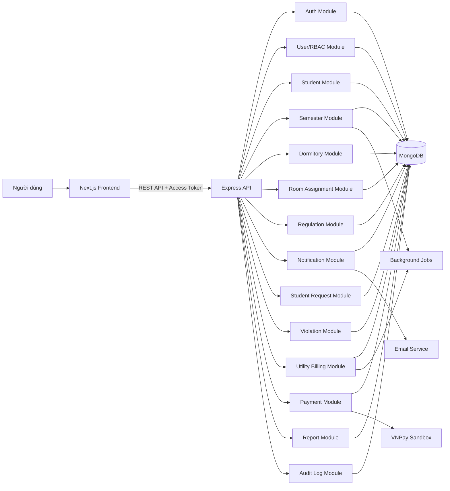
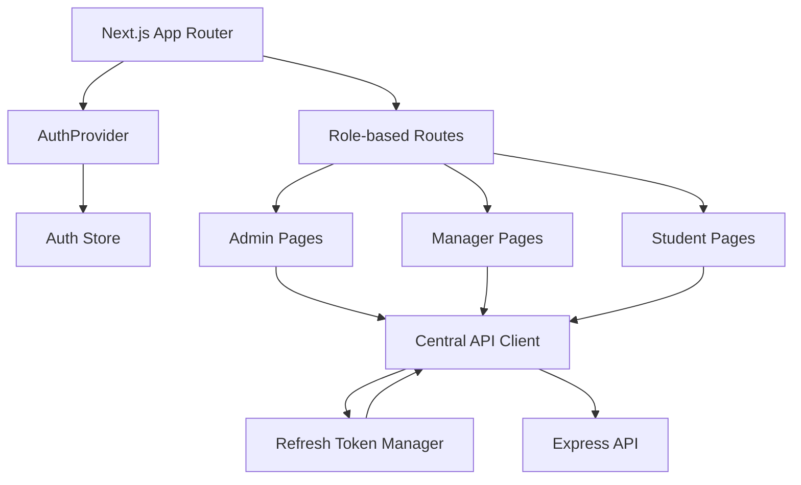
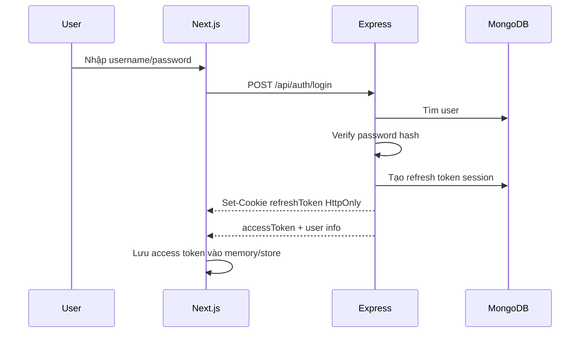
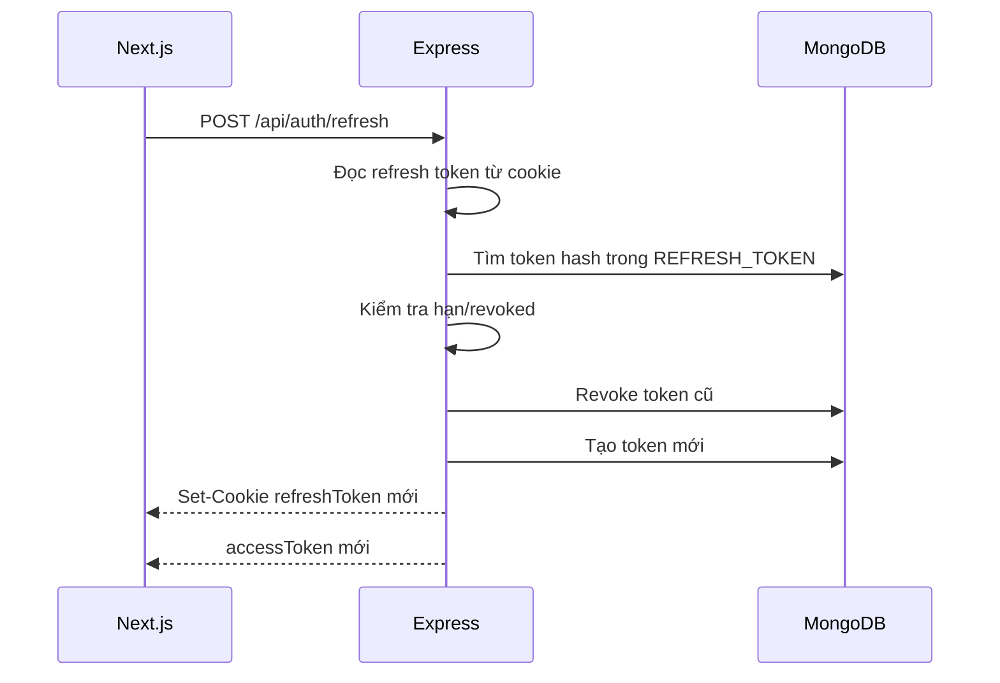
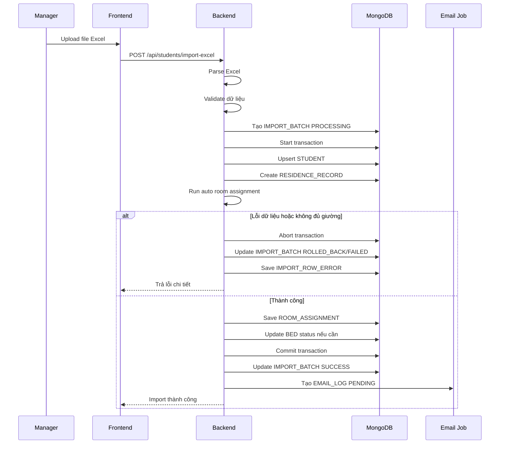
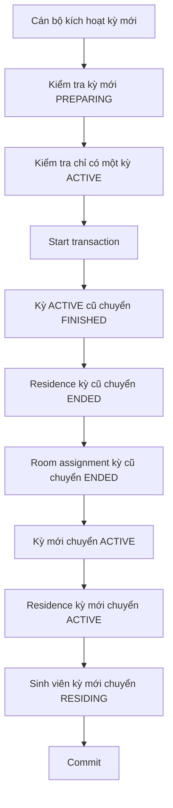
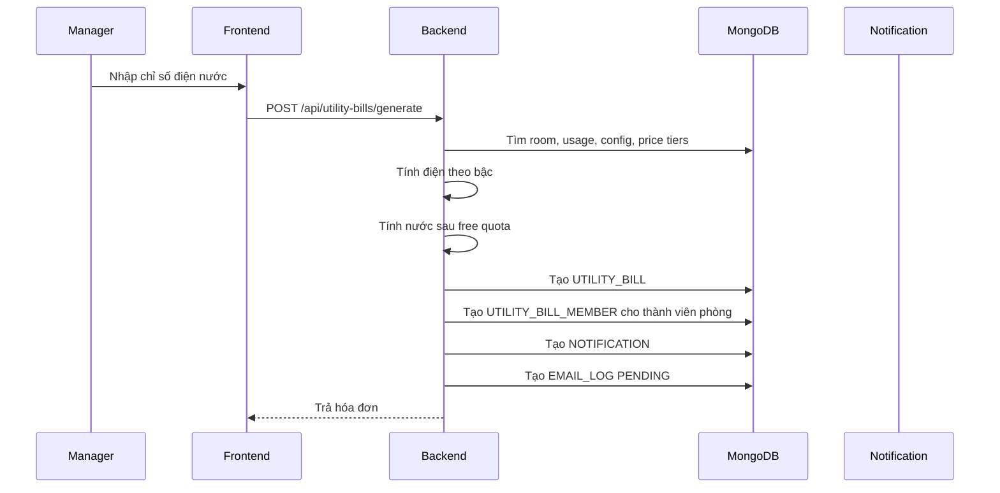
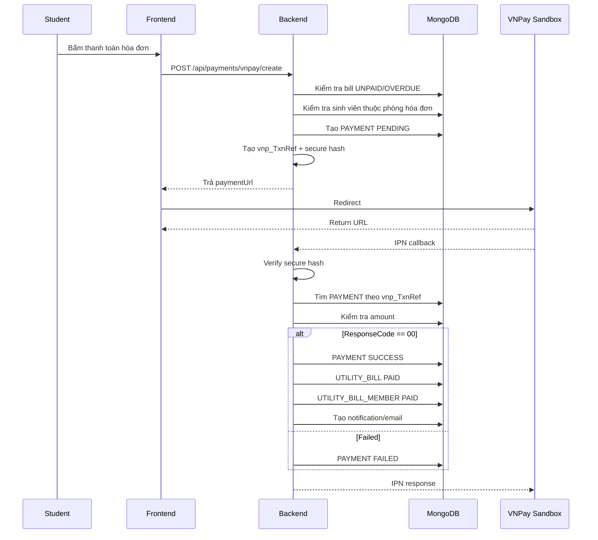
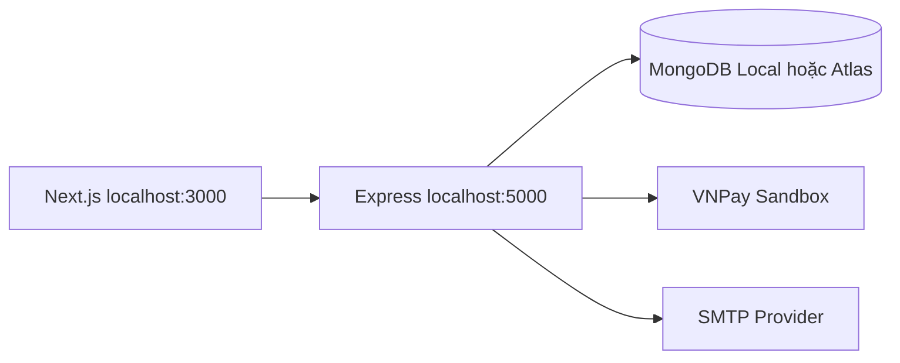
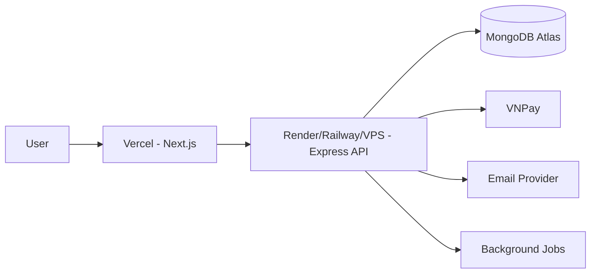

# System Design Architecture  
# Dự án: Phần mềm quản lý sinh viên ở ký túc xá HVCS

## 1. Mục tiêu tài liệu

Tài liệu này mô tả kiến trúc hệ thống chuẩn cho dự án **Quản lý sinh viên ở ký túc xá HVCS**, được hoàn thiện dựa trên nghiệp vụ và ERD/database hoàn chỉnh.

Tài liệu này dùng cho:

- Agent sinh code.
- Developer frontend.
- Developer backend.
- Thiết kế API.
- Thiết kế MongoDB/Mongoose schema.
- Thiết kế luồng xác thực JWT + refresh token.
- Tích hợp VNPay sandbox.
- Viết tài liệu phân tích thiết kế hệ thống.
- Làm chuẩn triển khai dự án theo module.

---

## 2. Nguồn thiết kế

Kiến trúc hệ thống được thiết kế dựa trên các nhóm dữ liệu chính trong ERD hoàn chỉnh:

```text
USER
PERMISSION
ROLE_PERMISSION
REFRESH_TOKEN
PASSWORD_RESET_TOKEN

STUDENT
SEMESTER
RESIDENCE_RECORD
ROOM_ASSIGNMENT

BUILDING
FLOOR
ROOM
BED

REGULATION
NOTIFICATION
NOTIFICATION_RECEIVER
STUDENT_REQUEST
VIOLATION

UTILITY_USAGE
UTILITY_BILL
UTILITY_BILL_MEMBER
PAYMENT

SYSTEM_CONFIG
ELECTRIC_PRICE_TIER

IMPORT_BATCH
IMPORT_ROW_ERROR
EMAIL_LOG
ACTIVITY_LOG
```

Các bảng trong ERD được xem là **logical database model**.  
Khi triển khai bằng MongoDB, mỗi bảng có thể map thành một collection tương ứng.

---

## 3. Tech stack

| Thành phần | Công nghệ |
|---|---|
| Frontend | Next.js |
| Frontend language | TypeScript |
| Backend | Node.js + Express |
| Backend language | TypeScript |
| Database | MongoDB |
| ODM | Mongoose |
| Authentication | JWT Access Token + Refresh Token |
| Refresh token storage | HttpOnly Cookie + DB session |
| Authorization | RBAC + Permission code |
| Payment | VNPay Sandbox |
| Email | Nodemailer / SMTP / Resend |
| Excel | ExcelJS / XLSX |
| Validation | Zod hoặc Joi |
| Logging | Winston / Pino |
| Background jobs | node-cron / BullMQ |
| Deployment FE | Vercel |
| Deployment BE | Render / Railway / VPS |
| Database hosting | MongoDB Atlas |

---

## 4. Kiến trúc tổng thể

Hệ thống được chia thành 5 lớp chính:

1. **Client Layer**
   - Next.js frontend.
   - Hiển thị giao diện cho Admin, Manager, Student.
   - Gọi API thông qua API client tập trung.
   - Không xử lý nghiệp vụ phức tạp.

2. **API Layer**
   - Express routes.
   - Middleware xác thực.
   - Middleware phân quyền.
   - Validate request.
   - Chuẩn hóa response.

3. **Business Service Layer**
   - Xử lý nghiệp vụ chính.
   - Import Excel.
   - Xếp phòng tự động.
   - Tạo hóa đơn.
   - Xác nhận thanh toán.
   - Gửi thông báo.
   - Ghi audit log.

4. **Data Access Layer**
   - Mongoose models.
   - Repository/query helper.
   - Transaction/session MongoDB.
   - Index và constraint.

5. **Infrastructure Layer**
   - MongoDB Atlas.
   - VNPay sandbox.
   - Email provider.
   - File storage nếu cần.
   - Background jobs.

---

## 5. Sơ đồ kiến trúc tổng thể



---

## 6. Nguyên tắc kiến trúc

## 6.1. Backend là nguồn sự thật

Frontend chỉ hiển thị và gửi yêu cầu.  
Mọi nghiệp vụ quan trọng bắt buộc nằm ở backend:

- Xếp phòng.
- Kiểm tra giới tính phòng.
- Kiểm tra sức chứa.
- Kiểm tra một sinh viên chỉ có một giường trong một kỳ.
- Kiểm tra một giường chỉ có một sinh viên trong một kỳ.
- Rollback import Excel nếu lỗi.
- Tính hóa đơn điện nước.
- Xác minh VNPay callback.
- Chuyển trạng thái kỳ lưu trú.
- Cập nhật trạng thái sinh viên.
- Ghi audit log.

---

## 6.2. Không gắn giường trực tiếp vào sinh viên

Sinh viên không giữ `bed_id` trực tiếp.

Thiết kế đúng:

```text
STUDENT
  -> RESIDENCE_RECORD
      -> ROOM_ASSIGNMENT
          -> ROOM
          -> BED
```

Lý do:

- Một sinh viên có thể lưu trú nhiều kỳ.
- Mỗi kỳ có thể ở phòng/giường khác nhau.
- Cần lưu lịch sử kỳ cũ.
- Cần ưu tiên phòng cũ khi sang kỳ mới.
- Khi bắt đầu kỳ mới, có thể xếp lại phòng mà không mất lịch sử.

---

## 6.3. Kỳ lưu trú là trung tâm hệ thống

Các nghiệp vụ sau cần gắn với `SEMESTER`:

- Hồ sơ lưu trú.
- Xếp phòng.
- Vi phạm.
- Hóa đơn.
- Báo cáo.
- Thống kê.

Trạng thái kỳ:

```text
PREPARING  -> ACTIVE -> FINISHED
```

Quy tắc:

- Kỳ mới tạo mặc định là `PREPARING`.
- Chỉ nên có một kỳ `ACTIVE` tại một thời điểm.
- Kỳ `FINISHED` không nên sửa dữ liệu cốt lõi.
- Khi kỳ mới bắt đầu, kỳ cũ chuyển sang `FINISHED`.

---

## 6.4. Transaction cho nghiệp vụ nhiều bước

Các nghiệp vụ sau phải dùng transaction:

- Import Excel sinh viên.
- Tạo hồ sơ lưu trú hàng loạt.
- Xếp phòng tự động.
- Chuyển kỳ.
- Tạo hóa đơn hàng loạt.
- Xác nhận thanh toán VNPay.
- Xác nhận thanh toán tiền mặt.

Nếu dùng MongoDB, cần dùng:

```text
mongoose.startSession()
session.startTransaction()
commitTransaction()
abortTransaction()
```

MongoDB transaction yêu cầu replica set. MongoDB Atlas hỗ trợ sẵn.

---

## 6.5. Không gửi email trong transaction

Email không nên gửi trực tiếp trong transaction vì:

- Gửi email có thể chậm.
- Email lỗi không nên làm hỏng dữ liệu đã hợp lệ.
- Transaction giữ lock lâu.

Cách đúng:

1. Hoàn tất transaction.
2. Ghi `EMAIL_LOG` trạng thái `PENDING`.
3. Background job gửi email.
4. Cập nhật `EMAIL_LOG` thành `SENT` hoặc `FAILED`.

---

# 7. Kiến trúc frontend Next.js

## 7.1. Vai trò frontend

Frontend chịu trách nhiệm:

- Đăng nhập.
- Hiển thị giao diện theo vai trò.
- Quản lý access token trong memory/store.
- Gọi API qua API client tập trung.
- Refresh token tự động khi access token hết hạn.
- Hiển thị bảng, form, modal.
- Validate dữ liệu cơ bản trước khi gửi.
- Điều hướng theo role.

Frontend không chịu trách nhiệm:

- Tính hóa đơn chính thức.
- Xếp phòng chính thức.
- Xác nhận VNPay.
- Phân quyền nghiệp vụ cuối cùng.
- Cập nhật trạng thái lưu trú không qua API.

---

## 7.2. Sơ đồ frontend



---

## 7.3. Cấu trúc thư mục frontend

```text
frontend/
├── src/
│   ├── app/
│   │   ├── (auth)/
│   │   │   ├── login/
│   │   │   ├── forgot-password/
│   │   │   └── reset-password/
│   │   │
│   │   ├── (admin)/
│   │   │   ├── dashboard/
│   │   │   ├── users/
│   │   │   ├── permissions/
│   │   │   └── audit-logs/
│   │   │
│   │   ├── (manager)/
│   │   │   ├── dashboard/
│   │   │   ├── students/
│   │   │   ├── import-excel/
│   │   │   ├── semesters/
│   │   │   ├── dormitories/
│   │   │   ├── room-assignments/
│   │   │   ├── regulations/
│   │   │   ├── notifications/
│   │   │   ├── requests/
│   │   │   ├── violations/
│   │   │   ├── utility-billing/
│   │   │   └── reports/
│   │   │
│   │   ├── (student)/
│   │   │   ├── dashboard/
│   │   │   ├── profile/
│   │   │   ├── residence-history/
│   │   │   ├── room/
│   │   │   ├── notifications/
│   │   │   ├── requests/
│   │   │   ├── violations/
│   │   │   ├── bills/
│   │   │   └── payment/
│   │   │
│   │   ├── payment/
│   │   │   └── vnpay-return/
│   │   │
│   │   ├── forbidden/
│   │   └── layout.tsx
│   │
│   ├── components/
│   │   ├── ui/
│   │   ├── forms/
│   │   ├── tables/
│   │   ├── dialogs/
│   │   ├── layout/
│   │   └── feedback/
│   │
│   ├── features/
│   │   ├── auth/
│   │   ├── users/
│   │   ├── students/
│   │   ├── semesters/
│   │   ├── dormitories/
│   │   ├── roomAssignments/
│   │   ├── regulations/
│   │   ├── notifications/
│   │   ├── requests/
│   │   ├── violations/
│   │   ├── utilityBilling/
│   │   ├── payments/
│   │   └── reports/
│   │
│   ├── lib/
│   │   ├── api/
│   │   │   ├── apiClient.ts
│   │   │   ├── endpoints.ts
│   │   │   ├── refreshTokenManager.ts
│   │   │   └── apiError.ts
│   │   │
│   │   ├── auth/
│   │   │   ├── AuthProvider.tsx
│   │   │   ├── authStore.ts
│   │   │   ├── roleGuard.ts
│   │   │   └── permissions.ts
│   │   │
│   │   ├── validators/
│   │   ├── constants/
│   │   └── utils/
│   │
│   ├── types/
│   │   ├── auth.types.ts
│   │   ├── user.types.ts
│   │   ├── student.types.ts
│   │   ├── semester.types.ts
│   │   ├── dormitory.types.ts
│   │   ├── bill.types.ts
│   │   └── common.types.ts
│   │
│   └── middleware.ts
│
├── .env.local
└── package.json
```

---

## 7.4. Quản lý refresh token tập trung

Không xử lý refresh token trong từng page/component.

Toàn bộ logic refresh token đặt tại:

```text
src/lib/api/apiClient.ts
src/lib/api/refreshTokenManager.ts
src/lib/auth/AuthProvider.tsx
```

Chiến lược token:

| Token | Nơi lưu | Ghi chú |
|---|---|---|
| Access token | Memory/Auth store | JS đọc được, thời gian sống ngắn |
| Refresh token | HttpOnly Cookie | JS không đọc được |
| Refresh token hash | Database `REFRESH_TOKEN` | Backend kiểm tra phiên |

Không lưu refresh token trong:

```text
localStorage
sessionStorage
React state
```

---

## 7.5. Cơ chế chống refresh nhiều lần

Khi nhiều request cùng hết hạn access token, chỉ gọi `/auth/refresh` một lần.

```ts
let refreshPromise: Promise<string | null> | null = null;

export async function getFreshAccessToken() {
  if (!refreshPromise) {
    refreshPromise = refreshAccessToken().finally(() => {
      refreshPromise = null;
    });
  }

  return refreshPromise;
}
```

---

## 7.6. Route guard frontend

| Route | Quyền truy cập |
|---|---|
| `/admin/*` | ADMIN |
| `/manager/*` | MANAGER |
| `/student/*` | STUDENT |
| `/payment/vnpay-return` | STUDENT hoặc public kiểm tra trạng thái |
| `/login` | Public |

Nếu user không đủ quyền:

- Chuyển sang `/forbidden`.
- Hoặc redirect về dashboard đúng role.

---

# 8. Kiến trúc backend Express

## 8.1. Vai trò backend

Backend chịu trách nhiệm:

- Xác thực.
- Phân quyền.
- Quản lý tài khoản.
- Quản lý sinh viên.
- Quản lý kỳ lưu trú.
- Quản lý khu/tầng/phòng/giường.
- Import Excel.
- Xếp phòng.
- Quản lý nội quy.
- Quản lý thông báo.
- Quản lý đơn từ.
- Quản lý vi phạm.
- Tạo hóa đơn điện nước.
- Thanh toán VNPay.
- Thống kê báo cáo.
- Ghi audit log.
- Gửi email.

---

## 8.2. Cấu trúc thư mục backend

```text
backend/
├── src/
│   ├── app.ts
│   ├── server.ts
│   │
│   ├── config/
│   │   ├── env.ts
│   │   ├── database.ts
│   │   ├── jwt.ts
│   │   ├── cookie.ts
│   │   ├── cors.ts
│   │   ├── mail.ts
│   │   └── vnpay.ts
│   │
│   ├── common/
│   │   ├── constants/
│   │   │   ├── roles.ts
│   │   │   ├── permissions.ts
│   │   │   ├── statuses.ts
│   │   │   └── errorCodes.ts
│   │   │
│   │   ├── errors/
│   │   │   ├── AppError.ts
│   │   │   ├── NotFoundError.ts
│   │   │   ├── ValidationError.ts
│   │   │   └── ForbiddenError.ts
│   │   │
│   │   ├── middlewares/
│   │   │   ├── auth.middleware.ts
│   │   │   ├── role.middleware.ts
│   │   │   ├── permission.middleware.ts
│   │   │   ├── validate.middleware.ts
│   │   │   ├── uploadExcel.middleware.ts
│   │   │   ├── audit.middleware.ts
│   │   │   └── error.middleware.ts
│   │   │
│   │   ├── utils/
│   │   │   ├── asyncHandler.ts
│   │   │   ├── pagination.ts
│   │   │   ├── response.ts
│   │   │   ├── crypto.ts
│   │   │   ├── date.ts
│   │   │   └── money.ts
│   │   │
│   │   └── types/
│   │
│   ├── models/
│   │   ├── user.model.ts
│   │   ├── permission.model.ts
│   │   ├── rolePermission.model.ts
│   │   ├── refreshToken.model.ts
│   │   ├── passwordResetToken.model.ts
│   │   ├── student.model.ts
│   │   ├── semester.model.ts
│   │   ├── residenceRecord.model.ts
│   │   ├── building.model.ts
│   │   ├── floor.model.ts
│   │   ├── room.model.ts
│   │   ├── bed.model.ts
│   │   ├── roomAssignment.model.ts
│   │   ├── regulation.model.ts
│   │   ├── notification.model.ts
│   │   ├── notificationReceiver.model.ts
│   │   ├── studentRequest.model.ts
│   │   ├── violation.model.ts
│   │   ├── utilityUsage.model.ts
│   │   ├── utilityBill.model.ts
│   │   ├── utilityBillMember.model.ts
│   │   ├── payment.model.ts
│   │   ├── systemConfig.model.ts
│   │   ├── electricPriceTier.model.ts
│   │   ├── importBatch.model.ts
│   │   ├── importRowError.model.ts
│   │   ├── emailLog.model.ts
│   │   └── activityLog.model.ts
│   │
│   ├── modules/
│   │   ├── auth/
│   │   ├── users/
│   │   ├── permissions/
│   │   ├── students/
│   │   ├── semesters/
│   │   ├── dormitories/
│   │   ├── roomAssignments/
│   │   ├── regulations/
│   │   ├── notifications/
│   │   ├── studentRequests/
│   │   ├── violations/
│   │   ├── utilityBilling/
│   │   ├── payments/
│   │   ├── configs/
│   │   ├── imports/
│   │   ├── reports/
│   │   └── auditLogs/
│   │
│   ├── jobs/
│   │   ├── residenceReminder.job.ts
│   │   ├── invoiceOverdue.job.ts
│   │   ├── emailRetry.job.ts
│   │   └── semesterTransition.job.ts
│   │
│   ├── integrations/
│   │   ├── vnpay/
│   │   │   ├── vnpay.client.ts
│   │   │   ├── vnpay.signature.ts
│   │   │   └── vnpay.types.ts
│   │   └── mail/
│   │       ├── mail.client.ts
│   │       └── mail.templates.ts
│   │
│   └── scripts/
│       ├── seedAdmin.ts
│       ├── seedPermissions.ts
│       ├── seedConfigs.ts
│       ├── seedElectricTiers.ts
│       └── seedDormitory.ts
│
├── .env
├── package.json
└── tsconfig.json
```

---

## 8.3. Layer chuẩn trong mỗi module

Mỗi module nên có cấu trúc:

```text
module/
├── module.routes.ts
├── module.controller.ts
├── module.service.ts
├── module.validation.ts
├── module.types.ts
└── module.repository.ts
```

Luồng xử lý:

```text
Route
  -> Middleware
    -> Controller
      -> Service
        -> Repository/Model
          -> MongoDB
```

### Route

- Khai báo endpoint.
- Gắn middleware auth/role/permission/validation.

### Controller

- Nhận request.
- Gọi service.
- Trả response.
- Không viết nghiệp vụ phức tạp.

### Service

- Chứa nghiệp vụ chính.
- Gọi nhiều model/repository.
- Quản lý transaction.
- Gọi notification/email/audit log.

### Repository/Model

- Tương tác database.
- Tối ưu query.
- Tạo aggregate nếu cần.

---

# 9. Mapping ERD sang MongoDB collections

## 9.1. Quy ước tên collection

| ERD Table | MongoDB Collection |
|---|---|
| `USER` | `users` |
| `PERMISSION` | `permissions` |
| `ROLE_PERMISSION` | `role_permissions` |
| `REFRESH_TOKEN` | `refresh_tokens` |
| `PASSWORD_RESET_TOKEN` | `password_reset_tokens` |
| `STUDENT` | `students` |
| `SEMESTER` | `semesters` |
| `RESIDENCE_RECORD` | `residence_records` |
| `BUILDING` | `buildings` |
| `FLOOR` | `floors` |
| `ROOM` | `rooms` |
| `BED` | `beds` |
| `ROOM_ASSIGNMENT` | `room_assignments` |
| `REGULATION` | `regulations` |
| `NOTIFICATION` | `notifications` |
| `NOTIFICATION_RECEIVER` | `notification_receivers` |
| `STUDENT_REQUEST` | `student_requests` |
| `VIOLATION` | `violations` |
| `UTILITY_USAGE` | `utility_usages` |
| `UTILITY_BILL` | `utility_bills` |
| `UTILITY_BILL_MEMBER` | `utility_bill_members` |
| `PAYMENT` | `payments` |
| `SYSTEM_CONFIG` | `system_configs` |
| `ELECTRIC_PRICE_TIER` | `electric_price_tiers` |
| `IMPORT_BATCH` | `import_batches` |
| `IMPORT_ROW_ERROR` | `import_row_errors` |
| `EMAIL_LOG` | `email_logs` |
| `ACTIVITY_LOG` | `activity_logs` |

---

## 9.2. Reference strategy

Nên dùng reference là chính vì hệ thống cần lịch sử và nhiều quan hệ.

Ví dụ:

```ts
studentId: Types.ObjectId
semesterId: Types.ObjectId
roomId: Types.ObjectId
bedId: Types.ObjectId
```

Có thể denormalize bằng snapshot để giữ lịch sử:

```ts
studentSnapshot: {
  studentCode: string;
  fullName: string;
  gender: string;
  className: string;
  major: string;
  department: string;
  academicYear: string;
}

roomSnapshot: {
  buildingName: string;
  floorNumber: number;
  roomNumber: string;
  bedNumber: string;
}
```

Snapshot nên dùng trong:

- `ROOM_ASSIGNMENT`
- `UTILITY_BILL`
- `PAYMENT`
- `ACTIVITY_LOG`

---

## 9.3. Index quan trọng

Các index bắt buộc nên tạo trong Mongoose:

### User

```ts
userSchema.index({ username: 1 }, { unique: true });
userSchema.index({ email: 1 }, { unique: true });
userSchema.index({ role: 1 });
userSchema.index({ status: 1 });
```

### Student

```ts
studentSchema.index({ studentCode: 1 }, { unique: true });
studentSchema.index({ email: 1 });
studentSchema.index({ residenceType: 1 });
studentSchema.index({ className: 1, major: 1, department: 1, academicYear: 1 });
```

### Semester

```ts
semesterSchema.index({ term: 1, academicYear: 1 }, { unique: true });
semesterSchema.index({ status: 1 });
semesterSchema.index({ startDate: 1, endDate: 1 });
```

### ResidenceRecord

```ts
residenceRecordSchema.index({ studentId: 1, semesterId: 1 }, { unique: true });
residenceRecordSchema.index({ semesterId: 1 });
residenceRecordSchema.index({ status: 1 });
```

### RoomAssignment

```ts
roomAssignmentSchema.index({ studentId: 1, semesterId: 1 }, { unique: true });
roomAssignmentSchema.index({ bedId: 1, semesterId: 1 }, { unique: true });
roomAssignmentSchema.index({ roomId: 1, semesterId: 1 });
```

### UtilityUsage

```ts
utilityUsageSchema.index({ roomId: 1, month: 1, year: 1 }, { unique: true });
```

### UtilityBill

```ts
utilityBillSchema.index({ roomId: 1, month: 1, year: 1 }, { unique: true });
utilityBillSchema.index({ status: 1 });
utilityBillSchema.index({ dueDate: 1 });
```

### Payment

```ts
paymentSchema.index({ vnpTxnRef: 1 }, { unique: true, sparse: true });
paymentSchema.index({ billId: 1 });
paymentSchema.index({ status: 1 });
```

---

# 10. Module backend theo database

## 10.1. Auth Module

### Collections liên quan

```text
users
refresh_tokens
password_reset_tokens
activity_logs
email_logs
```

### Chức năng

- Login.
- Logout.
- Refresh token.
- Forgot password.
- Reset password.
- Change password.
- Get current user.

### API

```text
POST /api/auth/login
POST /api/auth/logout
POST /api/auth/refresh
POST /api/auth/forgot-password
POST /api/auth/reset-password
POST /api/auth/change-password
GET  /api/auth/me
```

### Rule

- Password phải hash bằng bcrypt hoặc argon2.
- Refresh token lưu HttpOnly Cookie.
- Chỉ lưu hash refresh token trong database.
- Rotate refresh token sau mỗi lần refresh.
- Nếu refresh token bị reuse, revoke toàn bộ session liên quan.

---

## 10.2. User & Permission Module

### Collections liên quan

```text
users
permissions
role_permissions
activity_logs
```

### Chức năng

- CRUD user.
- Khóa/mở khóa tài khoản.
- Gán role.
- Quản lý permission.
- Xem danh sách tài khoản.

### API

```text
GET    /api/users
GET    /api/users/:id
POST   /api/users
PUT    /api/users/:id
PATCH  /api/users/:id/lock
PATCH  /api/users/:id/unlock

GET    /api/permissions
POST   /api/permissions
GET    /api/role-permissions
PUT    /api/role-permissions/:role
```

---

## 10.3. Student Module

### Collections liên quan

```text
students
users
residence_records
room_assignments
import_batches
import_row_errors
email_logs
activity_logs
```

### Chức năng

- CRUD sinh viên.
- Import Excel.
- Export Excel.
- Xem lịch sử lưu trú.
- Tạo tài khoản sinh viên nếu cần.
- Cập nhật `residenceType`.

### API

```text
GET    /api/students
GET    /api/students/:id
POST   /api/students
PUT    /api/students/:id
POST   /api/students/import-excel
GET    /api/students/export-excel
GET    /api/students/:id/residence-history
GET    /api/students/me
```

---

## 10.4. Semester Module

### Collections liên quan

```text
semesters
residence_records
room_assignments
students
activity_logs
```

### Chức năng

- Tạo kỳ lưu trú.
- Cập nhật kỳ đang chuẩn bị.
- Kích hoạt kỳ.
- Kết thúc kỳ.
- Khóa sửa dữ liệu kỳ đã kết thúc.

### API

```text
GET    /api/semesters
GET    /api/semesters/:id
POST   /api/semesters
PUT    /api/semesters/:id
PATCH  /api/semesters/:id/activate
PATCH  /api/semesters/:id/finish
```

### Rule

- Chỉ có một kỳ `ACTIVE`.
- Có thể có một kỳ `PREPARING`.
- Kỳ `FINISHED` không sửa dữ liệu cốt lõi.
- Khi activate kỳ mới:
  - Kỳ cũ chuyển `FINISHED`.
  - Kỳ mới chuyển `ACTIVE`.
  - Residence record chuyển `ACTIVE`.
  - Student chuyển `RESIDING`.

---

## 10.5. Dormitory Module

### Collections liên quan

```text
buildings
floors
rooms
beds
room_assignments
activity_logs
```

### Chức năng

- CRUD khu/dãy.
- CRUD tầng.
- CRUD phòng.
- CRUD giường.
- Cấu hình phòng nam/nữ.
- Cấu hình phòng ưu tiên tân sinh viên.
- Đánh dấu phòng bảo trì.

### API

```text
GET    /api/buildings
POST   /api/buildings
PUT    /api/buildings/:id

GET    /api/floors
POST   /api/floors
PUT    /api/floors/:id

GET    /api/rooms
POST   /api/rooms
PUT    /api/rooms/:id

GET    /api/beds
POST   /api/beds
PUT    /api/beds/:id
```

---

## 10.6. Room Assignment Module

### Collections liên quan

```text
students
semesters
residence_records
buildings
floors
rooms
beds
room_assignments
system_configs
activity_logs
```

### Chức năng

- Xếp phòng tự động.
- Xếp phòng thủ công.
- Xem danh sách phòng theo kỳ.
- Xem phòng hiện tại của sinh viên.
- Preview kết quả xếp phòng nếu cần.
- Rollback khi không đủ phòng.

### API

```text
POST /api/room-assignments/auto
POST /api/room-assignments/manual
GET  /api/room-assignments/semester/:semesterId
GET  /api/room-assignments/student/:studentId
GET  /api/room-assignments/rooms/:roomId/members
```

### Rule

- Sinh viên chỉ có một giường trong một kỳ.
- Giường chỉ có một sinh viên trong một kỳ.
- Phòng nam chỉ nhận nam.
- Phòng nữ chỉ nhận nữ.
- Không vượt sức chứa phòng.
- Ưu tiên phòng tân sinh viên nếu là kỳ 1.
- Ưu tiên phòng cũ nếu hợp lệ.
- Ưu tiên cùng lớp, ngành, khóa, khoa.

---

## 10.7. Regulation Module

### Collections liên quan

```text
regulations
notifications
notification_receivers
activity_logs
```

### Chức năng

- Tạo nội quy.
- Lưu nháp.
- Công bố nội quy.
- Lưu trữ nội quy cũ.
- Sinh viên xem nội quy đã công bố.

### API

```text
GET   /api/regulations
GET   /api/regulations/:id
POST  /api/regulations
PUT   /api/regulations/:id
PATCH /api/regulations/:id/publish
PATCH /api/regulations/:id/archive
```

---

## 10.8. Notification Module

### Collections liên quan

```text
notifications
notification_receivers
students
email_logs
activity_logs
```

### Chức năng

- Tạo thông báo chung.
- Tạo thông báo riêng.
- Gửi thông báo qua app.
- Ghi email log nếu cần gửi email.
- Sinh viên đánh dấu đã đọc.

### API

```text
GET   /api/notifications
POST  /api/notifications/general
POST  /api/notifications/private
GET   /api/notifications/me
PATCH /api/notifications/:id/read
```

---

## 10.9. Student Request Module

### Collections liên quan

```text
student_requests
students
notifications
notification_receivers
email_logs
activity_logs
```

### Chức năng

- Sinh viên nộp đơn.
- Cán bộ xem đơn.
- Cán bộ cập nhật trạng thái.
- Gửi thông báo khi trạng thái thay đổi.
- Hỗ trợ đơn tiền mặt nếu cần.

### API

```text
GET   /api/student-requests
POST  /api/student-requests
GET   /api/student-requests/:id
PATCH /api/student-requests/:id/status
GET   /api/student-requests/me
```

---

## 10.10. Violation Module

### Collections liên quan

```text
violations
students
semesters
notifications
notification_receivers
email_logs
activity_logs
```

### Chức năng

- Tạo vi phạm.
- Cập nhật vi phạm.
- Xem vi phạm theo sinh viên.
- Sinh viên xem vi phạm cá nhân.
- Gửi thông báo/email khi có vi phạm.

### API

```text
GET  /api/violations
POST /api/violations
GET  /api/violations/me
GET  /api/violations/student/:studentId
PUT  /api/violations/:id
```

---

## 10.11. Utility Billing Module

### Collections liên quan

```text
utility_usages
utility_bills
utility_bill_members
rooms
room_assignments
students
system_configs
electric_price_tiers
notifications
email_logs
activity_logs
```

### Chức năng

- Nhập chỉ số điện nước.
- Tạo hóa đơn.
- Tính điện theo bậc thang.
- Tính nước sau khi trừ số m3 miễn phí.
- Chia hóa đơn theo thành viên phòng nếu cần.
- Theo dõi quá hạn.
- Gửi thông báo hóa đơn.

### API

```text
POST  /api/utility-usages
GET   /api/utility-usages

POST  /api/utility-bills/generate
GET   /api/utility-bills
GET   /api/utility-bills/:id
GET   /api/utility-bills/me
PATCH /api/utility-bills/:id/mark-overdue
PATCH /api/utility-bills/:id/cancel
```

---

## 10.12. Payment Module

### Collections liên quan

```text
payments
utility_bills
utility_bill_members
students
notifications
email_logs
activity_logs
```

### Chức năng

- Tạo URL thanh toán VNPay.
- Xử lý VNPay return.
- Xử lý VNPay IPN.
- Verify secure hash.
- Cập nhật hóa đơn.
- Cập nhật thành viên phòng.
- Xác nhận tiền mặt.

### API

```text
POST /api/payments/vnpay/create
GET  /api/payments/vnpay/return
GET  /api/payments/vnpay/ipn
GET  /api/payments/status
POST /api/payments/cash-confirm
GET  /api/payments/bill/:billId
```

---

## 10.13. Config Module

### Collections liên quan

```text
system_configs
electric_price_tiers
activity_logs
```

### Chức năng

- Cấu hình số m3 nước miễn phí.
- Cấu hình giá nước.
- Cấu hình VAT.
- Cấu hình số ngày hạn đóng tiền.
- Cấu hình số ngày nhắc hết hạn lưu trú.
- Cấu hình bậc giá điện.
- Cấu hình phòng ưu tiên tân sinh viên.

### API

```text
GET   /api/configs
PUT   /api/configs/:key

GET   /api/electric-price-tiers
POST  /api/electric-price-tiers
PUT   /api/electric-price-tiers/:id
```

---

## 10.14. Import Module

### Collections liên quan

```text
import_batches
import_row_errors
students
residence_records
room_assignments
email_logs
activity_logs
```

### Chức năng

- Lưu lịch sử import Excel.
- Lưu lỗi từng dòng.
- Rollback khi import/xếp phòng thất bại.
- Theo dõi trạng thái import.

### API

```text
GET /api/import-batches
GET /api/import-batches/:id
GET /api/import-batches/:id/errors
```

---

## 10.15. Report Module

### Collections liên quan

```text
students
semesters
residence_records
room_assignments
utility_bills
payments
violations
student_requests
```

### Chức năng

- Báo cáo số sinh viên lưu trú.
- Báo cáo phòng/giường.
- Báo cáo hóa đơn.
- Báo cáo thanh toán.
- Báo cáo vi phạm.
- Báo cáo đơn từ.

### API

```text
GET /api/reports/residence
GET /api/reports/dormitory-capacity
GET /api/reports/utility
GET /api/reports/payments
GET /api/reports/violations
GET /api/reports/requests
```

---

# 11. Authentication & Authorization

## 11.1. JWT Access Token

Payload đề xuất:

```json
{
  "sub": "userId",
  "role": "MANAGER",
  "permissions": ["STUDENT_READ", "STUDENT_IMPORT"],
  "tokenVersion": 1,
  "iat": 1710000000,
  "exp": 1710000900
}
```

Thời gian sống:

```text
15 phút
```

---

## 11.2. Refresh Token

Refresh token:

- Tạo khi login.
- Gửi về frontend bằng HttpOnly Cookie.
- Hash rồi lưu vào `REFRESH_TOKEN`.
- Rotate mỗi lần refresh.
- Revoke khi logout.

Cookie đề xuất:

```ts
{
  httpOnly: true,
  secure: process.env.NODE_ENV === "production",
  sameSite: "lax",
  path: "/api/auth/refresh",
  maxAge: 7 * 24 * 60 * 60 * 1000
}
```

---

## 11.3. Login flow



---

## 11.4. Refresh flow



---

## 11.5. RBAC

Role chính:

```text
ADMIN
MANAGER
STUDENT
```

### ADMIN

- Quản lý user.
- Quản lý quyền.
- Xem audit log.
- Khóa/mở khóa tài khoản.
- Xem toàn bộ dữ liệu.

### MANAGER

- Quản lý sinh viên.
- Quản lý kỳ.
- Quản lý phòng/giường.
- Import Excel.
- Xếp phòng.
- Quản lý hóa đơn.
- Quản lý thông báo.
- Quản lý đơn từ.
- Quản lý vi phạm.
- Xem báo cáo.

### STUDENT

- Xem hồ sơ cá nhân.
- Xem lịch sử lưu trú.
- Xem thông tin phòng.
- Xem thông báo.
- Nộp đơn.
- Xem hóa đơn.
- Thanh toán hóa đơn.
- Xem vi phạm cá nhân.

---

## 11.6. Permission code đề xuất

```text
USER_READ
USER_CREATE
USER_UPDATE
USER_LOCK
USER_UNLOCK

PERMISSION_READ
PERMISSION_MANAGE

STUDENT_READ
STUDENT_CREATE
STUDENT_UPDATE
STUDENT_IMPORT
STUDENT_EXPORT

SEMESTER_READ
SEMESTER_CREATE
SEMESTER_UPDATE
SEMESTER_ACTIVATE
SEMESTER_FINISH

DORM_READ
DORM_CREATE
DORM_UPDATE

ROOM_ASSIGNMENT_READ
ROOM_ASSIGNMENT_AUTO
ROOM_ASSIGNMENT_MANUAL

REGULATION_READ
REGULATION_MANAGE
REGULATION_PUBLISH

NOTIFICATION_READ
NOTIFICATION_SEND

REQUEST_READ
REQUEST_CREATE
REQUEST_UPDATE_STATUS

VIOLATION_READ
VIOLATION_CREATE
VIOLATION_UPDATE

UTILITY_READ
UTILITY_USAGE_CREATE
UTILITY_BILL_CREATE
UTILITY_BILL_UPDATE

PAYMENT_CREATE
PAYMENT_CONFIRM_CASH
PAYMENT_READ

CONFIG_READ
CONFIG_UPDATE

REPORT_READ
AUDIT_LOG_READ
```

---

# 12. Luồng nghiệp vụ chính

## 12.1. Luồng import Excel và xếp phòng



### Transaction boundary

Các thao tác trong transaction:

```text
upsert students
create residence records
create room assignments
update bed status
write activity log
```

Không gửi email trực tiếp trong transaction.

---

## 12.2. Thuật toán xếp phòng tự động

Thứ tự ưu tiên:

1. Phòng ưu tiên tân sinh viên nếu là kỳ 1.
2. Đúng giới tính phòng.
3. Ưu tiên phòng cũ nếu sinh viên đã ở kỳ trước.
4. Cùng lớp.
5. Cùng ngành.
6. Cùng khóa.
7. Cùng khoa.

Pseudocode:

```pseudo
function autoAssignRooms(semesterId):
    begin transaction

    semester = findSemester(semesterId)
    validate semester.status == PREPARING

    students = findStudentsInResidenceRecords(semesterId)
    rooms = findActiveRoomsWithBeds()
    previousAssignments = findPreviousAssignments(students)

    if not enoughCapacityByGender(students, rooms):
        rollback
        throw ROOM_NOT_ENOUGH_CAPACITY

    assignments = []

    if semester.term == SEMESTER_1:
        assignFreshmenToPriorityRooms()

    assignStudentsToPreviousRoomsIfValid()

    remainingStudents = getUnassignedStudents()

    groups = groupByPriority(
        remainingStudents,
        [gender, className, major, academicYear, department]
    )

    for group in groups:
        assignGroupToBestRooms(group)

    validateNoDuplicateStudentInSemester()
    validateNoDuplicateBedInSemester()
    validateRoomGender()
    validateRoomCapacity()

    saveAssignments(assignments)

    commit
```

---

## 12.3. Luồng chuyển kỳ lưu trú



---

## 12.4. Luồng kết thúc cư trú

Khi kỳ kết thúc:

- `SEMESTER.status = FINISHED`
- `RESIDENCE_RECORD.status = ENDED`
- `ROOM_ASSIGNMENT.status = ENDED`
- Sinh viên không thuộc kỳ active nào chuyển `NOT_RESIDING`
- Gửi thông báo/email kết thúc cư trú.

---

## 12.5. Luồng tạo hóa đơn điện nước



---

## 12.6. Công thức tiền nước

```text
paidWaterUsage = max(waterUsage - freeWaterQuota, 0)
waterCost = paidWaterUsage * waterUnitPrice
```

Các giá trị lấy từ `SYSTEM_CONFIG`.

---

## 12.7. Công thức tiền điện

Tiền điện tính theo `ELECTRIC_PRICE_TIER`.

```text
electricBeforeVat = sum(kWhInTier * tierUnitPrice)
vatAmount = electricBeforeVat * vatRate
electricityCost = electricBeforeVat + vatAmount
totalCost = electricityCost + waterCost
```

Snapshot cấu hình giá tại thời điểm tạo hóa đơn lưu vào:

```text
UTILITY_BILL.price_config_snapshot
```

---

## 12.8. Luồng VNPay sandbox



---

## 12.9. Nguyên tắc xử lý VNPay

- Return URL chỉ dùng để hiển thị kết quả cho người dùng.
- IPN mới là nơi cập nhật trạng thái thanh toán chính thức.
- Phải verify secure hash.
- Phải kiểm tra amount.
- Phải xử lý idempotent.
- Nếu payment đã `SUCCESS`, không xử lý cộng/trừ lại.
- `vnp_txn_ref` phải unique.

---

# 13. API design chuẩn

## 13.1. Base URL

```text
Local:      http://localhost:5000/api
Production: https://your-api-domain.com/api
```

---

## 13.2. Success response

```json
{
  "success": true,
  "message": "Success",
  "data": {}
}
```

---

## 13.3. Error response

```json
{
  "success": false,
  "message": "Validation failed",
  "errorCode": "VALIDATION_ERROR",
  "errors": [
    {
      "field": "email",
      "message": "Email không hợp lệ"
    }
  ]
}
```

---

## 13.4. Pagination response

```json
{
  "success": true,
  "data": {
    "items": [],
    "pagination": {
      "page": 1,
      "limit": 10,
      "totalItems": 100,
      "totalPages": 10
    }
  }
}
```

---

## 13.5. Query convention

```text
?page=1&limit=10&keyword=abc&sortBy=createdAt&sortOrder=desc
```

---

## 13.6. Error code chuẩn

```text
AUTH_INVALID_CREDENTIALS
AUTH_ACCOUNT_LOCKED
AUTH_TOKEN_EXPIRED
AUTH_REFRESH_TOKEN_EXPIRED
AUTH_FORBIDDEN
AUTH_UNAUTHORIZED

USER_NOT_FOUND
STUDENT_NOT_FOUND
SEMESTER_NOT_FOUND
ROOM_NOT_FOUND
BED_NOT_FOUND
BILL_NOT_FOUND
PAYMENT_NOT_FOUND

VALIDATION_ERROR
EXCEL_INVALID_FORMAT
EXCEL_IMPORT_FAILED
EXCEL_IMPORT_ROLLED_BACK

SEMESTER_ALREADY_ACTIVE
SEMESTER_INVALID_STATUS
SEMESTER_FINISHED_LOCKED

ROOM_NOT_ENOUGH_CAPACITY
ROOM_GENDER_MISMATCH
ROOM_ASSIGNMENT_DUPLICATE_STUDENT
ROOM_ASSIGNMENT_DUPLICATE_BED
ROOM_ASSIGNMENT_FAILED

UTILITY_USAGE_INVALID
UTILITY_BILL_ALREADY_EXISTS
UTILITY_BILL_ALREADY_PAID
UTILITY_BILL_OVERDUE

PAYMENT_SIGNATURE_INVALID
PAYMENT_AMOUNT_INVALID
PAYMENT_ALREADY_PROCESSED
PAYMENT_FAILED

INTERNAL_SERVER_ERROR
```

---

# 14. Background jobs

## 14.1. Residence reminder job

Chức năng:

- Kiểm tra sinh viên sắp hết thời gian lưu trú.
- Dựa trên config `residence_end_reminder_days`.
- Tạo notification và email log.

Chạy:

```text
Mỗi ngày lúc 08:00
```

---

## 14.2. Invoice overdue job

Chức năng:

- Tìm hóa đơn `UNPAID` quá `dueDate`.
- Chuyển sang `OVERDUE`.
- Gửi cảnh báo cho thành viên phòng.

Chạy:

```text
Mỗi ngày lúc 08:30
```

---

## 14.3. Email retry job

Chức năng:

- Tìm `EMAIL_LOG.status = FAILED`.
- Retry nếu `retry_count` chưa vượt giới hạn.
- Cập nhật trạng thái gửi.

Chạy:

```text
Mỗi 10 hoặc 30 phút
```

---

## 14.4. Semester transition job

Chức năng:

- Kiểm tra kỳ đến ngày kết thúc.
- Chuyển kỳ hiện tại sang `FINISHED` nếu đến hạn.
- Có thể chỉ nhắc quản lý xác nhận thay vì tự động chuyển.

Khuyến nghị:

- Không tự động chuyển kỳ hoàn toàn nếu nghiệp vụ yêu cầu cán bộ xác nhận.
- Nên có màn hình manager xác nhận chuyển kỳ.

---

# 15. Security architecture

## 15.1. Password security

- Hash bằng bcrypt hoặc argon2.
- Không lưu password plain text.
- Không log password.
- Reset password token phải hash trong DB.
- Reset token có hạn ngắn, ví dụ 15 phút.

---

## 15.2. JWT security

- Access token sống ngắn.
- Refresh token rotate.
- Dùng `tokenVersion` để revoke token hàng loạt.
- Không đưa dữ liệu nhạy cảm vào JWT.
- Secret phải lưu trong `.env`.

---

## 15.3. Cookie security

Production:

```ts
httpOnly: true
secure: true
sameSite: "lax"
path: "/api/auth/refresh"
```

Development localhost:

```ts
secure: false
```

---

## 15.4. CORS

Backend cần bật credentials:

```ts
app.use(cors({
  origin: process.env.CLIENT_URL,
  credentials: true
}));
```

---

## 15.5. Rate limit

Nên rate limit:

- Login.
- Forgot password.
- Reset password.
- Refresh token.
- Upload Excel.

Không rate limit quá chặt VNPay IPN, nhưng phải verify secure hash.

---

## 15.6. Upload Excel security

Kiểm tra:

- File extension `.xlsx`.
- MIME type.
- Dung lượng tối đa.
- Số dòng tối đa.
- Header đúng mẫu.
- Không xử lý macro.
- Validate từng dòng.
- Lưu lỗi từng dòng vào `IMPORT_ROW_ERROR`.

---

## 15.7. Audit log

Các hành động cần ghi log:

- Login thành công/thất bại.
- Khóa/mở khóa tài khoản.
- Import Excel.
- Rollback import.
- Tạo/cập nhật kỳ.
- Kích hoạt/kết thúc kỳ.
- Xếp phòng tự động/thủ công.
- Tạo hóa đơn.
- Xác nhận thanh toán tiền mặt.
- VNPay callback.
- Tạo vi phạm.
- Xử lý đơn từ.
- Công bố nội quy.
- Thay đổi config giá điện nước.

---

# 16. Environment variables

## 16.1. Backend `.env`

```env
NODE_ENV=development
PORT=5000

CLIENT_URL=http://localhost:3000
SERVER_URL=http://localhost:5000

MONGODB_URI=mongodb://localhost:27017/hvcs_dormitory

JWT_ACCESS_SECRET=change_me_access_secret
JWT_REFRESH_SECRET=change_me_refresh_secret
ACCESS_TOKEN_EXPIRES_IN=15m
REFRESH_TOKEN_EXPIRES_IN=7d

COOKIE_SECRET=change_me_cookie_secret

SMTP_HOST=smtp.gmail.com
SMTP_PORT=587
SMTP_USER=your_email@gmail.com
SMTP_PASS=your_app_password
SMTP_FROM=HVCS Dormitory <your_email@gmail.com>

VNPAY_TMN_CODE=your_sandbox_tmn_code
VNPAY_HASH_SECRET=your_sandbox_hash_secret
VNPAY_URL=https://sandbox.vnpayment.vn/paymentv2/vpcpay.html
VNPAY_RETURN_URL=http://localhost:3000/payment/vnpay-return
VNPAY_IPN_URL=http://localhost:5000/api/payments/vnpay/ipn

LOG_LEVEL=debug
```

---

## 16.2. Frontend `.env.local`

```env
NEXT_PUBLIC_API_BASE_URL=http://localhost:5000/api
NEXT_PUBLIC_APP_NAME=HVCS Dormitory
```

Không đưa secret vào frontend.

---

# 17. Deployment architecture

## 17.1. Local development



---

## 17.2. Production/staging



---

## 17.3. Deploy lưu ý

- FE và BE khác domain thì phải cấu hình CORS credentials đúng.
- Cookie refresh token cần `SameSite=None; Secure` nếu cross-site thực sự.
- Nếu frontend/backend cùng site hoặc subdomain dễ cấu hình hơn.
- VNPay return URL phải trỏ đúng frontend.
- VNPay IPN URL phải trỏ đúng backend public URL.
- MongoDB Atlas phải whitelist IP hoặc dùng network access phù hợp.

---

# 18. Checklist triển khai theo phase

## Phase 1: Foundation

- [ ] Setup monorepo.
- [ ] Setup Next.js TypeScript.
- [ ] Setup Express TypeScript.
- [ ] Setup MongoDB/Mongoose.
- [ ] Setup error handler.
- [ ] Setup response format.
- [ ] Setup env validation.
- [ ] Setup logging.

## Phase 2: Auth & RBAC

- [ ] User model.
- [ ] Permission model.
- [ ] Role permission.
- [ ] Login.
- [ ] Logout.
- [ ] Refresh token.
- [ ] Forgot/reset password.
- [ ] Auth middleware.
- [ ] Role/permission middleware.
- [ ] Frontend AuthProvider.
- [ ] Central API client.

## Phase 3: Dormitory core data

- [ ] Student CRUD.
- [ ] Semester CRUD.
- [ ] Building CRUD.
- [ ] Floor CRUD.
- [ ] Room CRUD.
- [ ] Bed CRUD.

## Phase 4: Import Excel & Room Assignment

- [ ] Import Excel template.
- [ ] Validate Excel.
- [ ] Import batch.
- [ ] Import row error.
- [ ] Residence record.
- [ ] Auto room assignment.
- [ ] Manual room assignment.
- [ ] Rollback transaction.
- [ ] Export Excel.

## Phase 5: Student features

- [ ] Student dashboard.
- [ ] Profile.
- [ ] Residence history.
- [ ] Room info.
- [ ] Notification.
- [ ] Regulation.
- [ ] Student request.
- [ ] Violation view.

## Phase 6: Utility Billing & Payment

- [ ] System config.
- [ ] Electric price tier.
- [ ] Utility usage.
- [ ] Generate utility bill.
- [ ] Utility bill member.
- [ ] VNPay create payment.
- [ ] VNPay return page.
- [ ] VNPay IPN verify.
- [ ] Cash confirmation.
- [ ] Overdue job.

## Phase 7: Reports & Audit

- [ ] Residence report.
- [ ] Capacity report.
- [ ] Utility report.
- [ ] Payment report.
- [ ] Violation report.
- [ ] Request report.
- [ ] Audit log viewer.
- [ ] Email retry job.

---

# 19. Quy ước coding cho agent

## 19.1. Backend

Agent khi sinh backend phải tuân thủ:

- Không viết nghiệp vụ trong route.
- Controller mỏng.
- Service xử lý nghiệp vụ.
- Model có schema/index rõ ràng.
- Validate input bằng Zod/Joi.
- Dùng transaction cho nghiệp vụ nhiều bước.
- Dùng AppError/errorCode thống nhất.
- Dùng audit log cho thao tác quan trọng.
- Không hard-code giá điện/nước.
- Không hard-code role/permission rải rác.
- Không gửi email trực tiếp trong transaction.
- VNPay callback phải verify hash.
- Payment phải idempotent.

---

## 19.2. Frontend

Agent khi sinh frontend phải tuân thủ:

- Không gọi `fetch` rải rác trong component.
- Mọi API auth đi qua `apiClient`.
- Refresh token xử lý tập trung.
- Không lưu refresh token trong localStorage.
- Route phải guard theo role.
- Form phải validate.
- Bảng phải có search/filter/pagination.
- Hiển thị lỗi rõ ràng.
- Không để frontend tự quyết định nghiệp vụ quan trọng.

---

## 19.3. Database/Mongoose

Agent khi sinh schema phải tuân thủ:

- Enum rõ ràng.
- Index theo ERD.
- Unique constraint quan trọng.
- Reference bằng ObjectId.
- Snapshot ở bảng lịch sử/hóa đơn.
- Không xóa cứng dữ liệu lịch sử.
- Hóa đơn đã thanh toán không sửa trực tiếp.
- Kỳ đã kết thúc không sửa dữ liệu cốt lõi.

---

# 20. Kết luận kiến trúc

Kiến trúc chuẩn của hệ thống KTX HVCS cần xoay quanh 5 trục chính:

1. **Kỳ lưu trú**
   - Là trung tâm quản lý lịch sử.
   - Mọi lưu trú, xếp phòng, hóa đơn, vi phạm nên gắn với kỳ.

2. **Sinh viên không giữ giường trực tiếp**
   - Giường nằm trong `ROOM_ASSIGNMENT`.
   - Giúp lưu lịch sử và xếp lại phòng theo kỳ.

3. **Import Excel và xếp phòng phải dùng transaction**
   - Nếu thiếu phòng hoặc lỗi dữ liệu thì rollback toàn bộ.

4. **Hóa đơn tính theo phòng**
   - Có `UTILITY_BILL`.
   - Có `UTILITY_BILL_MEMBER` để cập nhật trạng thái từng thành viên.

5. **Thanh toán VNPay phải an toàn**
   - Verify secure hash.
   - Check amount.
   - Idempotent.
   - Chỉ IPN là nguồn cập nhật thanh toán chính thức.

Tài liệu này là chuẩn để agent tiếp tục sinh:

- Mongoose schema.
- Express modules.
- REST API.
- Next.js pages.
- Service logic.
- Transaction logic.
- VNPay integration.
- Test cases.
