# Design Architecture  
# Dự án: Phần mềm quản lý sinh viên ở ký túc xá HVCS

## 1. Mục tiêu tài liệu

Tài liệu này mô tả thiết kế kiến trúc tổng thể cho dự án **Xây dựng phần mềm quản lý sinh viên ở ký túc xá HVCS** dựa trên nghiệp vụ đã phân tích.

Tài liệu dùng làm context cho:

- Agent sinh code.
- Developer thiết kế backend.
- Developer thiết kế frontend.
- Thiết kế database MongoDB.
- Viết API.
- Thiết kế authentication / authorization.
- Tích hợp thanh toán VNPay sandbox.
- Viết tài liệu phân tích thiết kế hệ thống.

---

## 2. Tech stack chính

| Thành phần | Công nghệ |
|---|---|
| Frontend | Next.js |
| Frontend language | TypeScript |
| Backend | Node.js + Express |
| Backend language | TypeScript |
| Authentication | JWT Access Token + Refresh Token |
| Refresh Token Strategy | Quản lý tập trung |
| Database | MongoDB |
| ODM | Mongoose |
| Payment | VNPay Sandbox |
| Email | SMTP / Gmail / Resend / Nodemailer |
| File Excel | XLSX / ExcelJS |
| Validation | Zod / Joi |
| Logging | Winston / Pino |
| API style | REST API |
| Authorization | RBAC |
| Deployment frontend | Vercel |
| Deployment backend | Render / Railway / VPS |
| Database hosting | MongoDB Atlas |

---

## 3. Tổng quan kiến trúc hệ thống

Hệ thống được chia thành 3 lớp chính:

1. **Frontend Next.js**
   - Giao diện cho quản trị viên, cán bộ quản lý và sinh viên.
   - Quản lý phiên đăng nhập.
   - Gọi API backend.
   - Điều hướng theo vai trò.
   - Quản lý refresh token tập trung qua một module duy nhất.

2. **Backend Express**
   - Cung cấp REST API.
   - Xử lý nghiệp vụ ký túc xá.
   - Xác thực JWT.
   - Phân quyền RBAC.
   - Xử lý import / export Excel.
   - Xếp phòng tự động.
   - Tính hóa đơn điện nước.
   - Tích hợp VNPay sandbox.
   - Gửi email.
   - Ghi audit log.

3. **MongoDB**
   - Lưu người dùng, sinh viên, kỳ lưu trú, phòng, giường, hóa đơn, thanh toán, đơn từ, thông báo, vi phạm, audit log.

---

## 4. Sơ đồ kiến trúc tổng thể

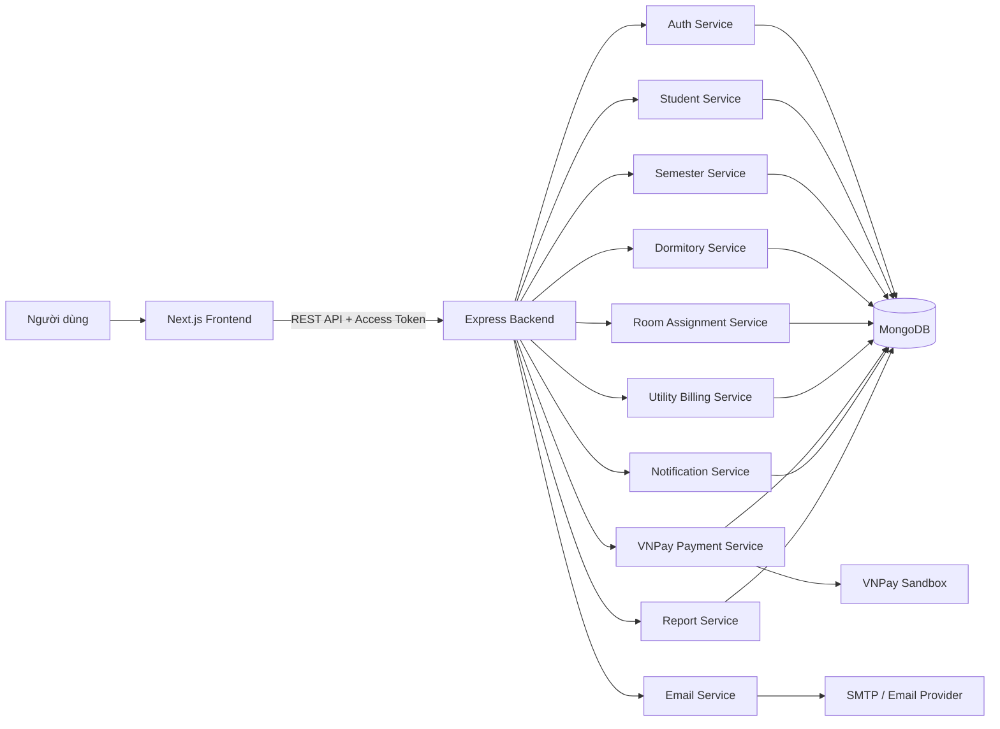

---

## 5. Nguyên tắc thiết kế kiến trúc

## 5.1. Tách rõ frontend và backend

Frontend không xử lý nghiệp vụ phức tạp.

Frontend chỉ nên:

- Hiển thị dữ liệu.
- Validate cơ bản.
- Gọi API.
- Quản lý UI state.
- Quản lý phiên đăng nhập.
- Điều hướng theo vai trò.

Backend chịu trách nhiệm:

- Validate nghiệp vụ.
- Xử lý transaction.
- Tính toán hóa đơn.
- Xếp phòng.
- Phân quyền.
- Ghi log.
- Gửi email.
- Tích hợp thanh toán.

---

## 5.2. Backend là nguồn sự thật

Mọi rule nghiệp vụ quan trọng phải nằm ở backend:

- Xếp phòng đúng giới tính.
- Không vượt sức chứa.
- Rollback khi import lỗi.
- Một sinh viên chỉ có một giường trong một kỳ.
- Một giường chỉ được gán cho một sinh viên trong một kỳ.
- Tính tiền điện nước.
- Xác minh thanh toán VNPay.
- Cập nhật trạng thái kỳ lưu trú.
- Cập nhật trạng thái đơn từ.

Frontend không được tự quyết định các nghiệp vụ này.

---

## 5.3. Thiết kế theo module nghiệp vụ

Mỗi nhóm nghiệp vụ nên tách thành một module riêng.

Ví dụ:

```text
auth
users
students
semesters
dormitories
roomAssignments
regulations
notifications
studentRequests
utilityBilling
payments
violations
reports
auditLogs
```

Mỗi module backend nên có:

```text
route -> controller -> service -> repository/model
```

---

## 5.4. Transaction cho nghiệp vụ quan trọng

Các nghiệp vụ sau bắt buộc nên dùng transaction MongoDB:

- Import Excel sinh viên.
- Xếp phòng tự động.
- Tạo kỳ lưu trú và gán sinh viên.
- Tạo hóa đơn hàng loạt.
- Cập nhật thanh toán hóa đơn.
- Chuyển trạng thái kỳ lưu trú.

Lưu ý:

> MongoDB transaction hoạt động tốt nhất khi dùng MongoDB replica set. Nếu dùng MongoDB Atlas thì đã hỗ trợ sẵn.

---

# 6. Kiến trúc frontend Next.js

## 6.1. Vai trò của frontend

Frontend Next.js chịu trách nhiệm hiển thị giao diện theo từng vai trò:

- Quản trị viên hệ thống.
- Cán bộ quản lý ký túc xá.
- Sinh viên.

Frontend gọi API backend thông qua một API client tập trung.

---

## 6.2. Kiến trúc frontend đề xuất

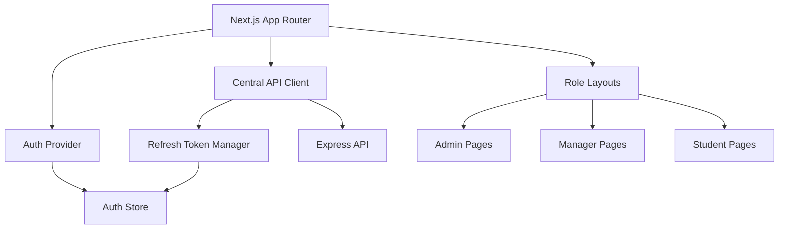

---

## 6.3. Cấu trúc thư mục frontend đề xuất

```text
frontend/
├── src/
│   ├── app/
│   │   ├── (auth)/
│   │   │   ├── login/
│   │   │   ├── forgot-password/
│   │   │   └── reset-password/
│   │   ├── (admin)/
│   │   │   ├── users/
│   │   │   ├── roles/
│   │   │   └── audit-logs/
│   │   ├── (manager)/
│   │   │   ├── dashboard/
│   │   │   ├── students/
│   │   │   ├── semesters/
│   │   │   ├── dormitories/
│   │   │   ├── room-assignments/
│   │   │   ├── regulations/
│   │   │   ├── notifications/
│   │   │   ├── requests/
│   │   │   ├── utility-billing/
│   │   │   ├── violations/
│   │   │   └── reports/
│   │   ├── (student)/
│   │   │   ├── profile/
│   │   │   ├── residence-history/
│   │   │   ├── room/
│   │   │   ├── notifications/
│   │   │   ├── requests/
│   │   │   ├── violations/
│   │   │   └── invoices/
│   │   └── layout.tsx
│   │
│   ├── components/
│   │   ├── ui/
│   │   ├── forms/
│   │   ├── tables/
│   │   ├── dialogs/
│   │   └── layout/
│   │
│   ├── features/
│   │   ├── auth/
│   │   ├── users/
│   │   ├── students/
│   │   ├── semesters/
│   │   ├── dormitories/
│   │   ├── roomAssignments/
│   │   ├── utilityBilling/
│   │   └── payments/
│   │
│   ├── lib/
│   │   ├── api/
│   │   │   ├── apiClient.ts
│   │   │   ├── endpoints.ts
│   │   │   ├── refreshTokenManager.ts
│   │   │   └── apiError.ts
│   │   ├── auth/
│   │   │   ├── authStore.ts
│   │   │   ├── AuthProvider.tsx
│   │   │   ├── roleGuard.ts
│   │   │   └── permissions.ts
│   │   ├── validators/
│   │   └── utils/
│   │
│   ├── middleware.ts
│   └── types/
│       ├── auth.types.ts
│       ├── user.types.ts
│       ├── student.types.ts
│       ├── semester.types.ts
│       └── common.types.ts
│
├── .env.local
├── next.config.ts
└── package.json
```

---

# 7. Quản lý access token và refresh token tập trung

## 7.1. Mục tiêu

Không để logic refresh token rải rác ở nhiều page hoặc nhiều component.

Toàn bộ xử lý token cần nằm trong:

```text
src/lib/api/apiClient.ts
src/lib/api/refreshTokenManager.ts
src/lib/auth/AuthProvider.tsx
```

---

## 7.2. Chiến lược token đề xuất

| Token | Nơi lưu | Thời gian sống | Ghi chú |
|---|---|---|---|
| Access token | Memory / Auth store | Ngắn, ví dụ 10-15 phút | Dùng gọi API |
| Refresh token | HttpOnly Secure Cookie | Dài hơn, ví dụ 7-30 ngày | Không cho JavaScript đọc trực tiếp |
| Refresh token hash | MongoDB | Theo phiên đăng nhập | Backend dùng để kiểm tra |

Khuyến nghị:

- Không lưu refresh token trong `localStorage`.
- Không lưu access token lâu dài trong `localStorage`.
- Refresh token nên được backend set vào cookie `HttpOnly`, `Secure`, `SameSite`.
- Frontend chỉ gọi endpoint refresh, không trực tiếp đọc refresh token.
- Backend rotate refresh token sau mỗi lần refresh để giảm rủi ro bị đánh cắp.

---

## 7.3. Flow đăng nhập

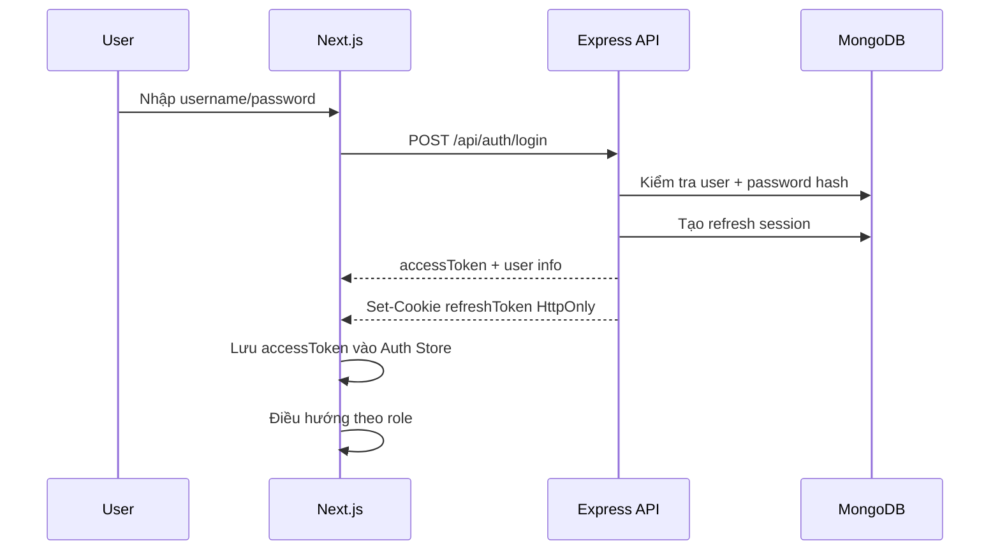

---

## 7.4. Flow gọi API bình thường

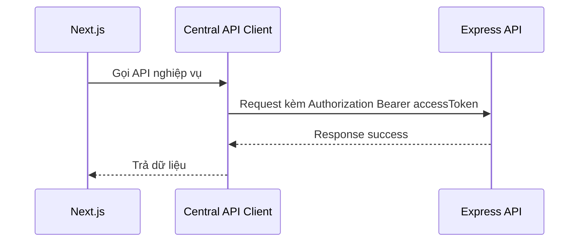

---

## 7.5. Flow access token hết hạn

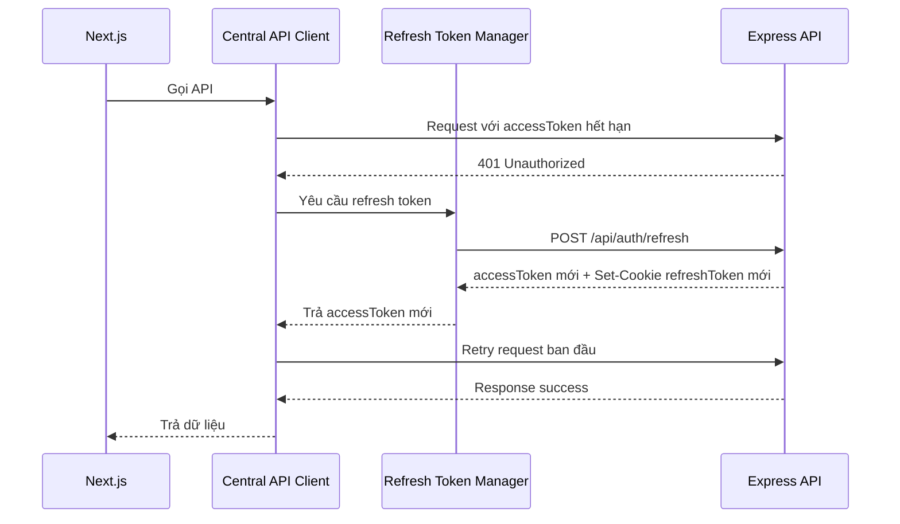

---

## 7.6. Chống refresh nhiều lần đồng thời

Khi nhiều request cùng bị `401`, frontend không nên gọi nhiều request refresh cùng lúc.

Cần dùng cơ chế `refreshPromise`.

Pseudocode:

```ts
let refreshPromise: Promise<string | null> | null = null;

async function getNewAccessToken() {
  if (!refreshPromise) {
    refreshPromise = refreshAccessToken()
      .finally(() => {
        refreshPromise = null;
      });
  }

  return refreshPromise;
}
```

Ý nghĩa:

- Request đầu tiên gặp 401 sẽ gọi refresh.
- Các request khác chờ chung promise đó.
- Sau khi refresh xong, tất cả request retry với access token mới.

---

## 7.7. API client tập trung

Tất cả request phải đi qua `apiClient`.

Ví dụ trách nhiệm của `apiClient`:

- Tự gắn access token.
- Tự xử lý lỗi `401`.
- Tự gọi refresh token.
- Tự retry request cũ.
- Tự logout nếu refresh token hết hạn.
- Chuẩn hóa lỗi API.
- Chuẩn hóa response.

Không gọi trực tiếp `fetch` hoặc `axios` rải rác trong component.

---

## 7.8. Auth store

Auth store lưu:

```ts
type AuthState = {
  user: CurrentUser | null;
  accessToken: string | null;
  isAuthenticated: boolean;
  isLoading: boolean;
  role: "ADMIN" | "MANAGER" | "STUDENT" | null;
};
```

Frontend dùng state này để:

- Hiển thị menu theo role.
- Guard route.
- Gửi access token vào API.
- Xử lý logout.

---

## 7.9. Route guard frontend

Frontend cần guard route theo role.

Ví dụ:

| Route | Role được phép |
|---|---|
| `/admin/*` | ADMIN |
| `/manager/*` | MANAGER |
| `/student/*` | STUDENT |
| `/login` | Public |

Nếu user không đủ quyền:

- Chuyển về trang `403`.
- Hoặc chuyển về dashboard đúng role.

---

# 8. Kiến trúc backend Express

## 8.1. Vai trò backend

Backend chịu trách nhiệm xử lý toàn bộ nghiệp vụ:

- Authentication.
- Authorization.
- User management.
- Student management.
- Import / export Excel.
- Semester management.
- Dormitory management.
- Room assignment.
- Regulation.
- Notification.
- Student request.
- Utility billing.
- VNPay payment.
- Violation.
- Report.
- Audit log.

---

## 8.2. Cấu trúc thư mục backend đề xuất

```text
backend/
├── src/
│   ├── app.ts
│   ├── server.ts
│   │
│   ├── config/
│   │   ├── env.ts
│   │   ├── database.ts
│   │   ├── jwt.ts
│   │   ├── vnpay.ts
│   │   └── mail.ts
│   │
│   ├── common/
│   │   ├── constants/
│   │   ├── errors/
│   │   ├── helpers/
│   │   ├── middlewares/
│   │   ├── types/
│   │   └── utils/
│   │
│   ├── modules/
│   │   ├── auth/
│   │   │   ├── auth.routes.ts
│   │   │   ├── auth.controller.ts
│   │   │   ├── auth.service.ts
│   │   │   ├── auth.validation.ts
│   │   │   └── token.service.ts
│   │   │
│   │   ├── users/
│   │   ├── students/
│   │   ├── semesters/
│   │   ├── dormitories/
│   │   ├── roomAssignments/
│   │   ├── regulations/
│   │   ├── notifications/
│   │   ├── studentRequests/
│   │   ├── utilityBilling/
│   │   ├── payments/
│   │   ├── violations/
│   │   ├── reports/
│   │   └── auditLogs/
│   │
│   ├── models/
│   │   ├── user.model.ts
│   │   ├── refreshToken.model.ts
│   │   ├── student.model.ts
│   │   ├── semester.model.ts
│   │   ├── building.model.ts
│   │   ├── floor.model.ts
│   │   ├── room.model.ts
│   │   ├── bed.model.ts
│   │   ├── roomAssignment.model.ts
│   │   ├── regulation.model.ts
│   │   ├── notification.model.ts
│   │   ├── studentRequest.model.ts
│   │   ├── utilityInvoice.model.ts
│   │   ├── payment.model.ts
│   │   ├── violation.model.ts
│   │   └── auditLog.model.ts
│   │
│   ├── jobs/
│   │   ├── residenceReminder.job.ts
│   │   ├── invoiceOverdue.job.ts
│   │   └── emailRetry.job.ts
│   │
│   └── scripts/
│       ├── seedAdmin.ts
│       ├── seedRooms.ts
│       └── seedConfigs.ts
│
├── .env
├── package.json
└── tsconfig.json
```

---

## 8.3. Layer backend

Mỗi module nên chia theo layer:

```text
Route
  -> Controller
    -> Service
      -> Model / Repository
```

### Route

Khai báo URL và middleware.

Ví dụ:

```text
POST /api/students/import-excel
```

### Controller

Nhận request, lấy dữ liệu từ `req`, gọi service và trả response.

Không viết logic nghiệp vụ phức tạp trong controller.

### Service

Xử lý nghiệp vụ chính.

Ví dụ:

- Kiểm tra kỳ lưu trú.
- Validate sinh viên.
- Xếp phòng.
- Tính hóa đơn.
- Gửi email.
- Ghi audit log.

### Model / Repository

Tương tác với MongoDB thông qua Mongoose.

---

## 8.4. Middleware backend

Các middleware quan trọng:

| Middleware | Chức năng |
|---|---|
| `authMiddleware` | Kiểm tra access token |
| `roleMiddleware` | Kiểm tra vai trò |
| `permissionMiddleware` | Kiểm tra quyền chi tiết |
| `validateRequest` | Validate body / params / query |
| `errorHandler` | Xử lý lỗi tập trung |
| `auditLogMiddleware` | Ghi log thao tác quan trọng |
| `rateLimitMiddleware` | Giới hạn request |
| `uploadExcelMiddleware` | Upload file Excel |
| `vnpayIpnMiddleware` | Xử lý callback / IPN từ VNPay |

---

# 9. Authentication và Authorization

## 9.1. JWT Access Token

Access token dùng để gọi API.

Payload đề xuất:

```json
{
  "sub": "userId",
  "role": "MANAGER",
  "permissions": ["STUDENT_READ", "STUDENT_IMPORT"],
  "tokenVersion": 1,
  "iat": 1710000000,
  "exp": 1710000900
}
```

Thời gian sống đề xuất:

```text
ACCESS_TOKEN_EXPIRES_IN=15m
```

---

## 9.2. Refresh Token

Refresh token dùng để cấp access token mới.

Nên lưu refresh token trong cookie:

```text
HttpOnly
Secure
SameSite=Lax hoặc Strict
Path=/api/auth/refresh
```

Backend lưu hash refresh token trong database, không lưu plain text.

Collection đề xuất:

```text
refresh_tokens
```

Trường dữ liệu:

| Trường | Ý nghĩa |
|---|---|
| `userId` | User sở hữu token |
| `tokenHash` | Hash refresh token |
| `expiresAt` | Ngày hết hạn |
| `revokedAt` | Ngày bị thu hồi |
| `replacedByTokenHash` | Token mới thay thế nếu rotate |
| `ipAddress` | IP đăng nhập |
| `userAgent` | Trình duyệt / thiết bị |
| `createdAt` | Ngày tạo |

---

## 9.3. Refresh token rotation

Mỗi lần gọi `/api/auth/refresh`:

1. Backend đọc refresh token từ cookie.
2. Hash token.
3. Tìm trong database.
4. Kiểm tra token còn hạn và chưa bị revoke.
5. Thu hồi token cũ.
6. Tạo refresh token mới.
7. Set cookie mới.
8. Trả access token mới.

Nếu phát hiện token cũ đã bị dùng lại:

- Thu hồi toàn bộ refresh token của user hoặc thiết bị.
- Bắt user đăng nhập lại.
- Ghi audit log cảnh báo bảo mật.

---

## 9.4. Role-based access control

Các role chính:

```text
ADMIN
MANAGER
STUDENT
```

### ADMIN

Có quyền:

- Quản lý tài khoản.
- Phân quyền.
- Khóa / mở khóa tài khoản.
- Xem audit log.
- Xem toàn hệ thống.

### MANAGER

Có quyền:

- Quản lý sinh viên.
- Import Excel.
- Quản lý kỳ lưu trú.
- Quản lý khu / tầng / phòng / giường.
- Xếp phòng.
- Quản lý nội quy.
- Quản lý thông báo.
- Quản lý đơn từ.
- Quản lý hóa đơn.
- Quản lý vi phạm.
- Xem báo cáo.

### STUDENT

Có quyền:

- Xem thông tin cá nhân.
- Xem lịch sử lưu trú.
- Xem phòng hiện tại nếu đang cư trú.
- Xem thông báo.
- Nộp đơn.
- Xem vi phạm cá nhân.
- Xem hóa đơn phòng mình.
- Thanh toán hóa đơn.

---

## 9.5. Permission code đề xuất

```text
USER_CREATE
USER_READ
USER_UPDATE
USER_LOCK
USER_UNLOCK

STUDENT_READ
STUDENT_CREATE
STUDENT_UPDATE
STUDENT_IMPORT
STUDENT_EXPORT

SEMESTER_READ
SEMESTER_CREATE
SEMESTER_UPDATE
SEMESTER_ACTIVATE
SEMESTER_FINISH

DORM_READ
DORM_CREATE
DORM_UPDATE

ROOM_ASSIGNMENT_AUTO
ROOM_ASSIGNMENT_MANUAL
ROOM_ASSIGNMENT_READ

REGULATION_MANAGE
NOTIFICATION_SEND

REQUEST_READ
REQUEST_UPDATE_STATUS

UTILITY_READ
UTILITY_CREATE_INVOICE
UTILITY_CONFIRM_PAYMENT

VIOLATION_READ
VIOLATION_CREATE
VIOLATION_UPDATE

REPORT_READ
AUDIT_LOG_READ
```

---

# 10. Thiết kế MongoDB

## 10.1. Nguyên tắc thiết kế MongoDB

MongoDB không bắt buộc chuẩn hóa giống SQL, nhưng với hệ thống này nên dùng hướng **reference là chính**, vì dữ liệu có nhiều quan hệ và cần truy vấn lịch sử.

Nên dùng reference cho:

- User - Student.
- Student - Semester.
- Student - Room Assignment.
- Room - Bed.
- Room - Invoice.
- Invoice - Payment.
- Student - Violation.
- Student - Request.

Có thể denormalize một số trường đọc nhiều để tăng hiệu năng:

- Lưu `studentCode`, `studentName` trong `roomAssignments`.
- Lưu `roomCode`, `buildingName` trong `utilityInvoices`.
- Lưu `semesterName` trong lịch sử nếu cần.
- Lưu snapshot thành viên phòng trong hóa đơn nếu cần giữ lịch sử.

---

## 10.2. Collections chính

```text
users
roles
permissions
refresh_tokens

students
semesters
residence_records

buildings
floors
rooms
beds
room_assignments

regulations
notifications
notification_recipients

student_requests
violations

utility_meter_readings
utility_invoices
payments

system_configs
electric_price_tiers

audit_logs
email_logs
```

---

## 10.3. User model

```ts
type User = {
  _id: ObjectId;
  username: string;
  email: string;
  passwordHash: string;
  role: "ADMIN" | "MANAGER" | "STUDENT";
  permissions: string[];
  status: "ACTIVE" | "LOCKED";
  tokenVersion: number;
  lastLoginAt?: Date;
  createdAt: Date;
  updatedAt: Date;
};
```

Index đề xuất:

```text
unique(username)
unique(email)
index(role)
index(status)
```

---

## 10.4. Student model

```ts
type Student = {
  _id: ObjectId;
  userId?: ObjectId;

  studentCode: string;
  fullName: string;
  gender: "MALE" | "FEMALE";
  email: string;

  className: string;
  major: string;
  cohort: string;
  faculty: string;

  isFreshman?: boolean;

  residenceType: "NOT_RESIDING" | "RESIDING";

  createdAt: Date;
  updatedAt: Date;
};
```

Index đề xuất:

```text
unique(studentCode)
index(email)
index(className)
index(major)
index(cohort)
index(faculty)
index(residenceType)
```

---

## 10.5. Semester model

```ts
type Semester = {
  _id: ObjectId;
  name: "Kỳ 1" | "Kỳ 2" | "Kỳ hè" | string;
  academicYear: string;

  startDate: Date;
  endDate: Date;

  status: "PREPARING" | "ACTIVE" | "FINISHED";

  createdBy: ObjectId;
  createdAt: Date;
  updatedAt: Date;
};
```

Ràng buộc nghiệp vụ:

- Chỉ có tối đa một kỳ `ACTIVE`.
- Kỳ `FINISHED` không được sửa dữ liệu cốt lõi.
- Kỳ mới tạo mặc định `PREPARING`.

---

## 10.6. ResidenceRecord model

```ts
type ResidenceRecord = {
  _id: ObjectId;

  studentId: ObjectId;
  semesterId: ObjectId;

  startDate: Date;
  endDate: Date;

  status: "PREPARING" | "ACTIVE" | "FINISHED" | "CANCELLED";

  createdAt: Date;
  updatedAt: Date;
};
```

Index đề xuất:

```text
unique(studentId, semesterId)
index(semesterId)
index(status)
```

---

## 10.7. Dormitory models

### Building

```ts
type Building = {
  _id: ObjectId;
  name: string;
  description?: string;
  isActive: boolean;
  createdAt: Date;
  updatedAt: Date;
};
```

### Floor

```ts
type Floor = {
  _id: ObjectId;
  buildingId: ObjectId;
  floorNumber: number;
  description?: string;
};
```

### Room

```ts
type Room = {
  _id: ObjectId;
  buildingId: ObjectId;
  floorId: ObjectId;

  roomCode: string;
  genderType: "MALE" | "FEMALE";
  capacity: number;

  status: "ACTIVE" | "MAINTENANCE" | "INACTIVE";

  isFreshmanPriority: boolean;

  createdAt: Date;
  updatedAt: Date;
};
```

### Bed

```ts
type Bed = {
  _id: ObjectId;
  roomId: ObjectId;
  bedCode: string;
  status: "AVAILABLE" | "OCCUPIED" | "BROKEN" | "MAINTENANCE";
  createdAt: Date;
  updatedAt: Date;
};
```

---

## 10.8. RoomAssignment model

```ts
type RoomAssignment = {
  _id: ObjectId;

  studentId: ObjectId;
  semesterId: ObjectId;
  roomId: ObjectId;
  bedId: ObjectId;

  studentSnapshot: {
    studentCode: string;
    fullName: string;
    gender: "MALE" | "FEMALE";
    className: string;
    major: string;
    cohort: string;
    faculty: string;
  };

  roomSnapshot: {
    buildingName: string;
    floorNumber: number;
    roomCode: string;
    bedCode: string;
  };

  assignedBy: ObjectId;
  assignedAt: Date;

  status: "ACTIVE" | "ENDED" | "CANCELLED";
};
```

Index đề xuất:

```text
unique(studentId, semesterId, status=ACTIVE)
unique(bedId, semesterId, status=ACTIVE)
index(roomId, semesterId)
index(semesterId)
```

---

## 10.9. UtilityInvoice model

```ts
type UtilityInvoice = {
  _id: ObjectId;

  roomId: ObjectId;
  semesterId: ObjectId;

  month: number;
  year: number;

  electricUsage: number;
  waterUsage: number;

  electricAmount: number;
  waterAmount: number;
  vatAmount: number;
  totalAmount: number;

  dueDate: Date;

  status:
    | "UNPAID"
    | "PENDING_CONFIRMATION"
    | "PAID"
    | "OVERDUE"
    | "CANCELLED";

  roomSnapshot: {
    buildingName: string;
    roomCode: string;
    memberIds: ObjectId[];
    memberStudentCodes: string[];
  };

  createdBy: ObjectId;
  createdAt: Date;
  updatedAt: Date;
};
```

Index đề xuất:

```text
unique(roomId, month, year)
index(semesterId)
index(status)
index(dueDate)
```

---

## 10.10. Payment model

```ts
type Payment = {
  _id: ObjectId;

  invoiceId: ObjectId;
  roomId: ObjectId;

  method: "VNPAY" | "CASH";

  amount: number;
  status: "PENDING" | "SUCCESS" | "FAILED" | "CANCELLED";

  vnpTxnRef?: string;
  vnpTransactionNo?: string;
  vnpResponseCode?: string;
  vnpPayDate?: string;
  vnpSecureHash?: string;

  paidBy?: ObjectId;
  confirmedBy?: ObjectId;

  rawData?: Record<string, any>;

  createdAt: Date;
  updatedAt: Date;
};
```

Index đề xuất:

```text
unique(vnpTxnRef)
index(invoiceId)
index(status)
index(method)
```

---

# 11. Module nghiệp vụ backend

## 11.1. Auth Module

Chức năng:

- Đăng nhập.
- Đăng xuất.
- Refresh token.
- Quên mật khẩu.
- Reset mật khẩu.
- Đổi mật khẩu.
- Thu hồi refresh token.
- Quản lý phiên đăng nhập.

API đề xuất:

```text
POST /api/auth/login
POST /api/auth/logout
POST /api/auth/refresh
POST /api/auth/forgot-password
POST /api/auth/reset-password
POST /api/auth/change-password
GET  /api/auth/me
```

---

## 11.2. User Module

Chức năng:

- Tạo tài khoản.
- Cập nhật tài khoản.
- Khóa / mở khóa tài khoản.
- Gán vai trò.
- Xem danh sách tài khoản.

API đề xuất:

```text
GET    /api/users
GET    /api/users/:id
POST   /api/users
PUT    /api/users/:id
PATCH  /api/users/:id/lock
PATCH  /api/users/:id/unlock
```

---

## 11.3. Student Module

Chức năng:

- Quản lý hồ sơ sinh viên.
- Import Excel.
- Export Excel.
- Xem lịch sử lưu trú.
- Tạo tài khoản sinh viên nếu cần.

API đề xuất:

```text
GET    /api/students
GET    /api/students/:id
POST   /api/students
PUT    /api/students/:id
POST   /api/students/import-excel
GET    /api/students/export-excel
GET    /api/students/:id/residence-history
```

---

## 11.4. Semester Module

Chức năng:

- Tạo kỳ lưu trú.
- Cập nhật kỳ lưu trú.
- Chuyển kỳ đang chuẩn bị sang đang lưu trú.
- Chuyển kỳ đang lưu trú sang đã lưu trú.
- Không cho sửa kỳ đã hoàn tất.

API đề xuất:

```text
GET    /api/semesters
GET    /api/semesters/:id
POST   /api/semesters
PUT    /api/semesters/:id
PATCH  /api/semesters/:id/activate
PATCH  /api/semesters/:id/finish
```

---

## 11.5. Dormitory Module

Chức năng:

- Quản lý khu.
- Quản lý tầng.
- Quản lý phòng.
- Quản lý giường.
- Cấu hình phòng nam / nữ.
- Cấu hình phòng ưu tiên tân sinh viên.

API đề xuất:

```text
GET    /api/buildings
POST   /api/buildings
PUT    /api/buildings/:id

GET    /api/floors
POST   /api/floors
PUT    /api/floors/:id

GET    /api/rooms
POST   /api/rooms
PUT    /api/rooms/:id

GET    /api/beds
POST   /api/beds
PUT    /api/beds/:id
```

---

## 11.6. Room Assignment Module

Chức năng:

- Xếp phòng tự động.
- Gán phòng thủ công.
- Xem danh sách xếp phòng theo kỳ.
- Xem phòng hiện tại của sinh viên.
- Rollback nếu không đủ phòng.

API đề xuất:

```text
POST /api/room-assignments/auto
POST /api/room-assignments/manual
GET  /api/room-assignments/semester/:semesterId
GET  /api/room-assignments/student/:studentId
```

---

## 11.7. Regulation Module

Chức năng:

- Quản lý nội quy.
- Lưu bản nháp.
- Công bố nội quy.
- Lưu trữ nội quy cũ.

API đề xuất:

```text
GET   /api/regulations
POST  /api/regulations
PUT   /api/regulations/:id
PATCH /api/regulations/:id/publish
PATCH /api/regulations/:id/archive
```

---

## 11.8. Notification Module

Chức năng:

- Tạo thông báo chung.
- Tạo thông báo riêng.
- Sinh viên xem thông báo.
- Đánh dấu đã đọc.
- Gửi email kèm thông báo nếu cần.

API đề xuất:

```text
GET   /api/notifications
POST  /api/notifications/general
POST  /api/notifications/private
GET   /api/notifications/me
PATCH /api/notifications/:id/read
```

---

## 11.9. Student Request Module

Chức năng:

- Sinh viên nộp đơn.
- Cán bộ xem đơn.
- Cán bộ cập nhật trạng thái.
- Gửi thông báo khi trạng thái thay đổi.

API đề xuất:

```text
GET   /api/student-requests
POST  /api/student-requests
GET   /api/student-requests/:id
PATCH /api/student-requests/:id/status
GET   /api/student-requests/me
```

---

## 11.10. Utility Billing Module

Chức năng:

- Nhập chỉ số điện nước.
- Tính số điện nước tiêu thụ.
- Tính tiền điện theo bậc.
- Tính tiền nước sau khi trừ số m3 miễn phí.
- Tạo hóa đơn theo phòng.
- Nhắc đóng tiền.
- Đánh dấu quá hạn.

API đề xuất:

```text
POST  /api/utility-readings
GET   /api/utility-readings

POST  /api/utility-invoices/generate
GET   /api/utility-invoices
GET   /api/utility-invoices/:id
PATCH /api/utility-invoices/:id/mark-paid
PATCH /api/utility-invoices/:id/mark-overdue
GET   /api/utility-invoices/me
```

---

## 11.11. Payment Module

Chức năng:

- Tạo URL thanh toán VNPay.
- Xử lý return URL.
- Xử lý IPN callback.
- Kiểm tra chữ ký VNPay.
- Cập nhật trạng thái thanh toán.
- Ghi payment log.
- Hỗ trợ xác nhận tiền mặt.

API đề xuất:

```text
POST /api/payments/vnpay/create
GET  /api/payments/vnpay/return
GET  /api/payments/vnpay/ipn
POST /api/payments/cash-confirm
GET  /api/payments/invoice/:invoiceId
```

---

## 11.12. Violation Module

Chức năng:

- Tạo vi phạm.
- Cập nhật vi phạm.
- Sinh viên xem vi phạm cá nhân.
- Gửi thông báo vi phạm.

API đề xuất:

```text
GET  /api/violations
POST /api/violations
GET  /api/violations/me
PUT  /api/violations/:id
```

---

## 11.13. Report Module

Chức năng:

- Thống kê sinh viên lưu trú.
- Thống kê phòng.
- Thống kê điện nước.
- Thống kê hóa đơn.
- Thống kê vi phạm.
- Thống kê đơn từ.

API đề xuất:

```text
GET /api/reports/residence
GET /api/reports/utility
GET /api/reports/violations
GET /api/reports/requests
```

---

# 12. VNPay Sandbox Architecture

## 12.1. Mục tiêu tích hợp

Sinh viên có thể thanh toán hóa đơn điện nước qua VNPay sandbox.

Khi thanh toán thành công:

- Hóa đơn chuyển sang `PAID`.
- Payment chuyển sang `SUCCESS`.
- Tất cả thành viên trong phòng được xem là đã thanh toán hóa đơn phòng.
- Hệ thống gửi thông báo và email.

---

## 12.2. Biến môi trường VNPay

```env
VNPAY_TMN_CODE=your_sandbox_tmn_code
VNPAY_HASH_SECRET=your_sandbox_hash_secret
VNPAY_URL=https://sandbox.vnpayment.vn/paymentv2/vpcpay.html
VNPAY_RETURN_URL=http://localhost:3000/payment/vnpay-return
VNPAY_IPN_URL=http://localhost:5000/api/payments/vnpay/ipn
VNPAY_API_URL=https://sandbox.vnpayment.vn/merchant_webapi/api/transaction
```

Production cần đổi URL và secret thật.

---

## 12.3. Flow tạo thanh toán VNPay

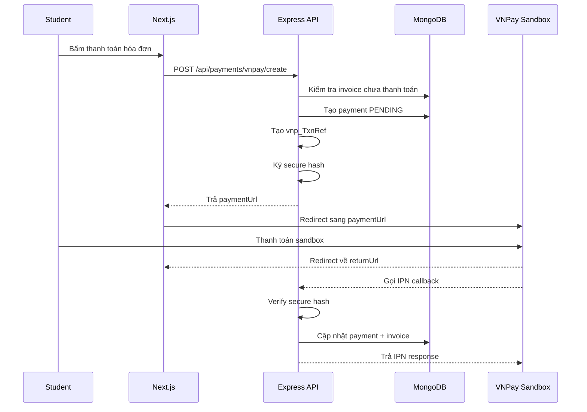

---

## 12.4. Luồng tạo URL thanh toán

Backend nhận:

```json
{
  "invoiceId": "..."
}
```

Backend xử lý:

1. Kiểm tra user là sinh viên đang cư trú.
2. Kiểm tra hóa đơn thuộc phòng của sinh viên.
3. Kiểm tra hóa đơn chưa thanh toán.
4. Tạo `Payment` trạng thái `PENDING`.
5. Sinh `vnp_TxnRef` duy nhất.
6. Tạo danh sách tham số VNPay.
7. Sort tham số theo alphabet.
8. Ký `vnp_SecureHash`.
9. Trả về URL thanh toán.

Response:

```json
{
  "success": true,
  "data": {
    "paymentUrl": "https://sandbox.vnpayment.vn/paymentv2/vpcpay.html?..."
  }
}
```

---

## 12.5. VNPay return URL

Return URL chủ yếu dùng để hiển thị kết quả cho người dùng.

Không nên chỉ dựa vào return URL để cập nhật thanh toán, vì return URL đi qua trình duyệt người dùng.

Frontend page:

```text
/payment/vnpay-return
```

Frontend đọc query:

- `vnp_ResponseCode`
- `vnp_TxnRef`
- `vnp_Amount`
- `vnp_TransactionNo`
- `vnp_SecureHash`

Frontend gọi backend để kiểm tra trạng thái payment thật:

```text
GET /api/payments/invoice/:invoiceId
```

Hoặc:

```text
GET /api/payments/status?vnpTxnRef=...
```

---

## 12.6. VNPay IPN

IPN là endpoint quan trọng để backend xác nhận thanh toán.

Endpoint:

```text
GET /api/payments/vnpay/ipn
```

Backend cần:

1. Nhận query từ VNPay.
2. Lấy `vnp_SecureHash`.
3. Xóa `vnp_SecureHash` và `vnp_SecureHashType` khỏi params trước khi ký lại.
4. Sort params.
5. Tạo hash bằng `VNPAY_HASH_SECRET`.
6. So sánh hash.
7. Tìm payment theo `vnp_TxnRef`.
8. Kiểm tra số tiền.
9. Kiểm tra hóa đơn chưa thanh toán.
10. Nếu `vnp_ResponseCode === "00"`:
    - Payment `SUCCESS`.
    - Invoice `PAID`.
    - Lưu `vnp_TransactionNo`.
    - Lưu `vnp_PayDate`.
11. Nếu thất bại:
    - Payment `FAILED`.
12. Ghi audit log.
13. Trả response đúng format cho VNPay.

---

## 12.7. Idempotency khi xử lý VNPay

VNPay có thể gọi IPN nhiều lần.

Backend phải xử lý idempotent:

- Nếu payment đã `SUCCESS`, không cập nhật lại nhiều lần.
- Nếu invoice đã `PAID`, không cộng tiền hoặc tạo log sai.
- Trả response xác nhận đã xử lý.

Cần unique index:

```text
unique(vnpTxnRef)
```

---

## 12.8. Trạng thái thanh toán

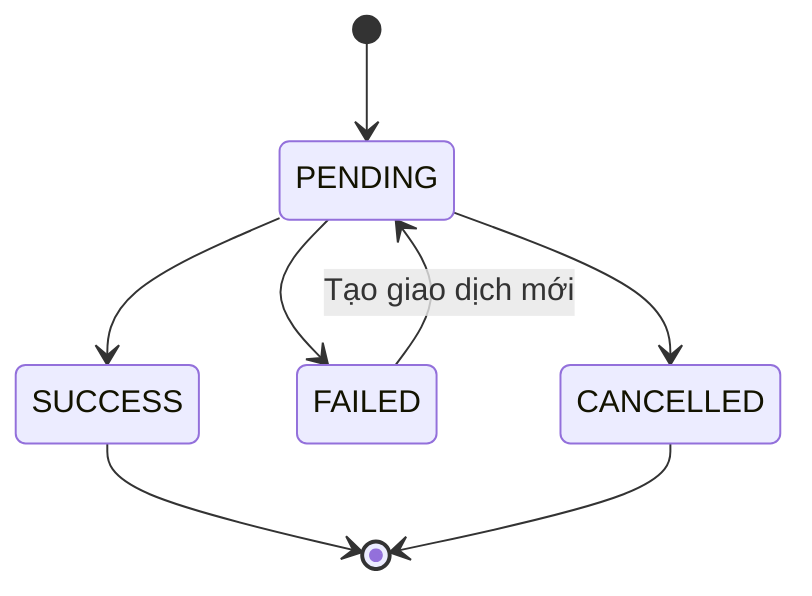

---

# 13. Luồng import Excel và xếp phòng

## 13.1. Yêu cầu nghiệp vụ

Khi bắt đầu kỳ mới:

- Cán bộ import Excel danh sách sinh viên đã đăng ký lưu trú.
- Hệ thống validate file.
- Hệ thống thêm sinh viên vào kỳ lưu trú.
- Hệ thống xếp phòng tự động.
- Nếu không đủ phòng thì rollback toàn bộ.
- Nếu thành công thì gửi thông báo và email.

---

## 13.2. Sequence import Excel

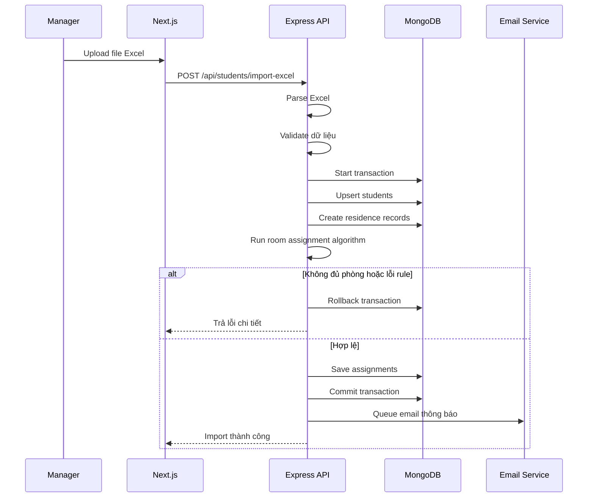

---

## 13.3. Room assignment service

Service chính:

```text
RoomAssignmentService.autoAssign(semesterId, options)
```

Input:

```ts
type AutoAssignInput = {
  semesterId: string;
  studentIds?: string[];
  keepPreviousRoomPriority: boolean;
  freshmanPriorityEnabled: boolean;
};
```

Output:

```ts
type AutoAssignResult = {
  totalStudents: number;
  assignedCount: number;
  roomCount: number;
  warnings: string[];
  assignments: AssignmentPreview[];
};
```

---

## 13.4. Rule xếp phòng

Thứ tự ưu tiên:

1. Phòng ưu tiên tân sinh viên nếu là kỳ 1.
2. Đúng giới tính phòng.
3. Giữ phòng cũ nếu sinh viên đã ở kỳ trước.
4. Cùng lớp.
5. Cùng ngành.
6. Cùng khóa.
7. Cùng khoa.

---

## 13.5. Transaction boundary

Toàn bộ các thao tác sau nên nằm trong một transaction:

```text
upsert students
create residence records
create room assignments
update bed status
write audit logs
```

Email không nên gửi trực tiếp trong transaction.

Cách làm tốt hơn:

1. Commit transaction thành công.
2. Ghi email job vào queue hoặc email log.
3. Worker gửi email sau.

---

# 14. Luồng tạo hóa đơn điện nước

## 14.1. Công thức tiền nước

```text
paidWaterUsage = max(waterUsage - freeWaterQuota, 0)
waterAmount = paidWaterUsage * waterUnitPrice
```

---

## 14.2. Công thức tiền điện

Tính theo bậc:

| Bậc | Khoảng kWh | Đơn giá |
|---|---:|---:|
| 1 | 0 - 50 | 1.984 |
| 2 | 51 - 100 | 2.050 |
| 3 | 101 - 200 | 2.380 |
| 4 | 201 - 300 | 2.998 |
| 5 | 301 - 400 | 3.350 |
| 6 | 401+ | 3.460 |

```text
electricBeforeVat = sum(amount by tier)
vatAmount = electricBeforeVat * 0.1
electricAmount = electricBeforeVat + vatAmount
totalAmount = electricAmount + waterAmount
```

Các giá trị này phải lấy từ database config, không hard-code trong code.

---

## 14.3. Sequence tạo hóa đơn

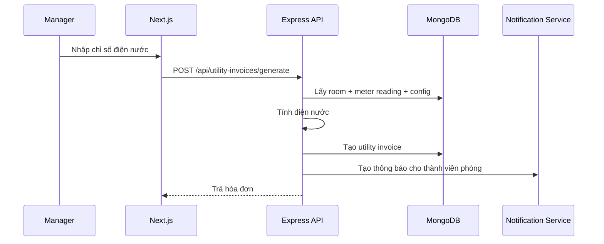

---

# 15. Background jobs

Hệ thống nên có các job chạy định kỳ.

## 15.1. Residence reminder job

Chức năng:

- Kiểm tra sinh viên sắp hết thời gian lưu trú.
- Nếu còn `t` ngày thì gửi thông báo và email.

Chạy:

```text
Mỗi ngày lúc 08:00
```

---

## 15.2. Invoice overdue job

Chức năng:

- Kiểm tra hóa đơn quá hạn.
- Nếu chưa thanh toán thì chuyển sang `OVERDUE`.
- Gửi cảnh báo, thông báo và email.

Chạy:

```text
Mỗi ngày lúc 08:30
```

---

## 15.3. Email retry job

Chức năng:

- Kiểm tra email gửi thất bại.
- Gửi lại theo số lần retry cho phép.

Chạy:

```text
Mỗi 10 hoặc 30 phút
```

---

# 16. API response chuẩn

## 16.1. Success response

```json
{
  "success": true,
  "message": "Success",
  "data": {}
}
```

---

## 16.2. Error response

```json
{
  "success": false,
  "message": "Validation failed",
  "errorCode": "VALIDATION_ERROR",
  "errors": [
    {
      "field": "email",
      "message": "Email không hợp lệ"
    }
  ]
}
```

---

## 16.3. Pagination response

```json
{
  "success": true,
  "data": {
    "items": [],
    "pagination": {
      "page": 1,
      "limit": 10,
      "totalItems": 100,
      "totalPages": 10
    }
  }
}
```

---

# 17. Error code đề xuất

```text
AUTH_INVALID_CREDENTIALS
AUTH_TOKEN_EXPIRED
AUTH_REFRESH_TOKEN_EXPIRED
AUTH_FORBIDDEN
AUTH_ACCOUNT_LOCKED

USER_NOT_FOUND
STUDENT_NOT_FOUND
SEMESTER_NOT_FOUND
ROOM_NOT_FOUND
BED_NOT_FOUND
INVOICE_NOT_FOUND
PAYMENT_NOT_FOUND

VALIDATION_ERROR
EXCEL_INVALID_FORMAT
EXCEL_IMPORT_FAILED

ROOM_NOT_ENOUGH_CAPACITY
ROOM_GENDER_MISMATCH
ROOM_ASSIGNMENT_FAILED

INVOICE_ALREADY_PAID
INVOICE_OVERDUE
PAYMENT_SIGNATURE_INVALID
PAYMENT_AMOUNT_INVALID
PAYMENT_ALREADY_PROCESSED

INTERNAL_SERVER_ERROR
```

---

# 18. Security design

## 18.1. Password

- Hash password bằng bcrypt hoặc argon2.
- Không lưu password plain text.
- Reset password dùng token ngắn hạn.
- Token reset password phải được hash trong database.

---

## 18.2. JWT

- Access token sống ngắn.
- Refresh token sống dài hơn nhưng phải rotate.
- Có thể dùng `tokenVersion` để revoke toàn bộ token của user.
- Không đưa dữ liệu nhạy cảm vào JWT payload.

---

## 18.3. Cookie refresh token

Cookie nên cấu hình:

```ts
{
  httpOnly: true,
  secure: true,
  sameSite: "lax",
  path: "/api/auth/refresh",
  maxAge: 7 * 24 * 60 * 60 * 1000
}
```

Khi development localhost có thể tạm `secure: false`.

---

## 18.4. CORS

Backend chỉ cho phép origin frontend:

```env
CLIENT_URL=http://localhost:3000
```

Production:

```env
CLIENT_URL=https://your-frontend-domain.vercel.app
```

Cần bật credentials nếu dùng cookie refresh token:

```ts
app.use(cors({
  origin: process.env.CLIENT_URL,
  credentials: true
}));
```

---

## 18.5. Rate limit

Nên rate limit các endpoint:

- Login.
- Forgot password.
- Reset password.
- Refresh token.
- VNPay callback không nên rate limit quá chặt nhưng cần verify signature.

---

## 18.6. File upload Excel

Cần kiểm tra:

- Dung lượng file.
- Định dạng file.
- MIME type.
- Số lượng dòng tối đa.
- Header đúng mẫu.
- Không execute macro.
- Không tin dữ liệu Excel tuyệt đối.

---

## 18.7. Audit log

Các hành động quan trọng cần ghi log:

- Login thất bại nhiều lần.
- Khóa / mở khóa tài khoản.
- Import Excel.
- Xếp phòng.
- Sửa kỳ lưu trú.
- Tạo hóa đơn.
- Xác nhận thanh toán tiền mặt.
- VNPay callback.
- Tạo vi phạm.
- Xử lý đơn từ.

---

# 19. Environment variables

## 19.1. Backend `.env`

```env
NODE_ENV=development
PORT=5000

CLIENT_URL=http://localhost:3000
SERVER_URL=http://localhost:5000

MONGODB_URI=mongodb://localhost:27017/hvcs_dormitory

JWT_ACCESS_SECRET=change_me_access_secret
JWT_REFRESH_SECRET=change_me_refresh_secret
ACCESS_TOKEN_EXPIRES_IN=15m
REFRESH_TOKEN_EXPIRES_IN=7d

COOKIE_SECRET=change_me_cookie_secret

SMTP_HOST=smtp.gmail.com
SMTP_PORT=587
SMTP_USER=your_email@gmail.com
SMTP_PASS=your_app_password
SMTP_FROM=HVCS Dormitory <your_email@gmail.com>

VNPAY_TMN_CODE=your_sandbox_tmn_code
VNPAY_HASH_SECRET=your_sandbox_hash_secret
VNPAY_URL=https://sandbox.vnpayment.vn/paymentv2/vpcpay.html
VNPAY_RETURN_URL=http://localhost:3000/payment/vnpay-return
VNPAY_IPN_URL=http://localhost:5000/api/payments/vnpay/ipn

LOG_LEVEL=debug
```

---

## 19.2. Frontend `.env.local`

```env
NEXT_PUBLIC_API_BASE_URL=http://localhost:5000/api
NEXT_PUBLIC_APP_NAME=HVCS Dormitory
```

Không đưa secret vào frontend.

---

# 20. Deployment architecture

## 20.1. Development local

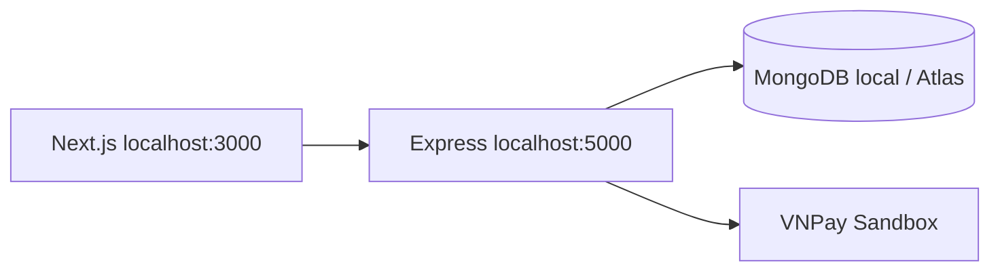

---

## 20.2. Production đề xuất

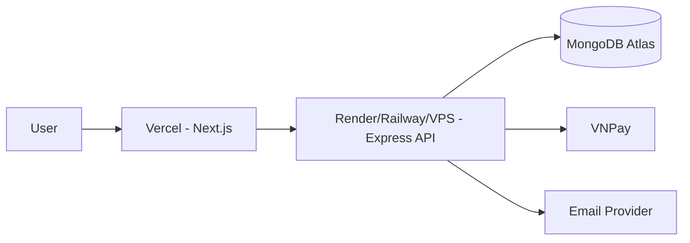

---

# 21. Quy ước coding cho agent

## 21.1. Backend

Agent khi sinh backend cần tuân thủ:

- Không viết logic nghiệp vụ trong route.
- Controller mỏng.
- Service chứa nghiệp vụ.
- Validate input bằng Zod hoặc Joi.
- Dùng async handler để bắt lỗi.
- Dùng error class thống nhất.
- Dùng transaction cho import và xếp phòng.
- Không hard-code giá điện nước.
- Không hard-code role trong nhiều nơi, nên dùng constant.
- Mọi endpoint quan trọng phải có auth middleware.
- Endpoint quản lý phải có role / permission middleware.

---

## 21.2. Frontend

Agent khi sinh frontend cần tuân thủ:

- Không gọi `fetch` trực tiếp trong page nếu API cần auth.
- Tất cả request auth đi qua `apiClient`.
- Không xử lý refresh token trong từng component.
- Không lưu refresh token trong localStorage.
- Route admin / manager / student phải có guard.
- Form phải validate trước khi submit.
- Bảng dữ liệu phải có pagination, search, filter.
- Lỗi API phải hiển thị rõ ràng cho người dùng.

---

## 21.3. Database

Agent khi sinh model cần tuân thủ:

- Dùng enum rõ ràng cho status.
- Tạo index cho các trường hay query.
- Tạo unique index cho dữ liệu quan trọng.
- Dữ liệu lịch sử không nên xóa cứng.
- Nên dùng soft delete nếu cần.
- Hóa đơn đã thanh toán không nên sửa trực tiếp.
- Kỳ đã kết thúc không nên sửa dữ liệu cốt lõi.

---

# 22. Checklist MVP

## 22.1. MVP Backend

- [ ] Auth login/logout/refresh.
- [ ] RBAC Admin/Manager/Student.
- [ ] CRUD user.
- [ ] CRUD student.
- [ ] Import Excel sinh viên.
- [ ] CRUD semester.
- [ ] CRUD building/floor/room/bed.
- [ ] Auto room assignment.
- [ ] CRUD regulation.
- [ ] Notification.
- [ ] Student request.
- [ ] Utility invoice.
- [ ] VNPay sandbox payment.
- [ ] Violation.
- [ ] Report cơ bản.
- [ ] Audit log.

---

## 22.2. MVP Frontend

- [ ] Login page.
- [ ] Forgot password page.
- [ ] Admin dashboard.
- [ ] Manager dashboard.
- [ ] Student dashboard.
- [ ] Student management page.
- [ ] Excel import page.
- [ ] Semester management page.
- [ ] Dormitory structure page.
- [ ] Room assignment page.
- [ ] Regulation page.
- [ ] Notification page.
- [ ] Student request page.
- [ ] Utility invoice page.
- [ ] VNPay return page.
- [ ] Violation page.
- [ ] Report page.

---

# 23. Roadmap triển khai đề xuất

## Phase 1: Core foundation

- Setup monorepo.
- Setup Next.js.
- Setup Express TypeScript.
- Setup MongoDB + Mongoose.
- Setup error handler.
- Setup auth JWT.
- Setup refresh token tập trung.
- Setup RBAC.

## Phase 2: Quản lý dữ liệu nền

- User.
- Student.
- Semester.
- Building.
- Floor.
- Room.
- Bed.

## Phase 3: Import Excel và xếp phòng

- Import Excel.
- Validate dữ liệu.
- Transaction.
- Auto room assignment.
- Preview assignment nếu cần.
- Commit assignment.
- Audit log.

## Phase 4: Sinh viên và thông báo

- Student dashboard.
- Residence history.
- Room info.
- Notifications.
- Regulations.
- Student requests.

## Phase 5: Hóa đơn và VNPay

- Meter readings.
- Utility invoice generation.
- VNPay sandbox.
- Payment status.
- Cash confirmation.
- Overdue reminder.

## Phase 6: Vi phạm, báo cáo, hoàn thiện

- Violations.
- Reports.
- Audit logs.
- Email retry.
- UI polish.
- Deployment.

---

# 24. Kết luận kiến trúc

Kiến trúc đề xuất sử dụng:

- **Next.js** cho frontend.
- **Express Node.js** cho backend.
- **MongoDB** cho database.
- **JWT access token + refresh token rotation** cho xác thực.
- **Refresh token manager tập trung ở frontend** để tránh lặp logic.
- **RBAC** cho phân quyền.
- **VNPay sandbox** cho thanh toán hóa đơn điện nước.
- **Transaction MongoDB** cho import Excel, xếp phòng và thanh toán.
- **Audit log** cho toàn bộ nghiệp vụ quan trọng.

Điểm quan trọng nhất khi triển khai là:

1. Không để frontend xử lý nghiệp vụ nhạy cảm.
2. Refresh token phải được quản lý tập trung và an toàn.
3. Import Excel và xếp phòng phải rollback nếu lỗi.
4. VNPay callback phải verify chữ ký và xử lý idempotent.
5. Dữ liệu lịch sử lưu trú, hóa đơn và vi phạm phải được bảo toàn.
